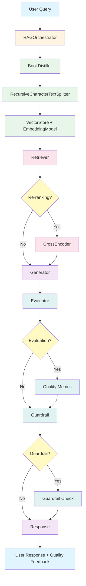

# AGENTS.md

## Setup Commands
- Install dependencies: `uv sync` (recommended) or `pip install -e ".[dev]"`
- Set up environment variables: `echo "GEMINI_API_KEY=your_key_here" > .env`
- Run CLI: `uv run python src/main.py --url <HTML_URL>`
- Run tests: `uv run pytest tests/` or `python -m pytest tests/`
- Build Docker image: `docker build -t rag-baseline .`
- Run Docker container: `docker run -e GEMINI_API_KEY=your_key rag-baseline`

## Code Style
- Use Python 3.11+ type hints and docstrings
- Follow PEP 8 formatting with comprehensive docstrings
- Prefer explicit data handoff documentation between components
- Use dataclasses for structured data (EvaluationResult, GuardrailResult)
- Implement lazy loading for expensive operations (models, API clients)
- Use context managers for resource management
- Follow conventional commit format: `feat:`, `fix:`, `docs:`, `test:`
- Prioritize data-centric AI principles in documentation

## Testing Guidelines
- Write unit tests for all new functions (TDD approach)
- Use pytest as the testing framework
- Mock external dependencies (HTTP, API calls) for deterministic testing
- Focus on orchestration logic and data handoff validation
- Aim for >80% code coverage
- Run tests before committing: `uv run pytest tests/ -v`
- Test component integration in addition to unit tests
- Verify data integrity at each handoff point

## Project Structure
- `/src` - Main application code
  - `book_distiller.py` - Web ingestion and HTML cleaning
  - `chunker.py` - Recursive text chunking
  - `vector_store.py` - Vector embeddings and NumPy storage
  - `retriever.py` - Semantic retrieval with cross-encoder re-ranking
  - `generator.py` - Grounded generation with context injection
  - `eval_guard.py` - AI-as-a-Judge evaluation and grounding guardrails
  - `main.py` - CLI orchestration and REPL interface
- `/tests` - Test files
  - `test_distiller.py` - HTML distillation tests
  - `test_chunker.py` - Text chunking tests
  - `test_vector_store.py` - Vector storage tests
  - `test_retriever.py` - Retrieval tests
  - `test_generator.py` - Generation tests
  - `test_eval_guard.py` - Evaluation and guardrail tests
  - `test_main.py` - Orchestration and CLI tests
- `Dockerfile` - Container configuration
- `pyproject.toml` - Dependencies and project configuration
- `.env` - Environment variables (API keys, configuration)

## Development Workflow
- Create feature branches from `main`
- Use semantic commits with conventional format
- Update documentation for new features
- Run full test suite before merging
- Tag releases with version numbers
- Maintain backward compatibility for API changes
- Document data handoff points in component docstrings

## RAG Architecture Overview

### Modular Design Philosophy

This RAG system implements a modular architecture where each component has a single, well-defined responsibility. This modularity prevents system complexity from collapsing by:

- **Isolation**: Each component can be developed, tested, and debugged independently
- **Interchangeability**: Components can be swapped (e.g., different embedding models) without rewriting the system
- **Observability**: Clear boundaries make it easy to monitor performance at each stage
- **Maintainability**: Changes to one component don't cascade to others
- **Scalability**: Individual components can be optimized or scaled independently

### Architecture Diagram

### Component Specifications

#### 1. BookDistiller (`book_distiller.py`)
**Purpose**: Web ingestion and intelligent HTML cleaning

**Input**: 
- URL (string) - Single HTML page containing full text
- Optional CSS selector for content extraction

**Output**: 
- Cleaned text (string) - Noise-free content ready for chunking

**Key Responsibilities**:
- Fetch single HTML page with retry logic
- Remove navigation, scripts, styles, and UI elements
- Auto-detect Project Gutenberg URLs for specialized cleaning
- Preserve semantic structure (headers, paragraphs, code blocks)
- Normalize whitespace for consistent chunking

**Data Handoff**: Returns `str` (single page text) to chunker

**Configuration**:
- Custom CSS selectors for different documentation sites
- Junk selectors for elements to remove
- Preserve selectors for technical content

#### 2. RecursiveCharacterTextSplitter (`chunker.py`)
**Purpose**: Intelligently split text into semantically meaningful chunks

**Input**:
- Cleaned text (string) from BookDistiller

**Output**:
- List of text chunks (List[str]) with configurable overlap

**Key Responsibilities**:
- Recursively try natural boundaries (paragraphs, sentences, words)
- Maintain configurable overlap between chunks
- Fall back to character-level splitting when needed
- Ensure chunks fit within size constraints

**Data Handoff**: Returns `List[str]` (chunks) to VectorStore

**Configuration**:
- `chunk_size`: Maximum characters per chunk (default: 1000)
- `chunk_overlap`: Characters to overlap (default: 200)
- `separators`: Ordered list of splitting preferences

#### 3. VectorStore + EmbeddingModel (`vector_store.py`)
**Purpose**: Convert text to vectors and enable semantic search

**Input**:
- List of text chunks (List[str]) from chunker

**Output**:
- Embedded vectors with similarity search capability

**Key Responsibilities**:
- Convert text chunks to dense vector representations
- Store vectors in NumPy-based vector store
- Perform similarity search using cosine similarity
- Lazy-load embedding model for efficiency

**Data Handoff**: Accepts `List[str]` (chunks), provides vector search interface

**Configuration**:
- Model: "all-MiniLM-L6-v2" (384 dimensions, ~80MB)
- Normalization: L2-normalized for cosine similarity
- Cache: Models cached in `/app/.cache/models`

#### 4. Retriever (`retriever.py`)
**Purpose**: Find relevant chunks using semantic search with optional re-ranking

**Input**:
- User query (string)
- VectorStore instance with embedded chunks

**Output**:
- List of retrieved chunks with similarity scores (List[Dict])

**Key Responsibilities**:
- Encode queries using same model as document chunks
- Perform semantic search via vector similarity
- Optionally re-rank results with cross-encoder
- Return top-k most relevant chunks

**Data Handoff**: Returns `List[Dict]` with "chunk" and "similarity" keys

**Configuration**:
- `use_reranking`: Enable cross-encoder re-ranking (default: True)
- `rerank_model`: "ms-marco-MiniLM-L-6-v2" for passage ranking
- `top_k_for_rerank`: Number of candidates before re-ranking (default: 20)

#### 5. Generator (`generator.py`)
**Purpose**: Generate factually grounded responses using context injection

**Input**:
- Retrieved chunks (List[str]) from Retriever
- User query (string)

**Output**:
- Grounded response (string) based on provided context

**Key Responsibilities**:
- Hydrate system prompts with retrieved context
- Enforce instruction hierarchy (System > Context > User)
- Generate responses using Gemini Flash API
- Implement fallback on rate limit errors
- Prevent hallucination through clear context boundaries

**Data Handoff**: Accepts `List[str]` (chunks) and query, returns response string

**Configuration**:
- Model: "gemini-2.5-flash" (primary), "gemini-3.5-flash-lite" (fallback)
- Temperature: 0.0 for maximum factuality
- API key via environment variable

#### 6. Evaluator + Guardrail (`eval_guard.py`)
**Purpose**: Quality assessment and safety enforcement

**Input**:
- Question, retrieved chunks, generated response

**Output**:
- Quality metrics (precision, faithfulness, guardrail confidence)

**Key Responsibilities**:
- AI-as-a-Judge evaluation of Context Precision and Faithfulness
- Grounding guardrail checks with confidence thresholds
- Warning-only behavior (not blocking) based on user configuration
- Quality tracking for comparison over time

**Data Handoff**: Returns quality metrics dictionary with scores and warnings

**Configuration**:
- Precision threshold: 0.7 (70% of chunks must be relevant)
- Faithfulness threshold: 0.8 (80% of claims must be grounded)
- Guardrail threshold: 0.3 (minimum confidence to allow response)

#### 7. RAGOrchestrator (`main.py`)
**Purpose**: Central coordination of all RAG components

**Input**:
- URL, configuration parameters, CLI flags

**Output**:
- Interactive REPL for querying indexed content

**Key Responsibilities**:
- Orchestrate complete pipeline from URL to REPL
- Manage component initialization and data handoffs
- Provide session statistics and quality tracking
- Handle user input and display responses
- Coordinate evaluation and guardrail integration

**Data Handoff**: Coordinates all component handoffs with validation

**Configuration**:
- All component parameters via CLI flags
- Session statistics tracking
- Quality history for comparison

### Data Flow Documentation

**Ingestion Pipeline**:
1. `URL` → `BookDistiller.distill_book()` → `str` (cleaned text)
2. `str` → `RecursiveCharacterTextSplitter.split_text()` → `List[str]` (chunks)
3. `List[str]` → `VectorStore.add_chunks_batch()` → embedded vectors

**Query Pipeline**:
1. `user_query` → `Retriever.retrieve()` → `List[Dict]` (retrieved chunks)
2. `List[Dict]` → extract "chunk" values → `List[str]` (chunk texts)
3. `List[str]` + `query` → `Generator.generate()` → `str` (response)
4. Response + context → `Evaluator.evaluate_*()` → quality metrics
5. Quality metrics → `Guardrail.check_grounding()` → guardrail results
6. Return `(response, sources, quality_metrics)` tuple

### Modularity Benefits

**Maintenance**:
- Each component has a single responsibility
- Changes are isolated to specific modules
- Clear interfaces prevent coupling
- Easy to understand and modify individual parts

**Debugging**:
- Component boundaries make it easy to isolate issues
- Data handoff validation catches problems early
- Lazy loading allows testing without expensive operations
- Mock-friendly design for unit testing

**Observability**:
- Quality metrics at each stage (precision, faithfulness)
- Session statistics track system health
- Component-level performance monitoring
- Clear data flow enables tracing

**Testing**:
- Unit tests for each component independently
- Integration tests for component interactions
- Mock external dependencies for deterministic tests
- Data handoff validation ensures integrity

**Extension**:
- Swap embedding models without changing pipeline
- Add new evaluation metrics without affecting generation
- Replace generator with different LLM API
- Extend cleaning rules for new documentation sites

### Infrastructure Overview

**Docker Containerization**:
- Python 3.11-slim base image for minimal footprint
- uv for lightning-fast package management
- Deterministic builds with `--system --no-dev`
- Model caching in `/app/.cache/models` for persistence
- Environment variables for API keys (runtime security)

**Package Management**:
- uv for fast dependency resolution and installation
- Pyproject.toml for declarative dependency specification
- Separate dev dependencies for testing
- Hatchling for wheel building

**Security**:
- API keys via environment variables (never hardcoded)
- Lazy API key validation (only when needed)
- Instruction hierarchy prevents prompt injection
- Grounding guardrails prevent hallucination

**Model Caching**:
- sentence-transformers models cached automatically
- Cross-encoder models lazy-loaded on first use
- Persistent cache across container restarts
- ~80MB for embedding model, ~80MB for cross-encoder

### Development Best Practices

**When Adding New Components**:
1. Define clear input/output data types
2. Document data handoff points in docstrings
3. Implement lazy loading for expensive operations
4. Write unit tests before implementation (TDD)
5. Add configuration options via CLI flags
6. Update AGENTS.md with component documentation

**When Modifying Existing Components**:
1. Maintain backward compatibility for data handoffs
2. Update corresponding tests
3. Document breaking changes in commit messages
4. Consider impact on downstream components
5. Add new configuration options with sensible defaults
6. Update AGENTS.md if component responsibilities change

**When Debugging Issues**:
1. Isolate the problematic component using unit tests
2. Check data handoff points for type mismatches
3. Verify lazy loading is working correctly
4. Monitor quality metrics for degradation
5. Check session statistics for anomalies
6. Use mock dependencies to isolate external factors

**Performance Optimization**:
1. Profile each component independently
2. Optimize data handoffs (batch operations)
3. Consider caching for expensive operations
4. Monitor memory usage for model loading
5. Balance accuracy vs. speed (re-ranking, evaluation)
6. Use lazy loading to defer expensive operations
