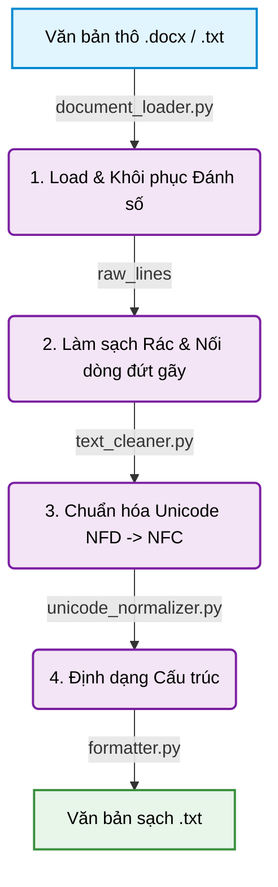

# TÓM TẮT MODULE 1: TIỀN XỬ LÝ VĂN BẢN PHÁP LUẬT (DOCUMENT PREPROCESSING)

## 1. Đánh giá Kiến trúc Hệ thống (System Architecture)
Kiến trúc của Module 1 được thiết kế rất chuẩn mực theo mô hình **Pipeline (Đường ống xử lý tuyến tính)** kết hợp với **Single Responsibility Principle (Nguyên tắc Đơn trách nhiệm)**. Dữ liệu thô (raw data) sẽ chảy qua các trạm xử lý (components) độc lập để tạo ra văn bản sạch (clean text) cuối cùng.

Cụ thể, các component được tổ chức thành các file riêng biệt:
- **`document_loader.py` (Tầng Nạp dữ liệu):** Xử lý giao tiếp với file vật lý (.docx, .txt), đặc biệt giải quyết bài toán hóc búa nhất là bóc tách đánh số tự động (auto-numbering).
- **`text_cleaner.py` (Tầng Làm sạch):** Bộ lọc rác, loại bỏ khoảng trắng thừa, ký tự ẩn, ngắt dòng sai.
- **`unicode_normalizer.py` (Tầng Chuẩn hóa):** Bộ kiểm soát bảng mã, ép toàn bộ văn bản về một quy chuẩn tiếng Việt duy nhất (Unicode NFC).
- **`formatter.py` (Tầng Định dạng):** Cấu trúc lại văn bản, căn chỉnh thống nhất để chuẩn bị cho bước bóc tách (Parsing) tiếp theo.
- **`clean_document.py` (Bộ Điều phối/Orchestrator):** Đóng vai trò là Pipeline Controller, xâu chuỗi 4 trạm trên lại với nhau, ghi nhận log, đo lường thời gian (elapsed time) và xuất ra file đích (như `clean_Luat_dat_dai_chuong_3.txt`).

## 2. Luồng xử lý (Workflow)

Văn bản pháp luật thô sẽ đi qua 4 bước tuần tự:
1. **Load (Tải và Giải mã):** Đọc file Word (`.docx`), can thiệp vào cấu trúc XML bên dưới để lấy cả phần chữ (text) lẫn các con số tự động (Khoản 1, Điểm a).
2. **Clean (Làm sạch):** Xóa bỏ các ký tự điều khiển (control characters), nối lại các câu bị đứt gãy do lỗi canh lề (layout).
3. **Normalize (Chuẩn hóa):** Quét toàn bộ văn bản, biến đổi mọi ký tự tiếng Việt gõ theo kiểu tổ hợp (NFD) về kiểu dựng sẵn (NFC).
4. **Format (Định dạng):** Chỉnh trang lại thụt lề, khoảng cách dòng, tạo ra một bản `clean_text` hoàn hảo, sẵn sàng bàn giao cho Module 2 (Tạo Cây Vật Lý).

## 3. Các bài toán gặp phải và Cách giải quyết

### Bài toán 1: "Tàng hình" đánh số tự động (Auto-numbering Loss)
- **Vấn đề:** Văn bản quy phạm pháp luật sử dụng chức năng Auto-Numbering rất nhiều cho các Điều, Khoản, Điểm (Ví dụ: tự động đánh số "1.", "a)"). Khi dùng các thư viện Python đọc file Word thông thường (như `python-docx` nguyên bản), các con số này bị "tàng hình" (biến mất). Điều này khiến toàn bộ cấu trúc phân cấp của văn bản bị phá nát (không biết đâu là Khoản 1, đâu là Điểm a).
- **Cách giải quyết (`document_loader.py`):** Hệ thống được thiết kế để đọc sâu vào cấu trúc XML (`numbering.xml`) của file `.docx`. Nó truy vết từng đoạn văn (paragraph) xem đang liên kết với ID đánh số nào, sau đó tự động khôi phục và "đính" (prefix) con số/chữ cái đó vào lại đầu câu văn trước khi nạp vào bộ nhớ.

### Bài toán 2: Bất đồng bộ Bảng mã Tiếng Việt (Unicode NFD vs NFC)
- **Vấn đề:** Các file luật thu thập từ nhiều nguồn (đặc biệt là soạn thảo trên máy Mac hoặc copy từ web) thường bị dính lỗi Unicode Tổ hợp (NFD). Trong NFD, chữ `ề` thực chất là 2 ký tự: chữ `e` và dấu `^` `\`. Trong khi đó, hệ thống mặc định hiểu chữ `ề` là 1 ký tự (NFC). Sự sai lệch này khiến các biểu thức chính quy (Regex) ở Module 2 hoàn toàn bị "mù", bắt hụt các từ khóa như "Điều", "Khoản".
- **Cách giải quyết (`unicode_normalizer.py`):** Khởi tạo một chốt chặn bắt buộc bằng thuật toán `unicodedata.normalize('NFC', text)`. Mọi văn bản chạy qua đây đều bị "ép" về quy chuẩn NFC, triệt tiêu hoàn toàn lỗi so khớp chuỗi về sau.

### Bài toán 3: Rác định dạng và Đứt gãy câu chữ (Noise & Broken Lines)
- **Vấn đề:** Do thói quen soạn thảo (ấn Tab/Space nhiều lần) hoặc do lỗi convert từ PDF sang Word, văn bản xuất hiện vô số khoảng trắng thừa, dòng trắng, hoặc trầm trọng hơn là **một câu bị ngắt xuống dòng giữa chừng** dù chưa hết ý.
- **Cách giải quyết (`text_cleaner.py`):** Sử dụng các biểu thức chính quy (Regex) và logic Heuristic để dọn rác. Đặc biệt, hệ thống sẽ tự động phát hiện các dòng kết thúc bất thường (không phải dấu chấm, chấm phẩy, v.v.) và chủ động **nối (merge)** chúng lại với dòng tiếp theo để khôi phục lại câu văn nguyên vẹn. Mọi kết quả đầu ra đều có chất lượng chữ (text quality) hoàn hảo.

## 4. Đánh giá Kết quả Thực thi (Output Evaluation)

Sau khi kiểm tra file kết quả đầu ra `clean_Luat_dat_dai_chuong_3.txt`, hệ thống bộc lộ những điểm rất đáng chú ý như sau:

**Ưu điểm vượt trội (Pros):**
- **Sạch sẽ tuyệt đối:** Không còn bất kỳ dòng trắng (blank lines), khoảng trắng thừa (trailing spaces) hay ký tự điều khiển (control characters) nào.
- **Nối câu hoàn hảo:** Các câu luật bị rớt dòng giữa chừng đã được nối lại thành một đoạn văn (paragraph) nguyên vẹn.
- **Chuẩn hóa Unicode:** File text hiển thị tiếng Việt mượt mà, không có hiện tượng vỡ font, đáp ứng 100% chuẩn NFC để phục vụ Regex ở các bước sau.

**Phát hiện bất ngờ - Giới hạn của file TXT (Cons & Insights):**
- Khi đọc file `.txt`, chúng ta dễ dàng nhận thấy **toàn bộ số thứ tự (Khoản 1, Khoản 2, Điểm a, b, c) ĐÃ BIẾN MẤT!** Ví dụ, dưới "Điều 26" chỉ có các dòng text trơn như *"Được cấp Giấy chứng nhận..."* thay vì *"1. Được cấp Giấy chứng nhận..."*. 
- Thú vị hơn, duy nhất điểm `đ)` ở Khoản 1 Điều 28 lại xuất hiện. Lý do là vì MS Word không hỗ trợ điểm `đ` trong hệ thống Auto-numbering tiếng Anh mặc định, nên người soạn thảo đã phải "gõ tay" (hardcode) chữ `đ)` vào văn bản.
- **Bản chất vấn đề:** Đây **KHÔNG PHẢI LÀ LỖI** của Module 1. Việc lưu ra file `.txt` chỉ đóng vai trò tạo ra một bản *Plain Text* tinh khiết dùng để huấn luyện mô hình ngôn ngữ (LLM Pre-training) hoặc lưu trữ thô. Trong kiến trúc thực tế, **Module 2 KHÔNG đọc file `.txt` này để dựng cây đồ thị**. Thay vào đó, Module 1 sẽ nạp file Word, bóc tách ra các đối tượng `StructuredParagraph` (chứa text đã làm sạch + giữ nguyên các con số bí mật trong bộ nhớ RAM) và trao tay trực tiếp cho Module 2 thông qua "Hợp đồng dữ liệu" (Data Contract).
