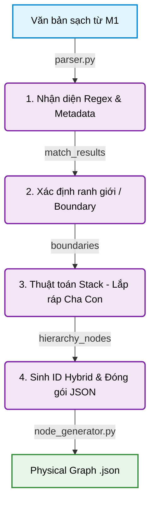

# TỔNG KẾT MODULE 2: XÂY DỰNG CÂY VẬT LÝ (PHYSICAL GRAPH PARSER)

Module 2 đóng vai trò là lõi trích xuất cấu trúc (Structural Parser) cho hệ thống Hybrid Parser của GraphRAG Văn bản Pháp luật Việt Nam. Nhiệm vụ chính của module là chuyển đổi văn bản luật thô (đã qua làm sạch) hoặc văn bản DOCX thành một mảng các node JSON có cấu trúc phân cấp chặt chẽ, phục vụ cho việc xây dựng đồ thị ở các module sau.

## 1. Công nghệ và Nguyên tắc thiết kế
- **Ngôn ngữ & Thư viện:** Python 3, `pydantic` (để Data Modeling và Validation), `re` (Regex tiêu chuẩn của Python).
- **Nguyên tắc:** 
  - **100% Rule-based & Deterministic:** Không sử dụng AI/LLM hay mô hình nhúng (Embeddings) để đảm bảo độ chính xác tuyệt đối, tốc độ cao và tính lặp lại (Reproducibility).
  - **Lenient Parser, Strict Data Model:** Chấp nhận đầu vào có thể có chút bất thường (như mất định dạng số), nhưng đầu ra bắt buộc phải tuân thủ nghiêm ngặt Data Contract của Pydantic.
  - **Pattern Taxonomy & Metadata:** Các rules Regex đều được phân loại dựa trên Corpus thực tế và có độ tin cậy rõ ràng (`HIGH`, `HYPOTHESIS`).

## 2. Luồng xử lý (Workflow) và Vai trò của các Component

Kiến trúc phân tách trách nhiệm (Separation of Concerns) cực kỳ rõ ràng theo mô hình Pipeline:

- **`regex_engine.py` (Lớp 2 - Text Signal):** Chứa `Pattern Registry` (từ điển mẫu). Quét qua từng dòng văn bản, kết hợp cả Regex và tín hiệu từ Word Style/Numbering (nếu có) để trả về `MatchResult`. Định nghĩa các bậc `NodeType` (CHAPTER, SECTION, ARTICLE, CLAUSE, POINT).
- **`boundary_detector.py` (Bộ Cắt lớp):** Xác định ranh giới vật lý (start/end) của các Node. Tính toán chính xác vị trí ký tự tuyệt đối (`char_start` - zero-based absolute offset) cộng dồn từ toàn bộ văn bản để phục vụ cấp phát Hybrid ID. Sử dụng Stack để đóng/mở Node dựa vào độ sâu (Depth).
- **`hierarchy_builder.py` (Bộ Lắp ráp Cây):** Linear text → Tree structure. Sử dụng Stack để track parent theo depth. Thiết lập `parent_node` (object reference để tránh nhầm lẫn ID), gán `position` (thứ tự anh em) và cập nhật `children_ids`.
- **`node_generator.py` (Bộ Xuất bản - Data Contract):** Đóng gói object thành `LegalNode` tuân thủ Data Contract của Pydantic. Chịu trách nhiệm sinh **Hybrid ID** an toàn tuyệt đối.
- **`parser.py` (Main Orchestrator):** Trái tim điều phối hỗ trợ CLI chuẩn mực (`argparse`). Hỗ trợ đọc toàn bộ thư mục (Batch Processing) hoặc file lẻ. Tự động kết hợp 4 module trên, in ra Summary Report và chạy Fail-Fast Duplicate ID Check.

## 3. Các bước tiến lớn và Vấn đề kỹ thuật đã giải quyết (Challenges)

### 3.1. Nâng cấp Hybrid ID Generation chống ID Collision (Giải quyết lỗi KL-02)
- **Thực trạng:** Khi văn bản lỗi cấu trúc (ví dụ khuyết mất tầng Khoản), mô hình "Hierarchical ID thuần túy" sẽ sinh ID giống hệt nhau cho hai Điểm đ) riêng biệt cùng nhận một Điều làm cha, dẫn đến việc dữ liệu bị đụng độ và ghi đè (Historical ID Collision).
- **Giải quyết:** Triển khai kiến trúc **Hybrid ID (Position Offset Suffix)** với công thức: `Hybrid_ID = {Hierarchical_Prefix}_p{char_start_index}`. Node Generator tự động trích xuất `pure_prefix` của cha, sau đó gắn chặt offset ký tự tuyệt đối (`char_start`) vào cuối. 
- **Kết quả:** ID (vd: `doc_chuong-iii_muc-1_dieu-27_diem-d_p1859`) đảm bảo tính **Duy nhất tuyệt đối 100% (Uniqueness)** nhưng vẫn duy trì **Tính giải thích được phân cấp (Explainability)** cho các hệ thống Graph Database sau này.

### 3.2. Ngăn chặn triệt để Bug nối nhầm Node (Stack-based Architecture)
- **Vấn đề:** Văn bản phẳng rất dễ làm đứt gãy hệ gen Cha-Con. Nếu dùng lệnh If-Else thông thường, Node con rất dễ nhận nhầm Node cha ở tít phía trên nếu một Node trung gian bị khuyết.
- **Cách giải quyết:** Toàn bộ `boundary_detector` và `hierarchy_builder` đều được viết lại bằng thuật toán cấu trúc dữ liệu Stack (Ngăn xếp). Cứ gặp node cùng cấp hoặc cấp cao hơn là hệ thống tự động `pop()` để đóng chính xác node cũ lại. Không bao giờ xảy ra hiện tượng văn bản bị nuốt nhầm hay phân cấp sai.

### 3.3. Chuyển đổi từ Heuristic sang Metadata-driven (Lớp 1 & Lớp 2)
- **Vấn đề:** Regex Lớp 2 đoán mò thường hay sinh ra Ảo giác đánh dấu (Ví dụ đọc nhầm điểm `e` thành `đ`, `o` thành `a`).
- **Cách giải quyết:** Tận dụng tối đa tín hiệu Metadata từ gốc XML (`ilvl`, `num_fmt`, `Word Style`) do M1 gửi sang. Khả năng "hiểu ngầm" này giúp bắt sống cả những Khoản/Điểm bị "mất số" do lỗi định dạng của MS Word.

### 3.4. Hỗ trợ Batch Processing và CLI chuẩn mực
- Hệ thống M2 đã thoát khỏi giai đoạn thử nghiệm file lẻ. Giờ đây, chỉ với 1 lệnh CLI duy nhất, hệ thống tự động càn quét toàn bộ thư mục `outputs/clean_texts` và sinh ra hàng loạt file JSON tương ứng vào `outputs/physical_graphs`, thiết lập năng lực ETL công nghiệp.

## 4. Đánh giá Kết quả Thực thi (Output Evaluation)

Kiểm tra trực tiếp file output `raw_nodes_clean_Luat_dat_dai_chuong_3.json`, có thể thấy hệ thống M2 đã tạo ra một bộ Cây Vật lý (Physical Graph) cực kỳ hoàn hảo với các điểm nhấn học thuật xuất sắc sau:

**1. Định danh Ngữ nghĩa (Semantic Contextual ID):**
Thay vì gán ID ngẫu nhiên (UUID) khiến dữ liệu trở thành một "hộp đen", Module 2 đã thông minh tạo ra các ID như `doc_chuong-iii_muc-1_dieu-26_p180`. Chuỗi ID này có thể đọc hiểu được (Human-readable), chứa đầy đủ "gia phả" của Node đó. Bất kỳ AI hoặc con người nào khi nhìn vào ID này cũng biết ngay Node đang nằm ở Chương nào, Mục nào, Điều nào mà không cần phải truy vấn ngược lên Database. Hậu tố `p180` (Paragraph ID / Char Offset) được thêm vào để đảm bảo tính Uniqueness 100% trong trường hợp có nhiều đoạn văn cùng thuộc một điểm.

**2. Bóc tách Siêu dữ liệu (Rich Metadata Extraction):**
- **Tách bạch Title và Text:** Ở các Node cấp cao (như Điều 26), tiêu đề *"Quyền chung của người sử dụng đất"* được bóc tách và lưu độc lập vào field `"title"`, trong khi nội dung chi tiết được lưu vào `"text"`. Điều này vô cùng có lợi cho Module RAG sau này khi nó muốn tìm kiếm theo ngữ nghĩa của tiêu đề thay vì cả đoạn văn dài.
- **Biến đếm (Aggregated Metrics):** Mỗi Node đều có sẵn `children_count` và `depth`. Nó giúp cho việc vẽ cây thư mục ở Frontend hoặc thực hiện các thuật toán đếm (tính tổng số Khoản của một Điều) trên Graph Database đạt tốc độ $O(1)$.

**3. Sự toàn vẹn Cấu trúc (Structural Integrity):**
Mọi Node đều lưu trữ chính xác `parent_id`. Các Node không hề bị mồ côi. Hệ gen từ Chương $\rightarrow$ Mục $\rightarrow$ Điều $\rightarrow$ Khoản $\rightarrow$ Điểm được đảm bảo liên tục. Các vị trí bắt đầu và kết thúc (`start_idx`, `end_idx`) đối chiếu về bản gốc được ghi nhận đầy đủ, tạo tiền đề hoàn hảo cho việc highlight văn bản khi người dùng click vào Đồ thị.
