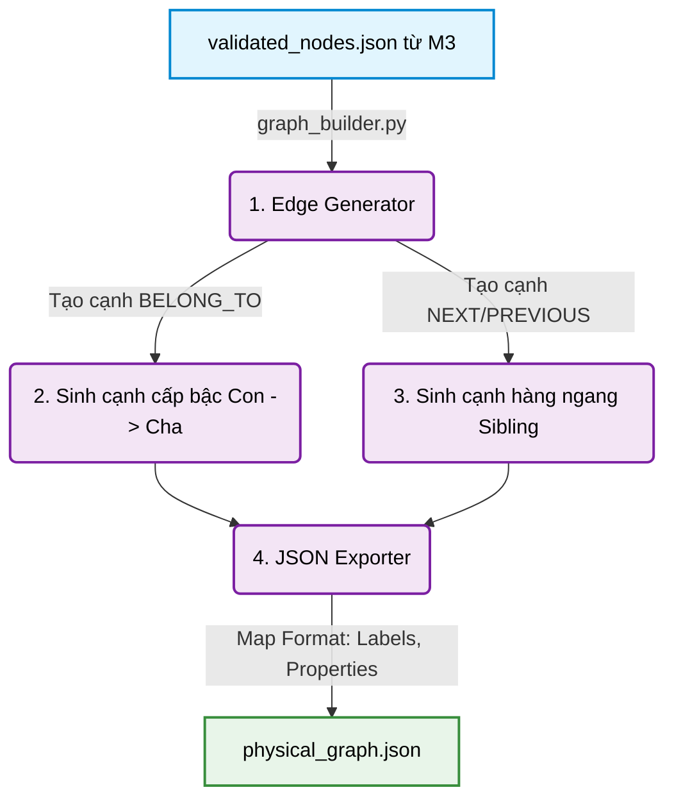

# TỔNG KẾT MODULE 4: XÂY DỰNG ĐỒ THỊ VẬT LÝ (PHYSICAL GRAPH BUILDER)

Module 4 đóng vai trò là **cây cầu nối (Bridge)** mang tính bước ngoặt giữa Physical Pipeline (M1→M2→M3) và Graph Database (Neo4j). Nhiệm vụ của module là nhận mảng node phẳng đã được dán mộc kiểm định (`validated_nodes.json`) từ Module 3, sau đó biến đổi, tính toán và lắp ráp chúng thành một **Đồ thị Vật lý (Physical Graph)** hoàn chỉnh — bao gồm Node và Cạnh có hướng (Directed Edges). Kết quả được xuất ra file `physical_graph.json` theo chuẩn Graph Serialization Format, sẵn sàng 100% để nạp thẳng lên Neo4j.

## 1. Công nghệ và Nguyên tắc thiết kế

- **Ngôn ngữ & Thư viện:** Python 3, **Tiêu chuẩn thư viện lõi (Stdlib-only)** — chỉ dùng `json`, `pathlib`, `dataclasses`, `collections`. Hoàn toàn không phụ thuộc vào bất kỳ thư viện bên ngoài nào (No external dependencies).
- **Nguyên tắc:**
  - **Single Responsibility:** Phân tách rõ ràng chức năng: sinh cạnh (`edge_generator.py`), định dạng JSON (`json_exporter.py`), điều phối (`graph_builder.py`).
  - **100% Deterministic (Tính xác định tuyệt đối):** Với cùng một file đầu vào `validated_nodes.json`, đầu ra `physical_graph.json` luôn giống hệt nhau đến từng byte. Thứ tự tạo cạnh luôn cố định: `BELONG_TO` $\rightarrow$ `NEXT` $\rightarrow$ `PREVIOUS`.
  - **Stateless & Offline:** Module không kết nối Database, không gọi API. Mọi thao tác xử lý hoàn toàn diễn ra trong RAM và ghi xuống ổ cứng.

## 2. Luồng xử lý (Workflow) và Vai trò của các Component

Module 4 được thiết kế theo một Pipeline lắp ráp (Assembly Pipeline) sắc bén:



- **`edge_generator.py` (Trái tim Thuật toán):** Đảm nhiệm việc "vẽ" ra các cạnh nối.
  - *Cạnh Dọc (Hierarchical):* Tạo cạnh `BELONG_TO` từ node con (`source`) lên node cha (`target`) dựa vào `parent_id`.
  - *Cạnh Ngang (Sequential):* Nhóm các anh em cùng cha (Sibling) và nối chúng với nhau bằng `NEXT` và `PREVIOUS`.
- **`json_exporter.py` (Bộ Định dạng Data):** Chuyển đổi dữ liệu thô sang định dạng Graph Node. Map các Type thành mảng `labels = ["LegalNode", type]` và gom mọi metadata vào thẻ `properties` để Neo4j dễ dàng nuốt trọn.
- **`graph_builder.py` (Nhạc trưởng Orchestrator):** Điều phối toàn bộ tiến trình, tải file lên RAM, gọi các class xử lý và cung cấp Command Line Interface (CLI) chuyên nghiệp.
- **`__init__.py`:** Xuất các Class theo chuẩn Lazy Import để ngăn ngừa lỗi vòng lặp (Circular Import) khi chạy module bằng tham số `-m`.

## 3. Các bài toán gặp phải và Cách giải quyết (Challenges)

### 3.1. Bài toán: Đứt gãy luồng đọc (Reading Flow) do sự cố nhảy số pháp lý
- **Vấn đề:** Nếu dùng thuộc tính `position` (số thứ tự logic) để nối các cạnh `NEXT`/`PREVIOUS` giữa các Điểm (Point), ta sẽ gặp thảm họa khi văn bản Luật bị lỗi nhảy số (Ví dụ: đang là Điểm đ, nhảy vọt sang Điểm g, khuyết Điểm e). Nếu nối theo `position`, đồ thị sẽ bị gãy hoặc nối sai trình tự.
- **Cách giải quyết (`edge_generator.py`):** Thiết kế Module 4 từ chối tin tưởng vào Logic pháp lý (`position`), thay vào đó đặt niềm tin tuyệt đối vào **Tọa độ vật lý (Absolute Physical Coordinates)**. Hệ thống sẽ **sort (sắp xếp)** các Node anh em dựa trên `start_idx` (vị trí ký tự bắt đầu của Node trên toàn văn bản) trước khi nối cạnh. Nhờ vậy, cạnh `NEXT` luôn luôn phản ánh đúng 100% dòng chảy đọc (Reading Flow) từ trên xuống dưới của con người, bất chấp văn bản có bị sai số thứ tự.

### 3.2. Bài toán: Rủi ro "Dependency Hell" khi làm việc với Đồ thị
- **Vấn đề:** Khi nghe tới Đồ thị (Graph), phản xạ tự nhiên của lập trình viên là cài đặt ngay các thư viện đồ sộ như `NetworkX` hay `igraph`. Tuy nhiên, điều này biến kiến trúc trở nên phình to, chậm chạp và dễ xung đột thư viện (Dependency Hell).
- **Cách giải quyết:** Thiết lập kỷ luật **Stdlib-only (Chỉ dùng thư viện lõi)**. Xét cho cùng, việc sinh cạnh đồ thị vật lý chỉ là bài toán thao tác trên List và Dict. Module 4 đã giải quyết bài toán với thuật toán cực nhẹ `O(N log N)` (cho việc sorting) hoàn toàn bằng Python thuần. Kết quả: Tốc độ xử lý tính bằng mili-giây (< 1s), không phình to môi trường ảo.

### 3.3. Bài toán: Mất mát Siêu dữ liệu (Metadata Loss) khi chuyển đổi Graph
- **Vấn đề:** Đồ thị Property Graph (như Neo4j) đòi hỏi cấu trúc `labels` và `properties` riêng. Nếu chỉ map Text và Title, chúng ta sẽ mất các thông tin như `law_code`, `depth`, `word_style` vốn rất quan trọng cho việc Search RAG sau này.
- **Cách giải quyết (`json_exporter.py`):** Áp dụng chiến lược **Greedy Properties**. Hệ thống sẽ đẩy TẤT CẢ mọi trường (ngoại trừ `id`, `type`, `parent_id`) nhét toàn bộ vào object `properties`. Chấp nhận file JSON nặng hơn một chút (~310KB) nhưng bù lại Neo4j sẽ sở hữu một hệ thống Metadata Filtering khổng lồ, ví dụ: RAG có thể ra lệnh *"Chỉ tìm trong Node có depth=3 thuộc luật 59/2024"*.

## 4. Đánh giá Kết quả Thực thi (Output Evaluation)

Sau khi kiểm tra file `physical_graph.json`, kết quả đầu ra cho thấy sự thành công rực rỡ của toàn bộ Physical Pipeline (M1 $\rightarrow$ M2 $\rightarrow$ M3 $\rightarrow$ M4):

**1. Mật độ Đồ thị chuẩn mực (Graph Density):**
- Hệ thống nhận `222 nodes` và sinh ra chính xác `551 edges`.
- Chi tiết: `221 cạnh BELONG_TO` (Tất cả node con đều hướng về cha), `165 cạnh NEXT` và `165 cạnh PREVIOUS` (cho các anh em hàng ngang). 
- **Tỉ lệ Edges/Nodes $\approx 2.48$**. Đây là một mật độ Vàng (Golden Ratio) cho một đồ thị phân cấp 5 tầng (Chương $\rightarrow$ Mục $\rightarrow$ Điều $\rightarrow$ Khoản $\rightarrow$ Điểm), vừa đủ sâu sắc để truy vấn, vừa không quá cồng kềnh.

**2. Sẵn sàng 100% cho Database (Neo4j Readiness):**
Cấu trúc JSON sinh ra:
```json
{
  "source": "doc_chuong-iii_muc-1_dieu-26_khoan-1_p223",
  "target": "doc_chuong-iii_muc-1_dieu-26_khoan-2_p365",
  "type": "NEXT",
  "properties": {}
}
```
Thiết kế này cực kỳ sắc sảo. Nó không bắt Neo4j phải suy nghĩ. Ở Module 5 (Ingestion), Neo4j chỉ việc gọi hàm `UNWIND edges AS edge MATCH (s {id: edge.source}), (t {id: edge.target}) MERGE (s)-[:edge.type]->(t)` là toàn bộ 551 cạnh sẽ được ốp thẳng lên CSDL chưa tới 1 giây. Module 4 thực sự là một cú chốt hạ hoàn hảo cho phase xây dựng đồ thị Vật lý.
