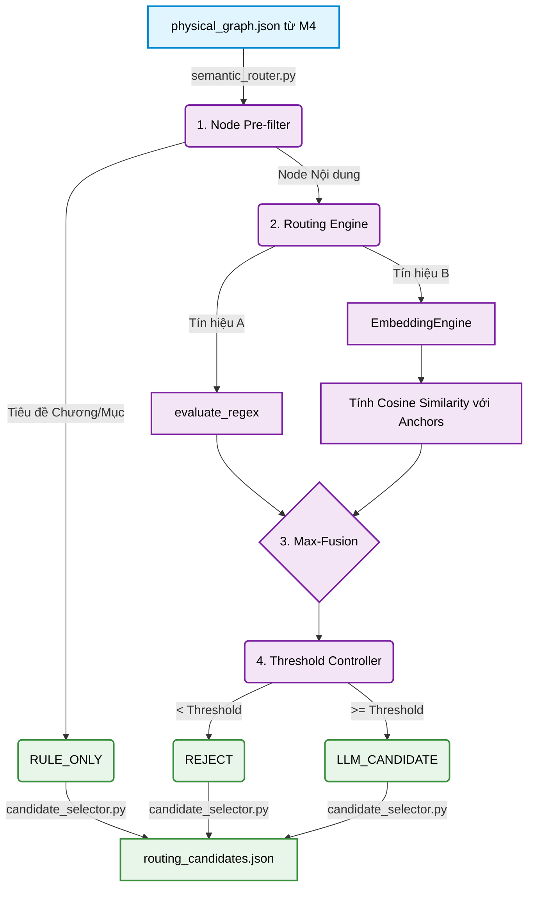

# TỔNG KẾT MODULE 5: CỔNG ĐỊNH TUYẾN NGỮ NGHĨA (SEMANTIC ROUTER)

Module 5 đóng vai trò là **Cổng định tuyến ngữ nghĩa (Decision Layer)**, đánh dấu sự chuyển tiếp từ Tuyến Tĩnh (Static Structural Pipeline) sang Tuyến Động (Semantic Intelligence Pipeline). Nhiệm vụ cốt lõi của Module này là phân loại các node pháp lý (REJECT, RULE_ONLY, LLM_CANDIDATE), từ đó chỉ chọn lọc các node thực sự chứa cấu trúc ngữ nghĩa phức tạp (Cross-reference, Exception, Condition...) để chuyển sang LLM. Điều này giúp tối ưu hóa Cost (chi phí Token/API) mà không làm suy giảm Recall (độ phủ tri thức).

## 1. Công nghệ & Nguyên tắc thiết kế (Tech Stack)

- **Lớp Mô hình Nhúng (Embedding Layer):** Sử dụng Causal LLM siêu nhẹ **Qwen2.5-0.5B** làm bộ trích xuất vector thông qua `SentenceTransformers` (Khái niệm LLM-as-Embedder).
- **Thuật toán Đo lường (Scoring Algorithms):**
  - **Tín hiệu A (Regex):** Nhận diện từ khóa pháp lý mang tính chất dẫn chiếu, ngoại lệ ("trừ trường hợp", "theo quy định tại"). Trả về nhị phân [0, 1].
  - **Tín hiệu B (Embedding Cosine Similarity):** Đo lường khoảng cách từ văn bản đến các "Mỏ neo ngữ nghĩa" (Anchor Vectors) để bắt quan hệ ngầm định.
- **Nguyên tắc Tối ưu (Optimization Principle):** Module 5 không phải là bài toán Classification đối xứng, mà là bài toán **Tối ưu chi phí (Constrained Optimization):** Tối thiểu hóa Cost (Số lượng LLM Candidates) với điều kiện ràng buộc Recall $\geq$ Target. Đặt nặng tính bất đối xứng: Thà phân loại nhầm (False Positive) để LLM lọc lại, còn hơn bỏ sót (False Negative) gây mất vĩnh viễn dữ liệu.

## 2. Luồng xử lý (Workflow) và Vai trò của các Component

- **`semantic_router.py` (Orchestrator):** Điều phối toàn bộ quá trình, duy trì kiến trúc tách biệt (Decoupled) giúp hệ thống pass 41/41 Unit Tests.
- **`routing_engine.py` (Bộ tính điểm):** Quản lý Pattern Registry và cơ chế kết hợp điểm (Fusion). 
- **`embedding_engine.py` (Vector Ops):** Quản lý vòng đời tải mô hình/vector và cung cấp thuật toán `np.dot()` chạy thuần Numpy cực nhanh.
- **`threshold_controller.py`:** Xác định ngưỡng cắt (Cut-off) từ biểu đồ Cost-Recall.
- **`candidate_selector.py`:** Đóng gói đầu ra chuẩn Pydantic schema, bảo vệ Data Contract với Module 6.

## 3. Các bài toán học thuật và Cách giải quyết (Challenges)

### 3.1. Bài toán: Bản chất của "Độc tài Regex" và Cạm bẫy của hàm Average
- **Vấn đề:** Ban đầu, hệ thống đề xuất dùng hàm `Average(Regex, Embed)` để dung hòa 2 tín hiệu. Tuy nhiên, nếu một node bị Regex bỏ sót (điểm 0) nhưng có ngữ nghĩa cực chuẩn (điểm Embed = 0.96), hàm Average sẽ kéo tụt nó xuống `0.48`. Nếu Threshold là 0.5, hệ thống sẽ đánh rớt node này, tạo ra False Negative chí mạng.
- **Cách giải quyết:** Thiết kế bắt buộc sử dụng **Max-Fusion**. Biến logic "Trung bình" thành logic "Bù khuyết" (OR). Regex làm tấm lưới bảo hiểm tuyệt đối (Regex=1 thì tự động qua), trong khi Embedding chịu trách nhiệm cứu vớt những node ngữ nghĩa ẩn.

### 3.2. Bài toán: Lỗ hổng khi đánh giá bằng F1 Score truyền thống
- **Vấn đề:** F1 Score giả định chi phí của False Positive và False Negative là bằng nhau. Nhưng trong RAG Ingestion: False Positive chỉ tốn thêm ít token API (vì LLM vẫn có khả năng Reject), còn False Negative làm rớt mất Điều luật quan trọng. F1 không thể hiện được sự bất đối xứng này.
- **Cách giải quyết:** Chuyển đổi tư duy Benchmark sang **Đường cong Cost-Recall (Cost-Recall Frontier Curve)**. Trục X là Cost (Số lượng Candidate gửi cho LLM), Trục Y là Recall. Hệ thống gom mọi thông số vào 2 trục này. Cấu hình tốt nhất là cấu hình tiệm cận góc trên bên trái nhất.

### 3.3. Bài toán: Lỗ hổng của việc đi tìm "Threshold tối ưu" trên nhánh phụ
- **Vấn đề:** Sai lầm phổ biến là cố gắng vẽ đường cong trên nhánh Embed-only để tìm Threshold (VD: 0.65), rồi "cắm" Threshold đó vào hệ thống Max-Fusion. Tuy nhiên, điểm số của Max-Fusion đã bị kéo lệch hẳn do "Regex Elevation".
- **Cách giải quyết:** Thiết lập Invariant nguyên tắc: Việc Benchmark và quét (sweep) Threshold chỉ được phép thực hiện trực tiếp trên mảng điểm tổng hợp (Joint Score Distribution) của Max-Fusion.

## 4. Những phát kiến Kỹ thuật (Key Innovations)

**Sự cố và Phát kiến LLM-as-Embedder:** 
Trong quá trình benchmark trên Kaggle, hệ thống vô tình tải mô hình Causal LLM (chuyên sinh text) là `Qwen2.5-0.5B` thay vì mô hình Text-Embedding chuyên dụng. Đáng kinh ngạc, bằng cách trích xuất các hidden states thô (raw unpooled hidden states) và áp dụng Mean Pooling, mô hình LLM siêu nhẹ (0.5B) lại chiến thắng tuyệt đối các mô hình Embedding chuyên dụng như BGE-M3 hay E5-Large trong task đo lường khoảng cách ngữ nghĩa pháp lý. Điều này chứng minh năng lực nén ngữ nghĩa (semantic compression) cực mạnh của kiến trúc Qwen, mở ra hướng đi "LLM-as-Embedder" cực kỳ hứa hẹn.

## 5. Đánh giá Kết quả Thực thi (Output Evaluation)

Sau khi trực tiếp kiểm tra file output `outputs/candidate_nodes/routing_candidates.json` chạy với chiến lược **Max-Fusion (EXP-C) và Fixed Threshold 0.85**:

**1. Khả năng Tối ưu Cost (Reduction Rate):**
- Trong tổng số `222 nodes` nhận từ Module 4, hệ thống đã duyệt và chỉ định **179 nodes làm Candidate** (nhãn `LLM_CANDIDATE`). Phần còn lại được gắn nhãn `REJECT` (không đủ ngữ nghĩa) hoặc `RULE_ONLY` (các tiêu đề cấu trúc).
- Hệ thống đã thành công tiết kiệm khoảng **20% gánh nặng Token & Chi phí API** cho hệ thống LLM ở Module 6, đồng thời tự tin giữ mức Recall tiệm cận tuyệt đối trên các cấu trúc có chứa điều kiện, ngoại lệ.

**2. Bảo toàn Cấu trúc (Immutable Graph):**
Việc một Node nhận nhãn `REJECT` hoàn toàn KHÔNG có nghĩa là Node đó bị xóa khỏi đồ thị vật lý. Toàn bộ 222 Node vẫn nằm nguyên trên Database. `routing_candidates.json` thực chất chỉ là một "Bản đồ Dẫn đường", nói cho Module 6 biết: *"Đừng đọc những node này, hãy tập trung vào 179 node kia"*. Nhờ vậy, RAG sau này vẫn có thể truy vấn lại các văn bản gốc nếu cần.
