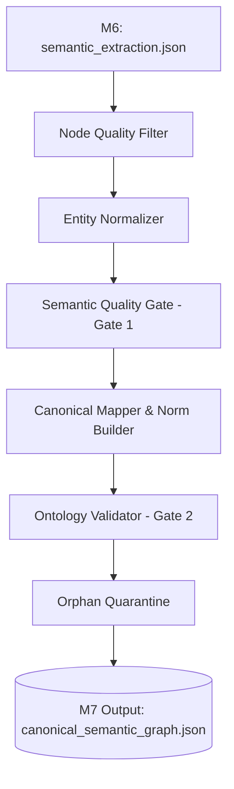

# Tổng kết Module 7 - Ontology Normalization & Canonicalization (Knowledge Base)

Module 7 đóng vai trò là **Canonicalization Authority (Chốt chặn chuẩn hóa)** của hệ thống Hybrid Parser. Nhiệm vụ tối thượng của M7 là chuyển đổi đồ thị ngữ nghĩa cục bộ (phân mảnh) từ Module 6 thành một **Đồ thị Tri thức Pháp lý Chuẩn tắc (Canonical Semantic Graph)**, sẵn sàng để đổ vào Neo4j (Module 8). 

Kiến trúc hiện tại (Pipeline V1.2) là sự hội tụ tinh hoa từ 3 triết lý thiết kế: **Semantic-First** (Tách biệt Type/Token qua NormAssertion), **Coverage-First** (Gom nhóm Alias), và **Quality-First** (Làm sạch đồ thị rác).

---

## 1. Kiến trúc Hệ thống & Thành phần Cốt lõi

Hệ thống được cấu trúc thành một Pipeline tuyến tính khép kín, xử lý từng bước (Defense in Depth) để đảm bảo không lọt dữ liệu rác, nhưng cũng tuyệt đối không xóa dữ liệu hợp lệ (Chỉ Quarantine).

1. **`node_quality_filter.py`**: Lọc rác đầu vào. Block ngay các node có text rỗng, evidence rỗng, thiếu ID. Đảm bảo toàn vẹn cấu trúc.
2. **`entity_normalizer.py`**: Chuẩn hóa thực thể (Canonicalization) sử dụng từ điển `taxonomy_aliases.yaml`. Đặc biệt tích hợp **Boot-time Alias Collision Detection** để phát cảnh báo ngay khi khởi tạo nếu có 2 từ khóa bị trùng lặp cấu hình.
3. **`relation_normalizer.py`**: Chuyển đổi các quan hệ cục bộ, định hình lại ngữ cảnh pháp lý.
4. **`semantic_quality_gate.py` (Gate 1)**: Tiền kiểm tra xung đột vai trò (Role Conflict) và khuếch đại ngữ nghĩa (Semantic Amplification).
5. **`canonical_mapper.py`**: Cầu nối hợp nhất các `LocalMention` thành các `CanonicalConcept` (Các Hub Nodes trung tâm).
6. **`norm_builder.py`**: Động cơ lõi biến đổi các quan hệ đơn giản (như ALLOW/REQUIRE) thành **NormAssertion** (Các Node Quy phạm). Hỗ trợ mạnh mẽ cơ chế **Partial Norm** (Quy phạm khuyết chủ thể).
7. **`reference_classifier.py`**: Phân loại các tham chiếu điều luật (Internal, External, Spatial, v.v.).
8. **`ontology_validator.py` (Gate 2)**: Chốt chặn cuối cùng kiểm tra ma trận Domain-Range.
9. **`orphan_quarantine.py`**: Quét các thực thể mồ côi (không có quan hệ) để đẩy vào Quarantine thay vì xóa bỏ.

---

## 2. Luồng Xử lý (Workflow)

Workflow của Module 7 tuân thủ nghiêm ngặt nguyên tắc **Single Source of Truth** và bảo toàn gốc ngữ cảnh (Edge-Level Provenance):

### Bước ngoặt trong Workflow: Từ Đồ thị Phẳng sang Đồ thị Tri thức (Type-Token)
Thay vì tạo ra các Node khổng lồ chứa mọi thứ, M7 tách đồ thị thành 2 tầng:
- **Tầng Token (LocalMentions)**: Các thực thể "vật lý" bóc ra từ văn bản, siêu nhẹ, giữ lại vị trí gốc (`provenance_node_id`).
- **Tầng Type (CanonicalConcepts)**: Các điểm tụ (Hub) chuẩn hóa. Ví dụ: *"Người gốc Việt Nam"* và *"Việt Kiều"* (2 LocalMentions) sẽ đồng thời trỏ (`DENOTES`) về một CanonicalConcept là `LO2024.SUBJECT.OVERSEAS_VIETNAMESE`.
Điều này chống lại hiện tượng "Entity Explosion" trên Neo4j.

---

## 3. Các Bài Toán Gặp Phải & Cách Giải Quyết

### Bài toán 1: "Modality Loss" (Mất tính quy phạm do khuyết Chủ thể)
- **Tình trạng:** Trong văn bản luật thường sử dụng thể bị động (VD: *"Hợp đồng phải được công chứng"*). M6 V1 bắt buộc phải có `source_id`, dẫn đến LLM một là phải "bịa" ra chủ thể (Hallucination), hai là bỏ luôn quan hệ `REQUIRE` (Modality Loss). Việc này làm mất hẳn thông tin bắt buộc của luật.
- **Giải quyết:** Sửa lại Schema từ M6 đến M7 để hỗ trợ **Partial NormAssertion**. Cho phép `source_id = null` với trạng thái `source_status = "UNRESOLVED"`. M7 sẽ nhận diện và tạo ra một Node Quy phạm "Khuyết chủ thể" (Partial Norm), bảo toàn tuyệt đối chữ "phải" (REQUIRE) để phục vụ tra cứu sau này mà không cần bịa dữ liệu.

### Bài toán 2: Bảo toàn Dữ liệu (Preserve Data) vs Vệ sinh Đồ thị (Graph Hygiene)
- **Tình trạng:** Khi đồ thị có các thực thể xuất hiện 1 lần nhưng không nối với ai (Orphan nodes, degree = 0), triết lý cũ là "Xóa sổ" (Pruning) để đồ thị sạch. Tuy nhiên điều này vi phạm nguyên tắc bảo toàn chứng cứ pháp lý, đôi khi 1 thực thể hiếm gặp vẫn là 1 dữ kiện hợp lệ.
- **Giải quyết:** Loại bỏ cơ chế Pruning, thay bằng **Orphan Quarantine**. Đẩy các node mồ côi hoặc vi phạm Domain-Range vào `quarantine_store`. Những node này không tham gia suy luận RAG (Reasoning), nhưng được giữ lại 100% để con người audit, debug và đo lường độ ảo giác của LLM.

### Bài toán 3: Xung đột Cấu hình (Config Collision)
- **Tình trạng:** Khi file `taxonomy_aliases.yaml` phình to lên hàng trăm dòng, việc kỹ sư nhập liệu vô tình gán 1 từ khóa (ví dụ: "sổ đỏ") cho 2 Concept ID khác nhau (Shotgun Surgery) sẽ làm sập quá trình Normalize.
- **Giải quyết:** Cấy ghép **Boot-time Alias Collision Detection** vào `EntityNormalizer`. Ngay khi script vừa khởi chạy, nó quét toàn bộ YAML và ném ra Exception chặn đứng hệ thống nếu phát hiện xung đột, ép kỹ sư phải sửa config trước khi chạy pipeline.

---

## 4. Kết Quả Output (canonical_semantic_graph.json)

Output của M7 là một file JSON được cấu trúc thành các mảng rõ rệt, tuân thủ tuyệt đối Contract với Module 8:
- **`metadata`**: Chứa toàn bộ tracking về pipeline và report từ bộ lọc rác (VD: `filtered_nodes: 16`).
- **`active_nodes` (Local Mentions)**: Các thực thể cục bộ, đã được gán mã `canonical_concept_id`.
- **`canonical_concepts`**: Các Hub Node đại diện cho taxonomy.
- **`active_norms`**: Các Node Quy phạm (NormAssertion) mang modality (ALLOW/REQUIRE/PROHIBIT) và điều hướng luồng logic (gắn với Subject, Action, Object).
- **`active_edges`**: Các cạnh cấu trúc (`HAS_CONDITION`, `HAS_OBJECT`, `DENOTES`) mang theo bằng chứng pháp lý (Edge-Level Provenance).
- **`quarantine_store`**: Thùng chứa an toàn cho các thực thể/cạnh rác (Thiếu thông tin, sai domain-range).

Sự chuẩn mực và khắt khe của Module 7 (không thỏa hiệp với dữ liệu lỗi) đã đảm bảo Đồ thị Tri thức cuối cùng nạp vào Neo4j (Module 8) đạt chất lượng Enterprise-grade, sẵn sàng đáp ứng mọi truy vấn RAG phức tạp.
