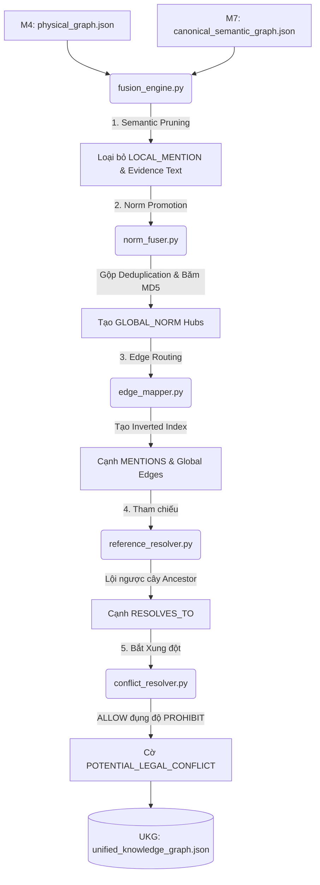

# Tổng kết Module 8: The Fusion Engine (M8 V3.0)

Module 8 (Fusion Engine) đóng vai trò là "Trái tim" hợp nhất của hệ thống Hybrid Parser. Nhiệm vụ tối thượng của M8 là kết hợp **Tầng Vật lý (M4)** và **Tầng Ngữ nghĩa (M7)** thành một **Đồ thị Tri thức Thống nhất (Unified Knowledge Graph - UKG)**. 

Bản nâng cấp **KIẾN TRÚC KÉP M8 V3.0** đã lột xác toàn diện đồ thị, giải quyết triệt để bài toán bùng nổ Token và chuẩn bị một cấu trúc Flat JSON siêu nén, sẵn sàng cho Agentic GraphRAG (Module 9).

---

## 1. Kiến trúc Hệ thống & Luồng Xử lý (Workflow)

Kiến trúc M8 V3.0 được thiết kế quanh 5 trụ cột để dọn rác và thăng cấp dữ liệu. Luồng dữ liệu chạy qua một hệ thống "Phòng vệ chiều sâu" (Defense-in-depth) như sau:

### 5 Trụ cột Cốt lõi:
1. **Đại thanh trừng Ngữ nghĩa (Semantic Pruning):** Tiêu diệt `LOCAL_MENTION` và xóa bỏ Evidence để Tầng 2 đạt trạng thái **0% Raw Text**, ép mọi truy xuất văn bản phải lội ngược về Tầng 1 bằng con trỏ.
2. **Thăng cấp Mệnh đề & Trạm trung chuyển (Norm Promotion):** Gom nhóm quy phạm có chung Subject, Action, Condition thành một "Ngã tư logic" (`GLOBAL_NORM`). Khóa chính được băm bằng MD5 để đảm bảo tính tất định.
3. **Định tuyến Con trỏ & Khử nhiễu Cạnh:** Mũi tên `MENTIONS` bắn thẳng từ Tầng 1 lên Tầng 2 tạo thành Inverted Index hoàn hảo.
4. **Giải mã Tọa độ Không gian:** `reference_resolver.py` lội ngược cây `BELONG_TO` để giải mã các dẫn chiếu chéo và bắn cạnh `RESOLVES_TO` xuống Tầng 1.
5. **Bộ Bắt Xung đột Thế hệ mới:** Tự động phát hiện các luồng `ALLOW` đụng độ với `PROHIBIT` trên cùng Subject/Action mà không có bối cảnh ngoại lệ phân định.

---

## 2. Các Bài Toán Gặp Phải & Cách Giải Quyết

Trong quá trình phát triển (đặc biệt là giai đoạn tích hợp sang M9), hệ thống đã đối mặt với bài toán cực kỳ nguy hiểm là **Silent Data Loss (Thất thoát dữ liệu thầm lặng)**. Dưới đây là các vấn đề và cách giải quyết triệt để:

### Bài toán 2.1: Rò rỉ Partial Norm (I5 Invariant Failure) tại M8
- **Tình trạng:** Hệ thống ghi nhận 102 Norms hợp lệ từ M7, nhưng UKG chỉ sinh ra 77 node `GLOBAL_NORM`. Thuật toán Fusion cũ dùng vòng lặp lồng nhau (nested loops) duyệt qua `subject_ids × action_ids`. Với các "Quy phạm khuyết hành động" (Partial Norms) nơi `action_ids` bị rỗng (`[]`), vòng lặp không bao giờ kích hoạt, khiến toàn bộ dữ liệu bốc hơi không dấu vết.
- **Giải quyết:** Sửa lại logic phân nhánh (branching) trong `m7_adapter.py`. Bắt triệt để các trường hợp `subject_ids != []` và `action_ids == []`. Cập nhật ánh xạ cấu hình từ 1:1 sang **1:N** trong hệ thống Hash-Fusion để một `GLOBAL_NORM` có thể gánh nhiều norm cục bộ.

### Bài toán 2.2: Silent Drop qua Cơ Chế Cypher MATCH tại M9
- **Tình trạng:** Quá trình Ingest node thành công 100%, nhưng Ingest Edge thất bại hoàn toàn (0/1142 edges) mà log không hề báo lỗi. Nguyên nhân do lệnh `MATCH` của Neo4j hoạt động như bộ lọc (Filter). Nếu 1 trong 2 đầu endpoint của Cạnh không tồn tại, kết quả Descartes trả về rỗng, dòng dữ liệu bị hủy bỏ âm thầm.
- **Giải quyết (Per-Row Accounting):** Chuyển từ `MATCH` sang `OPTIONAL MATCH` kết hợp `CALL { ... } UNION`. Kỹ thuật này ép Neo4j phải trả về trạng thái của TỪNG DÒNG. Toán học hóa 6 trạng thái độc lập (`created`, `already_exists`, `missing_source`, v.v.) và nhúng lệnh `assert attempted == SUM(6_trang_thai)` vào code. Bất cứ sự thất thoát nào cũng sẽ làm bẻ gãy Pipeline (`RuntimeError`) ngay lập tức.

### Bài toán 2.3: Thiếu Cổng Kiểm Duyệt Toàn Vẹn (Completeness Gate)
- **Tình trạng:** Khó xác minh xem M8 có làm mất norm nào của M7 không.
- **Giải quyết:** Xây dựng cơ chế mapping truy ngược `prov_to_norms`. Completeness Gate sẽ đối chiếu và chỉ PASSED khi 100% ID của M7 nằm trọn vẹn trong các túi `source_node_ids` của đồ thị M8.

### Bài toán 2.4: Lỗi Tương thích Dynamic Labels trên Neo4j AuraDB
- **Tình trạng:** Tầng Database đám mây (AuraDB 5.x) không hỗ trợ tính năng nội suy label động `SET n:$(...)` của Cypher, gây lỗi khi bơm dữ liệu.
- **Giải quyết:** Triển khai **Python-Allowlist**. Dùng Python để đối chiếu nhãn với Ontology Schema và sinh ra câu lệnh Cypher "cứng" (Hard-coded label). Giải pháp này vừa đảm bảo tương thích ngược vĩnh viễn, vừa chặn đứng rủi ro Cypher Injection.

---

## 3. Đánh giá Kết quả Đầu ra Thực tế

Hệ thống đã chạy thành công trên toàn bộ Chương III Luật Đất đai 2024. Dưới đây là phân tích từ các file đầu ra thực tế:

### 3.1. Quy mô UKG (unified_knowledge_graph.json)
Cấu trúc output được thiết kế thành một **mảng phẳng (Flat JSON)** hoàn hảo, tối ưu hóa triệt để cho Token Limit của LLM.
- **Tổng số Node:** 331 Nodes (222 Node Vật lý, 109 Node GLOBAL_NORM/Concepts).
- **Tổng số Cạnh:** 1142 Edges (551 Cạnh cấu trúc vật lý, 252 Cạnh ngữ nghĩa logic, 339 Cạnh MENTIONS xuyên tầng).

### 3.2. Báo cáo Chất lượng Ontology (fusion_shacl_report.json)
- **Kết quả:** `Conforms: True`
- **Số lỗi:** 0 Lỗi.
- **Kết luận:** Sự khắt khe của Semantic Quality Gate tại M7 và thuật toán Fusion tại M8 đã đảm bảo đồ thị không có bất kỳ mũi tên nào vi phạm Domain/Range của chuẩn Hohfeldian.

### 3.3. Báo cáo Xung đột Pháp lý (fusion_conflicts.json)
Hệ thống đã tóm sống **01 xung đột pháp lý tiềm ẩn**:
- **Đối tượng:** `LO2024.SUBJECT.DOMESTIC_ORGANIZATION`
- **Hành vi:** `LO2024.ACTION.LAND_TRANSFER`
- **Loại xung đột:** `ALLOW_PROHIBIT`
- **Chi tiết:** Phát hiện các luồng `ALLOW` đụng độ với `PROHIBIT` tại cụm 7 `GLOBAL_NORM` khác nhau (Ví dụ: `GNORM_f67ac3...`, `GNORM_0ded72...`), trong bối cảnh các điều kiện đang bị bỏ trống hoặc trùng lặp (`SAME_OR_UNSPECIFIED_CONDITIONS`).

Cờ đỏ `POTENTIAL_LEGAL_CONFLICT` này chính là nguyên liệu quý giá để hệ thống Agentic GraphRAG (M9) tiến hành suy luận và tư vấn rủi ro pháp lý cho người dùng cuối.
