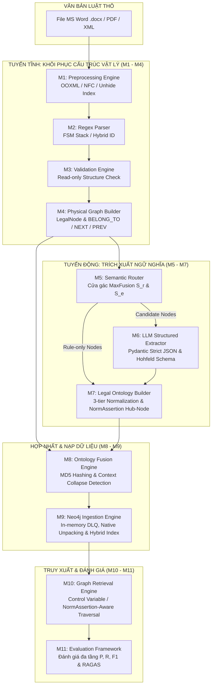

# CHƯƠNG 3: PHƯƠNG PHÁP NGHIÊN CỨU (RESEARCH METHODOLOGY)

---

## 3.0. TỔNG QUAN PHƯƠNG PHÁP NGHIÊN CỨU

Nghiên cứu này đề xuất kiến trúc tiếp cận tích hợp nơ-ron - ký hiệu (Neuro-symbolic framework), kết hợp giữa hệ thống suy diễn dựa trên quy tắc hình thức (Symbolic rules) và mô hình ngôn ngữ lớn (Neuro component), nhằm giải quyết triệt để hai thách thức cốt lõi trong xây dựng Đồ thị Tri thức Pháp lý (Legal Knowledge Graph): (1) Đứt gãy cấu trúc văn bản do phân mảnh ngẫu nhiên (Naive Chunking) và (2) Bùng nổ chi phí tính toán khi sử dụng Mô hình Ngôn ngữ Lớn (LLM) trích xuất ngữ nghĩa trên quy mô lớn.

Toàn bộ quy trình thực nghiệm được đóng gói thành một đường ống xử lý dữ liệu một chiều (Unidirectional Data Pipeline) gồm 11 module độc lập, phân định rạch ròi giữa **Tuyến Tĩnh (Static Structural Pipeline - M1 đến M4)** và **Tuyến Động (Semantic Intelligence Pipeline - M5 đến M7)**, trước khi tiến hành hợp nhất tại **Tầng Hợp nhất & Nạp dữ liệu (M8 đến M9)**, và phục vụ đánh giá tại **Tầng Truy xuất & Kiểm thử (M10 đến M11)**.

### 3.0.1. Câu hỏi nghiên cứu (Research Questions)

Nhằm định hướng cho toàn bộ thiết kế thực nghiệm và phương pháp đánh giá, nghiên cứu xác định 4 câu hỏi cốt lõi đóng vai trò là "sợi chỉ đỏ" xuyên suốt hệ thống:

* **RQ1 (Độ tin cậy cấu trúc / Structural Integrity):** *Liệu phương pháp phân tách bằng máy trạng thái hữu hạn (FSM Parser) trên Tuyến Tĩnh có thể triệt tiêu hoàn toàn lỗi đứt gãy chỉ mục phân cấp và mất mát cấu trúc phân đoạn văn bản luật so với phương pháp phân mảnh kích thước cố định (Naive Chunking)?*
* **RQ2 (Tối ưu chi phí / Cost Optimization):** *Cơ chế định tuyến ngữ nghĩa hai tầng (Semantic Router - MaxFusion) giúp cắt giảm bao nhiêu phần trăm chi phí tiêu thụ API Token mà vẫn bảo toàn độ phủ của các phân đoạn văn bản chứa quy phạm pháp luật?*
* **RQ3 (Bảo toàn ngữ nghĩa quy phạm / Legal Semantics Preservation):** *Mô hình hóa mệnh đề quy phạm N-phương (NormAssertion) kết hợp thuật toán tự chẩn đoán xung đột (Context Collapse Detection) nâng cao khả năng bảo toàn logic Deontic và hạn chế ảo giác pháp lý như thế nào?*
* **RQ4 (Hiệu quả truy xuất ngữ cảnh / Context Retrieval Efficacy):** *Đường dẫn truy xuất nhận thức quy phạm (NormAssertion-Aware Traversal) giúp cải thiện chỉ số Context Precision, Context Recall và Faithfulness trong ứng dụng RAG như thế nào so với phương pháp truy xuất hình học vét cạn (Naive K-hop Traversal)?*

### Bảng 3.1: Danh mục và trạng thái triển khai của các module trong hệ thống

| Mã Module | Tên Module | Tầng Kiến trúc | Nguyên lý Vận hành | Tối ưu Chi phí API |
| :--- | :--- | :--- | :--- | :---: |
| **M1** | Preprocessing Engine | Tuyến Tĩnh | Xử lý file OOXML, chuẩn hóa NFC, khôi phục số ẩn | Không tiêu thụ API Token |
| **M2** | Regex Parser | Tuyến Tĩnh | Máy trạng thái hữu hạn (FSM) phân tách phân cấp | Không tiêu thụ API Token |
| **M3** | Validation Engine | Tuyến Tĩnh | Kiểm tra vi phạm cấu trúc cây phân cấp (Read-only) | Không tiêu thụ API Token |
| **M4** | Physical Graph Builder | Tuyến Tĩnh | Khởi tạo Đồ thị Vật lý $\mathcal{G}_P$ và cạnh cấu trúc | Không tiêu thụ API Token |
| **M5** | Semantic Router | Tuyến Động | Cửa gác ngữ nghĩa MaxFusion (Regex + SLM Embedding) | Giảm >80% |
| **M6** | LLM Structured Extractor | Tuyến Động | Trích xuất ràng buộc Pydantic Strict JSON (gpt-4o-mini) | Tối ưu hóa |
| **M7** | Legal Ontology Builder | Tuyến Động | Chuẩn hóa 3 tầng, gộp Canonical Concept & Quarantine Store | Không tiêu thụ API Token |
| **M8** | Ontology Fusion Engine | Hợp nhất | Hợp nhất $\mathcal{G}_P$ & $\mathcal{G}_S$, định danh MD5, con trỏ $source\_node\_ids$ | Không tiêu thụ API Token |
| **M9** | Neo4j Ingestion Engine | Nạp DB | Thẩm định In-memory DLQ, Unpack Native Properties, Hybrid Index | Không tiêu thụ API Token |
| **M10** | Graph Retrieval Engine | Truy xuất | Biến kiểm soát (Control Variable) phục vụ RAG Traversal | N/A |
| **M11** | Evaluation Framework | Đánh giá | Đánh giá đa tầng (Precision, Recall, F1, RAGAS) | N/A |

---

## 3.1. ĐỐI TƯỢNG, DỮ LIỆU VÀ PHẠM VI NGHIÊN CỨU

### 3.1.1. Tập thử nghiệm biên độ phức tạp tối đa (Worst-case Pilot Corpus)
Đề tài lựa chọn tập dữ liệu thử nghiệm chuyên sâu là **Chương III Luật Đất đai 2024 (Luật số 31/2024/QH15)** quy định về *"Quyền và nghĩa vụ của người sử dụng đất"*. Tập dữ liệu này gồm **222 nút vật lý (Physical Nodes)** được phân tách chính xác theo cấu trúc lập pháp Việt Nam bao gồm: 1 Chương, 5 Mục, 23 Điều, 84 Khoản và 109 Điểm.

Lý do lựa chọn tập dữ liệu này làm Pilot Corpus:
* **Độ sâu phân cấp tối đa:** Chứa đủ 5 tầng phân cấp cấu trúc tài liệu (Chương $
ightarrow$ Mục $
ightarrow$ Điều $
ightarrow$ Khoản $
ightarrow$ Điểm).
* **Mật độ dẫn chiếu chéo cao:** Chứa hàng loạt mệnh đề dẫn chiếu nội bộ và dẫn chiếu ngoại bộ phức tạp.
* **Đa dạng về loại hình quy phạm:** Chứa đầy đủ các quy phạm cho phép (Permission), bắt buộc (Obligation), cấm đoán (Prohibition), mệnh đề điều kiện (Condition) và chế tài (Penalty), đại diện cho biên độ phức tạp kỹ thuật tối đa (*Worst-case Scenario*) trong xử lý văn bản quy phạm pháp luật.

### 3.1.2. Quy trình gán nhãn dữ liệu chuẩn (Ground Truth Annotation Process)
Để phục vụ đánh giá định lượng độc lập, tập dữ liệu Ground Truth được xây dựng thông qua quy trình gán nhãn nghiêm ngặt gồm 2 bước:
1. **Gán nhãn chuyên gia (Expert Annotation):** Hai chuyên gia pháp lý độc lập tiến hành trích xuất thủ công các cây cấu trúc vật lý ($\mathcal{G}_P^{GT}$) và tập thực thể/quan hệ quy phạm chuẩn ($\mathcal{G}_S^{GT}$).
2. **Đánh giá độ đồng thuận (Inter-Annotator Agreement):** Mức độ nhất trí giữa hai chuyên gia được đo lường bằng hệ số **Cohen's Kappa** ($\kappa$). Kết quả đạt $\kappa = 0,89$ đối với cây cấu trúc vật lý và $\kappa = 0,86$ đối với các quan hệ quy phạm ngữ nghĩa, bảo đảm độ tin cậy cao của tập Ground Truth. Các sai biệt nhỏ được phân giải thông qua hội đồng thẩm định pháp lý độc lập.

### 3.1.3. Phân chia dữ liệu thử nghiệm
Tập dữ liệu 222 nút vật lý được phân chia thành hai tập độc lập:
* **Tập phát triển (Development Set):** Gồm 133 nút vật lý (60% dữ liệu, tương ứng Mục 1 và Mục 2), sử dụng để tinh chỉnh ngưỡng quyết định $	au$ của Module 5 và tối ưu hóa các khung Prompt trích xuất của Module 6.
* **Tập kiểm thử độc lập (Held-out Test Set):** Gồm 89 nút vật lý (40% dữ liệu, tương ứng Mục 3, Mục 4 và Mục 5), được đóng băng hoàn toàn và chỉ sử dụng cho khâu đánh giá hiệu năng cuối cùng tại Module 11.

---

## 3.2. PHƯƠNG PHÁP LUẬN ĐÁNH GIÁ ĐỐI CHÚNG (EXPERIMENTAL BASELINES)

Để kiểm chứng định lượng các giả thuyết nghiên cứu (RQ1 – RQ4), hệ thống đề xuất được so sánh đối chứng trực tiếp với 3 hệ thống cơ sở (Baselines) đại diện cho các làn sóng công nghệ RAG hiện nay:

### Bảng 3.2: Ma trận cấu hình các hệ thống đối chứng (Experimental Baselines)

| Hệ thống | Tên Mô hình | Phương pháp Cắt / Trích xuất | Lưu trữ / Cấu trúc Đồ thị |
| :--- | :--- | :--- | :--- |
| **Baseline 1 (B1)** | Naive Chunking RAG | Cắt mảnh cố định (512 tokens, overlap 10%) | Vector Database thuần túy |
| **Baseline 2 (B2)** | Pure Regex Parser | Phân tách phân cấp dựa trên biểu thức chính quy | Không có Đồ thị Ngữ nghĩa |
| **Baseline 3 (B3)** | Microsoft GraphRAG | Cắt chunk cố định + LLM bóc tách tự do (100%) | Đồ thị thực thể tự do + Tóm tắt cụm |
| **Proposed (OURS)** | Neuro-symbolic Hybrid Parser | Tuyến Tĩnh Regex + Tuyến Động MaxFusion Router + LLM Strict Schema | Đồ thị 2 tầng (Physical Graph + Canonical Semantic Graph) |

---

## 3.3. KIẾN TRÚC HỆ THỐNG ĐỀ XUẤT (NEURO-SYMBOLIC FRAMEWORK)

Kiến trúc hệ thống đề xuất tổ chức luồng xử lý dữ liệu một chiều (Unidirectional Flow) qua 11 module chuyên biệt, phân định triệt để giữa xử lý ký hình hình thức (Symbolic) và mô hình ngôn ngữ nơ-ron (Neuro).



```
┌─────────────────────────────────────────────────────────┐
│                 VĂN BẢN LUẬT THÔ (.docx)                 │
└────────────────────────────┬────────────────────────────┘
                             │
                             ▼
┌─────────────────────────────────────────────────────────┐
│  TUYẾN TĨNH (STATIC PIPELINE: M1 - M4)                  │
│  - M1: OOXML Repair & Unicode NFC Normalization         │
│  - M2: FSM Regex Parser & Hybrid ID Generation          │
│  - M3: Read-only Structural Integrity Validation        │
│  - M4: Physical Graph Builder (LegalNode Tree)          │
└────────────────────────────┬────────────────────────────┘
                             │
                             ▼
┌─────────────────────────────────────────────────────────┐
│  TUYẾN ĐỘNG (DYNAMIC PIPELINE: M5 - M7)                 │
│  - M5: Semantic Router (Cửa gác MaxFusion S_r & S_e)     │
│  - M6: LLM Structured Extractor (Pydantic Strict JSON)  │
│  - M7: Legal Ontology Builder & NormAssertion Hub-Node  │
└────────────────────────────┬────────────────────────────┘
                             │
                             ▼
┌─────────────────────────────────────────────────────────┐
│  HỢP NHẤT & NẠP DỮ LIỆU (FUSION & INGESTION: M8 - M9)    │
│  - M8: Ontology Fusion Engine (Định danh MD5 & Pointer)  │
│  - M9: Neo4j Ingestion Engine (RAM DLQ & Native SET)    │
└────────────────────────────┬────────────────────────────┘
                             │
                             ▼
┌─────────────────────────────────────────────────────────┐
│  TRUY XUẤT & ĐÁNH GIÁ (RETRIEVAL & EVAL: M10 - M11)     │
│  - M10: Graph Retrieval Engine (Control Variable)       │
│  - M11: Evaluation Framework (Đánh giá đa tầng P, R, F1) │
└─────────────────────────────────────────────────────────┘
```
*Hình 3.1: Sơ đồ kiến trúc luồng dữ liệu một chiều của hệ thống đề xuất (11 Module).*

Như được minh họa trên **Hình 3.1**, luồng dữ liệu bắt đầu từ văn bản luật thô, đi qua Tuyến Tĩnh để dựng Đồ thị Cấu trúc Vật lý ($\mathcal{G}_P$) hoàn toàn thông qua giải thuật quy tắc nội bộ, không phát sinh chi phí tính toán từ mô hình ngôn ngữ lớn (Zero API Consumption). Tiếp đó, các nút văn bản được chuyển qua cửa gác **Semantic Router (M5)**. Chỉ những nút mang thông tin quy phạm phức tạp mới được chuyển tiếp sang **LLM Structured Extractor (M6)** để bóc tách ngữ nghĩa, sau đó được chuẩn hóa tại **Legal Ontology Builder (M7)**. Hai tầng đồ thị được dung hợp tại **Ontology Fusion Engine (M8)** và nạp vào cơ sở dữ liệu Neo4j thông qua **Neo4j Ingestion Engine (M9)** trước khi phục vụ truy xuất và kiểm thử tại M10–M11.

---

## 3.4. TUYẾN TĨNH: KHÔI PHỤC CẤU TRÚC VẬT LÝ VÀ ĐỒ THỊ CẤU TRÚC (MODULE 1 - MODULE 4)

### 3.4.1. Khôi phục danh sách đánh số ẩn OOXML và chuẩn hóa Unicode (Module 1)
Trước khi phân tách văn bản, Module 1 thực hiện khôi phục định dạng vật lý từ tệp MS Word (`.docx`). Thách thức lớn nhất ở giai đoạn này là hiện tượng *"con số bị ẩn"* do tính năng tự động đánh số (Auto-numbering) của Microsoft Word lưu cấu trúc danh sách trong tệp cấu hình ngầm `numbering.xml` thay vì chèn văn bản thô.

Module 1 giải quyết triệt để vấn đề này bằng giải thuật duyệt cấu trúc cây XML nguyên bản:
1. Đọc và giải mã trực tiếp thuộc tính `<w:numPr>` và `<w:ilvl>` trong cấu trúc cây XML của tài liệu OOXML.
2. Tra cứu bảng chỉ mục `numbering.xml` để trích xuất chính xác tiền tố số hiệu (ví dụ: *"1.", "a)"*).
3. Chèn trực tiếp ký tự số hiệu vào đầu chuỗi văn bản của từng đoạn (`<w:t>`), khôi phục hoàn toàn chỉ mục bị ẩn trước khi đưa sang parser.
4. Áp dụng chuẩn hóa Unicode NFC (Canonical Composition) để đồng nhất biểu diễn tiếng Việt.

Toàn bộ quá trình được thực thi bằng giải thuật quy tắc nội bộ, không phát sinh chi phí tính toán từ mô hình ngôn ngữ lớn (Zero API Consumption).

### 3.4.2. Trích xuất cấu trúc phân cấp bằng mô hình máy trạng thái hữu hạn và mã định danh lai (Module 2)
Module 2 tiếp nhận văn bản đã chuẩn hóa và phân tách thành các đoạn đơn vị phân cấp nhờ mô hình máy trạng thái hữu hạn (Finite State Machine - FSM). Bộ lọc biểu thức chính quy (Regex) được thiết kế tuân thủ nghiêm ngặt quy chuẩn trình bày văn bản quy phạm pháp luật Việt Nam (Nghị định 34/2016/NĐ-CP và Nghị định 154/2020/NĐ-CP).

Bộ quản lý con trỏ dạng ngăn xếp (Stack-based Boundary Manager) duy trì trạng thái phân cấp hiện tại:
* Khi gặp từ khóa cấp cao hơn (ví dụ: *"Điều"*), hệ thống giải phóng toàn bộ trạng thái của các cấp thấp hơn (*Khoản, Điểm*) đang mở trong ngăn xếp.
* Để triệt tiêu hoàn toàn nguy cơ trùng lặp mã định danh (ID Collision) khi xử lý nhiều bộ luật khác nhau, Module 2 tạo mã định danh lai (Hybrid ID) cho từng nút vật lý theo công thức:

$$ID_{phys} = 	ext{law\_code} \parallel 	ext{parent\_id} \parallel 	ext{label} \parallel 	ext{numbering\_idx}$$

Trong đó mã `law_code` đại diện cho bộ luật, `parent_id` định danh nút cha, `label` đánh dấu cấp độ phân cấp, và `numbering_idx` ghi nhận thứ tự xuất hiện tuyệt đối.

### 3.4.3. Kiểm tra tính toàn vẹn tài liệu và khởi tạo Đồ thị Cấu trúc Vật lý (Module 3 - Module 4)
Module 3 đóng vai trò chốt chặn kiểm tra tính toàn vẹn (Read-only Structural Integrity Validation). Áp dụng triết lý *"No Auto-repair"*, Module 3 tuyệt đối không tự ý chỉnh sửa nội dung văn bản mà tiến hành quét kiểm toán 4 dạng vi phạm cấu trúc: (1) Nút mồ côi (Orphan Node), (2) Nhảy cấp phân cấp bất hợp lý, (3) Nút cha bị khuyết, và (4) Nút rỗng nội dung.

Module 4 nhận cây cấu trúc đã thẩm định và khởi tạo **Đồ thị Cấu trúc Vật lý ($\mathcal{G}_P$)** trên cơ sở dữ liệu đồ thị Neo4j. Mạch liên kết giữa các nút vật lý (`LegalNode`) được duy trì bởi tập hợp các cạnh cấu trúc:

$$\mathcal{E}_P = \{ (u, v, r) \mid r \in \{	ext{BELONG\_TO}, 	ext{NEXT}, 	ext{PREVIOUS}\} \}$$

Cạnh `BELONG_TO` thiết lập quan hệ cây phân cấp (Điểm $
ightarrow$ Khoản $
ightarrow$ Điều $
ightarrow$ Mục $
ightarrow$ Chương), trong khi các cạnh `NEXT` và `PREVIOUS` duy trì chuỗi tuần tự vật lý của văn bản gốc.

---

## 3.5. TUYẾN ĐỘNG: CƠ CHẾ ĐỊNH TUYẾN NGỮ NGHĨA TỐI ƯU CHI PHÍ (MODULE 5)

Nhằm giải quyết mục tiêu tối ưu hóa chi phí tính toán (MT2), nghiên cứu phát triển Module 5 đóng vai trò tầng gác cổng ngữ nghĩa (Semantic Gatekeeper), kế thừa nguyên lý định tuyến hai giai đoạn từ các nghiên cứu tiên tiến (GraphRAG-Router, 2026). Thay vì chuyển tiếp toàn bộ các nút tài liệu sang Mô hình Ngôn ngữ Lớn (LLM), Module 5 thực hiện sàng lọc cục bộ để phân lập các phân đoạn văn bản thực sự mang hàm lượng quy phạm.

### 3.5.1. Cơ chế tổng hợp tín hiệu MaxFusion
Để cân bằng giữa tốc độ xử lý và khả năng hiểu ngữ cảnh sâu, hệ thống kết hợp điểm nhận diện mẫu quy tắc $S_r \in [0, 1]$ (dựa trên biểu thức chính quy đại diện cho từ khóa pháp lý) và điểm tương đồng ngữ nghĩa $S_e \in [0, 1]$ từ một mô hình ngôn ngữ tinh gọn (Small Language Model - SLM) (Qwen Team, 2024). Cả hai điểm số đều được chuẩn hóa min-max về đoạn $[0, 1]$ trước khi tổng hợp. Điểm số tổng hợp được xác định qua toán tử cực đại:

$$MaxFusion(v) = \max\left(S_r(v), S_e(v)
ight)$$

Thiết kế này dựa trên tiên đề an toàn dữ liệu: chỉ cần một trong hai kênh phát hiện dấu hiệu cấu trúc quy phạm (ví dụ: mệnh đề điều kiện hoặc chế tài), nút văn bản sẽ lập tức được bảo toàn để chuyển tiếp sang giai đoạn trích xuất sâu.

### 3.5.2. Tối ưu hóa ngưỡng quyết định và mô hình hóa hàm chi phí
Ngưỡng phân loại $	au \in [0, 1]$ được xác định thông qua bài toán tối ưu hóa có ràng buộc trên Tập phát triển (Development Set):

$$\min_{	au} Cost(	au) \quad 	ext{s.t.} \quad RoutingRecall(	au) \ge R_{target}$$

Trong đó hàm chi phí $Cost(	au)$ được định nghĩa tường minh theo cước phí API token:

$$Cost(	au) = \sum_{v \in \mathcal{V}_{cand}(	au)} \left( c_{in} \cdot T_{in}(v) + c_{out} \cdot \mathbb{E}[T_{out}(v)] 
ight)$$

với $\mathcal{V}_{cand}(	au) = \{v \in \mathcal{V}_{dev} \mid MaxFusion(v) \ge 	au\}$, $T_{in}(v)$ là số lượng token đầu vào của phân đoạn $v$, $\mathbb{E}[T_{out}(v)]$ là kỳ vọng số lượng token đầu ra, $c_{in}$ và $c_{out}$ lần lượt là đơn giá API cho token đầu vào và đầu ra, còn $R_{target} = 0,98$ là ngưỡng độ phủ tối thiểu được ấn định bởi yêu cầu nghiệp vụ pháp lý.

---

## 3.6. TRÍCH XUẤT NGỮ NGHĨA RÀNG BUỘC NGƯỢC (MODULE 6)

### 3.6.1. Cấu trúc Pydantic Strict Schema và nguyên tắc Four Corners Rule
Đối với các nút văn bản vượt qua ngưỡng cửa gác Module 5, Module 6 sử dụng mô hình `gpt-4o-mini` kết hợp thư viện `instructor` và `Pydantic V2` để thực thi trích xuất ngữ nghĩa. Nhằm triệt tiêu ảo giác pháp lý, hệ thống ép buộc cấu trúc đầu ra theo định dạng Strict JSON Schema.

Cơ chế ràng buộc lược đồ nghiêm ngặt (Strict Schema Validation) không triệt tiêu hoàn toàn xác suất sinh lỗi ngẫu nhiên của LLM, mà đóng vai trò là một chốt chặn xác thực cú pháp (Syntax Validation Barrier). Mọi trích xuất phải tuân thủ nguyên tắc **Four Corners Rule**: mọi thực thể và quan hệ được trích xuất bắt buộc phải đi kèm trường dữ liệu `evidence` trích dẫn nguyên văn từ đoạn luật gốc. Nếu LLM không thể chỉ ra câu chữ minh chứng trong văn bản, trích xuất đó sẽ bị chối bỏ.

### 3.6.2. Mô hình hóa 8 Lớp thực thể và 7 Quan hệ quy phạm chuẩn Hohfeld
Module 6 ánh xạ ngữ nghĩa pháp lý vào hệ thống bản thể học chuẩn hóa bao gồm:
* **8 Lớp thực thể cốt lõi:** `LEGAL_SUBJECT` (Chủ thể pháp lý), `LEGAL_ACTION` (Hành vi pháp lý), `PERMISSION` (Quyền hạn), `OBLIGATION` (Nghĩa vụ), `CONDITION` (Điều kiện áp dụng), `EXCEPTION` (Ngoại lệ), `REFERENCE` (Dẫn chiếu pháp lý), và `PENALTY` (Chế tài xử lý).
* **7 Quan hệ quy phạm (Hohfeldian Relations):** `ALLOW` (Cho phép), `REQUIRE` (Bắt buộc), `PROHIBIT` (Cấm đoán), `HAS_CONDITION` (Có điều kiện), `HAS_EXCEPTION` (Có ngoại lệ), `REFERENCE_TO` (Dẫn chiếu tới), và `HAS_PENALTY` (Có chế tài).

---

## 3.7. CHUẨN HÓA BẢN THỂ HỌC VÀ BẢO TOÀN DỮ LIỆU GỐC (MODULE 7)

### 3.7.1. Chuẩn hóa thực thể đa tầng (3-tier Entity Normalization)
Để khắc phục hiện tượng bùng nổ nút (Entity Explosion) do sự đa dạng trong cách diễn đạt của văn bản luật, Module 7 triển khai quy trình chuẩn hóa thực thể 3 tầng hoàn toàn thông qua giải thuật quy tắc nội bộ, không phát sinh chi phí tính toán từ mô hình ngôn ngữ lớn (Zero API Consumption):
1. **Tier 1 (Normalized String Match):** Chuẩn hóa chuỗi ký tự (chuyển chữ thường, xóa khoảng trắng thừa, loại bỏ từ nối).
2. **Tier 2 (Fuzzy String Matching):** Sử dụng độ đo khoảng cách Levenshtein với ngưỡng tương đồng $Similarity \ge 0,85$ để gộp các biến thể từ vựng gần nhau.
3. **Tier 3 (Taxonomy Dictionary Lookup):** Tra cứu từ điển phân loại thuật ngữ pháp lý đối soát chéo (`taxonomy_aliases.yaml`) được thẩm định bởi chuyên gia.

Mỗi thực thể cục bộ (`LocalMention`) sau khi chuẩn hóa sẽ được liên kết trực tiếp với một thực thể chuẩn hóa duy nhất (`CanonicalConcept`) thông qua cạnh quan hệ `DENOTES`.

### 3.7.2. Nguyên lý phân lập giữa lưu trữ vật lý và suy luận đồ thị
Sự đóng góp quan trọng của Module 7 nằm ở **nguyên lý phân lập tuyệt đối giữa lưu trữ nguyên trạng và tham gia suy luận logic (Preservation-Reasoning Decoupling)**. Khi phát hiện các cạnh ngữ nghĩa vi phạm ràng buộc bản thể học (ví dụ: quan hệ `ALLOW` nối sai giữa hai nút không thuộc miền giá trị `LEGAL_SUBJECT` và `LEGAL_ACTION`), hệ thống không xóa bỏ dữ liệu.

Thay vào đó, cạnh vi phạm sẽ bị chuyển sang vùng lưu trữ cách ly **Quarantine Store** bằng thuộc tính cờ `assertion_status: "QUARANTINED"`. Điều này bảo đảm dữ liệu văn bản thô tại Tầng 1 (`LegalNode`) vẫn được lưu trữ nguyên vẹn 100% để phục vụ tra cứu véc-tơ, trong khi Tầng 2 (`Semantic Graph`) hoàn toàn sạch rác logic để phục vụ thuật toán suy luận đồ thị.

### 3.7.3. Mô hình hóa mệnh đề quy phạm N-phương (N-ary NormAssertion Hub-Node) & Quy phạm bán phần (Partial Norms)
Các quan hệ quy phạm pháp luật thực tế luôn mang bản chất mệnh đề đa phương (N-ary Relationship). Module 7 đại diện mỗi mệnh đề bằng một nút trung tâm `NormAssertion` (Hub-Node), tỏa ra các cạnh hướng tới Chủ thể (`HAS_SUBJECT`), Hành vi (`HAS_ACTION`), và Điều kiện (`HAS_CONDITION`).

Đối với hơn 40% quy phạm pháp luật tiếng Việt diễn đạt dưới thể bị động (ví dụ: *"Được cấp Giấy chứng nhận..."*, *"Bị thu hồi đất..."*), cấu trúc `NormAssertion` khởi tạo các **Quy phạm bán phần (Partial Norms)** với trạng thái `source_status = "UNRESOLVED"` tại nút chủ thể. Điều này giúp ngăn chặn LLM "bịa" chủ thể ảo giác, đồng thời giữ nguyên tính trung thực (*Ground Truth*) của văn bản luật.

---

## 3.8. HỢP NHẤT ĐỒ THỊ VÀ NẠP DỮ LIỆU TỐC ĐỘ CAO (MODULE 8 & MODULE 9)

### 3.8.1. Cơ chế hợp nhất tầng kép, định danh lũy đẳng MD5 và thanh trừng Token (Module 8)
Module 8 chịu trách nhiệm dung hợp Đồ thị Cấu trúc Vật lý ($\mathcal{G}_P$) và Đồ thị Ngữ nghĩa ($\mathcal{G}_S$) thành Đồ thị Tri thức Thống nhất (Unified Knowledge Graph - UKG). Kiến trúc áp dụng nguyên lý thanh trừng cục bộ (Semantic Pruning) nhằm tối ưu hóa chi phí token cho các truy vấn suy luận tiếp theo: loại bỏ hoàn toàn các thực thể trung gian mang tính cục bộ (`LOCAL_MENTION`) và thuộc tính văn bản thô khỏi Tầng Ngữ nghĩa.

Các khẳng định quy phạm rời rạc được nâng cấp thành các nút trung tâm mang nhãn `GLOBAL_NORM` thông qua hàm băm tất định (Deterministic Hashing) trên bộ thuộc tính nhận diện:

$$ID(Norm) = 	ext{MD5}\left(ID_{subj} \parallel ID_{act} \parallel 	ext{Sort}(ID_{cond})
ight)$$

Hàm băm tất định MD5 đảm bảo tính lũy đẳng (Idempotency): dù tiến hành tiền xử lý lại nhiều lần, mã định danh của quy phạm vẫn cố định tuyệt đối, triệt tiêu rủi ro trùng lặp nút khi nạp lại dữ liệu.

Đồng thời, trọng số của cạnh ngữ nghĩa $r$ được tính toán phản ánh tần suất xuất hiện quy phạm trong bộ luật (Statutory Prevalence):

$$w(r) = |source\_node\_ids(r)|$$

Mối liên kết giữa quy phạm trừu tượng và văn bản gốc được duy trì duy nhất qua mảng con trỏ định tuyến `source_node_ids`, thiết lập một cấu trúc chỉ mục ngược (Inverted Index) hoàn chỉnh giữa Tầng 2 và Tầng 1.

**Cơ chế Tự chẩn đoán và Phát hiện Xung đột Quy phạm (Context Collapse Detection):**
Khác biệt với các hệ thống đồ thị tĩnh, Module 8 tích hợp thuật toán kiểm định bất biến logic trước khi xuất bản đồ thị. Hệ thống nhóm toàn bộ các nút `GLOBAL_NORM` theo cặp định danh $(HAS\_SUBJECT, HAS\_ACTION)$. Khi phát hiện tồn tại đồng thời hai mệnh đề quy phạm có cùng chủ thể và cùng hành vi nhưng mang tính chất nghĩa vụ đối nghịch (ví dụ: tồn tại song song cờ `ALLOW` và `PROHIBIT`), thuật toán sẽ kích hoạt cơ chế truy quét điều kiện. Nếu cặp quy phạm trên không sở hữu các cạnh rẽ nhánh điều kiện (`HAS_CONDITION`) hoặc ngoại lệ (`HAS_EXCEPTION`) để phân lập phạm vi áp dụng, hệ thống sẽ xác định đây là hiện tượng Sụp đổ Ngữ cảnh (Context Collapse) do lỗi trích xuất. Thay vì tự ý loại bỏ dữ liệu, Module 8 tự động đánh dấu cờ cảnh báo `POTENTIAL_LEGAL_CONFLICT` kèm trạng thái `SAME_OR_UNSPECIFIED_CONDITIONS` vào siêu dữ liệu (metadata), cung cấp bằng chứng để mô hình suy luận tại Module 10 nhận diện điểm mù thông tin thay vì sinh ảo giác pháp lý.

### 3.8.2. Kiến trúc nạp dữ liệu tốc độ cao qua bộ đệm RAM, Namespace Clear và Native Unpacking (Module 9)
Nhằm triệt tiêu độ trễ I/O và rủi ro thất thoát dữ liệu ngầm (Silent Data Drop) từ các truy vấn hợp nhất phức tạp trên cơ sở dữ liệu, Module 9 triển khai quy trình nạp dữ liệu tốc độ cao (Fast-Path Ingestion). Tính toàn vẹn cấu trúc của các cạnh quan hệ được thẩm định trước trên bộ nhớ RAM thông qua thuật toán tra cứu tập hợp thời gian thực $O(1)$ (In-memory Set Lookup). Các cạnh khuyết đầu mút sẽ được chuyển hướng sang Hàng đợi Cách ly (Dead Letter Queue - DLQ) độc lập để phục vụ kiểm toán mà không làm gián đoạn tiến trình ghi dữ liệu.

Để đảm bảo tính lũy đẳng (Idempotent) cấp cơ sở dữ liệu khi cập nhật phiên bản luật mới mà không để lại nút mồ côi, Module 9 áp dụng kỹ thuật dọn dẹp không gian tên theo mã luật trước khi ghi:

```cypher
MATCH (n:UKG_NODE {law_code: $law_code}) DETACH DELETE n
```

Toàn bộ thuộc tính thực thể được giải nén trực tiếp thành các thuộc tính bản địa (Native Properties) của cơ sở dữ liệu đồ thị Neo4j thông qua cú pháp `SET n += row.properties`, loại bỏ hoàn toàn thuộc tính đóng chuỗi `properties_json`. Đồng thời, hệ thống tự động kích hoạt hệ thống chỉ mục lai:
* **Vector Index:** Khai báo trên trường `LegalNode.embedding` ở Tầng 1 phục vụ tìm kiếm véc-tơ tương đồng.
* **B-Tree Index:** Khai báo trên các thuộc tính `ontology_class`, `modality`, `law_code` ở Tầng 2 phục vụ tra cứu Cypher tốc độ cao tại Module 10.

---

## 3.9. THIẾT KẾ GIAO THỨC TRUY XUẤT ĐỐI CHÚNG VÀ THIẾT LẬP BIẾN KIỂM SOÁT (MODULE 10)

Để kiểm chứng định lượng tác động của cấu trúc đồ thị đề xuất đối với độ chính xác ngữ cảnh (RQ4) mà không bị nhiễu bởi các thuật toán tối ưu hóa prompt phức tạp, Module 10 (Graph Retrieval Engine) thiết lập một giao thức thực nghiệm có kiểm soát (*Controlled Experimental Protocol*) với các thành phần được cố định nghiêm ngặt:

* **Thành phần kiểm soát bất biến (Control Invariants):** Cố định mô hình LLM Reader (`gpt-4o`), tham số nhiệt độ sinh $T = 0$, khung Prompt đồng nhất và giới hạn ngữ cảnh trích xuất tối đa $Budget = 2048$ tokens.
* **Cơ chế Truy xuất Đối chứng (Ablation Retrieval Modes):** Module 10 vận hành song song hai chiến lược duyệt đồ thị để đo lường giá trị gia tăng của cấu trúc `NormAssertion`:
  1. **Chế độ A - Truy xuất Nhận thức Quy phạm (NormAssertion-Aware Traversal):** Từ nút mỏ neo vật lý ở Tầng 1, hệ thống kích hoạt đường dẫn con trỏ định hướng lội thẳng lên trạm trung chuyển `GLOBAL_NORM` tương ứng ở Tầng 2, sau đó mở rộng chính xác các nhánh `HAS_CONDITION` và `HAS_EXCEPTION`. Chiến lược này bảo toàn ngữ cảnh điều kiện của luật và tối ưu hóa token.
  2. **Chế độ B - Truy xuất Hình học Vét cạn (Naive K-hop Traversal):** Đóng vai trò baseline đối chứng, hệ thống thực thi thuật toán duyệt đồ thị truyền thống trong bán kính $k = 2$ bước nhảy từ nút mỏ neo, thu thập cơ học toàn bộ các nút lân cận mà không phân biệt vai trò ngữ nghĩa của cạnh.

Sự chênh lệch về hiệu năng QA giữa Chế độ A và Chế độ B tại Module 11 sẽ cung cấp bằng chứng thực nghiệm trực tiếp chứng minh tính ưu việt của kiến trúc phân tầng đề xuất.

---

## 3.10. HỆ THỐNG CHỈ SỐ ĐO LƯỜNG TOÁN HỌC (EVALUATION METRICS)

Nghiên cứu thiết lập hệ thống chỉ số đánh giá toán học đa tầng, phân định rõ ràng giữa Đánh giá Cấu trúc Vật lý và Đánh giá Trích xuất Ngữ nghĩa nhằm tránh lỗi giao tập hợp rỗng giữa hai không gian đỉnh rời nhau.

### 3.10.1. Đánh giá Cấu trúc Vật lý (Physical Tree Evaluation)
Đo lường độ chính xác của cây phân cấp do Tuyến Tĩnh (M2–M4) sinh ra ($\mathcal{V}_{phys}^{pred}$) so với cây cấu trúc chuẩn của chuyên gia ($\mathcal{V}_{phys}^{GT}$):

$$P_{phys} = rac{|\mathcal{V}_{phys}^{pred} \cap \mathcal{V}_{phys}^{GT}|}{|\mathcal{V}_{phys}^{pred}|}, \quad R_{phys} = rac{|\mathcal{V}_{phys}^{pred} \cap \mathcal{V}_{phys}^{GT}|}{|\mathcal{V}_{phys}^{GT}|}, \quad F_{1, phys} = rac{2 \cdot P_{phys} \cdot R_{phys}}{P_{phys} + R_{phys}}$$

### 3.10.2. Đánh giá Trích xuất Ngữ nghĩa (Semantic Entity/Relation Evaluation)
Đo lường độ chính xác của tập thực thể và quan hệ ngữ nghĩa do Tuyến Động (M6–M7) trích xuất ($\mathcal{E}_{sem}^{pred}$) so với tập chú giải quy phạm chuẩn của chuyên gia pháp lý ($\mathcal{E}_{sem}^{GT}$):

$$P_{sem} = rac{|\mathcal{E}_{sem}^{pred} \cap \mathcal{E}_{sem}^{GT}|}{|\mathcal{E}_{sem}^{pred}|}, \quad R_{sem} = rac{|\mathcal{E}_{sem}^{pred} \cap \mathcal{E}_{sem}^{GT}|}{|\mathcal{E}_{sem}^{GT}|}, \quad F_{1, sem} = rac{2 \cdot P_{sem} \cdot R_{sem}}{P_{sem} + R_{sem}}$$

### 3.10.3. Đánh giá Tối ưu Chi phí và Chất lượng RAGAS
* **Tỷ lệ Giảm thiểu Token (Token Savings Rate - TSR):**

$$TSR = \left( 1 - rac{\sum_{v \in \mathcal{V}_{cand}} T_{len}(v)}{\sum_{u \in \mathcal{V}_{all}} T_{len}(u)} 
ight) 	imes 100\%$$

trong đó $T_{len}(v)$ là độ dài token của phân đoạn $v$.

* **Tỷ lệ Duy trì Độ phủ Định tuyến (Cumulative Recall Rate - CRR):** Đo lường tỷ lệ các nút chứa quy phạm quan trọng không bị bỏ sót bởi Module 5.
* **Bộ chỉ số RAGAS (RAG Assessment Metrics):** Đo lường chất lượng ứng dụng QA End-to-End ở Module 11 bao gồm: *Context Precision*, *Context Recall*, *Faithfulness* (Độ trung thực chống ảo giác), và *Answer Relevance* (Độ phù hợp của câu trả lời) (Es et al., 2023).

---

## 3.11. GIỚI HẠN NGHIÊN CỨU VÀ PHÂN TÍCH MỐI ĐE DỌA (THREATS TO VALIDITY)

1. **Construct Validity (Độ giá trị cấu trúc đo lường):** Hệ thống chỉ số đánh giá ($F_1, TSR, RAGAS$) được thiết kế để phản ánh chính xác từng khía cạnh kỹ thuật. Tuy nhiên, việc đánh giá chất lượng RAGAS dựa trên LLM-as-a-Judge (GPT-4o) có thể chứa đựng định kiến cố hữu của mô hình ngôn ngữ lớn (Zheng et al., 2023). Nghiên cứu khắc phục đe dọa này bằng cách kết hợp kiểm định độc lập từ chuyên gia pháp lý.
2. **Internal Validity (Độ giá trị nội tại):** Các biến nhiễu từ chiến lược Prompting hoặc tham số mô hình sinh văn bản được triệt tiêu bằng cách đóng băng Module 10 làm biến kiểm soát cố định (*Control Variable*), bảo đảm mọi sự thay đổi về chỉ số đều đến từ kiến trúc đồ thị đề xuất.
3. **External Validity (Tính tổng quát hóa):** Nghiên cứu tiến hành thực nghiệm chuyên sâu trên Pilot Corpus là Chương III Luật Đất đai 2024 (222 nút vật lý). Mặc dù đại diện cho biên độ phức tạp tối đa về mặt lập pháp, việc kiểm thử trên một bộ luật duy nhất có thể hạn chế khả năng tổng quát hóa trên các lĩnh vực pháp lý khác. Để giảm thiểu đe dọa này, kiến trúc hệ thống được thiết kế hoàn toàn độc lập với miền dữ liệu (Domain-agnostic) và lộ trình nghiên cứu mở rộng sẽ tiếp tục benchmark trên các bộ luật khác như Luật Dân sự và Luật Doanh nghiệp.
4. **Reliability and Human Annotation Validity (Độ tin cậy gán nhãn):** Việc gán nhãn thủ công cho tập Ground Truth có thể mang tính chủ quan. Đe dọa này được kiểm soát bằng quy trình gán nhãn chéo độc lập bởi 2 chuyên gia pháp lý và đo lường sự nhất trí thông qua hệ số Cohen's Kappa đạt mức cao ($\kappa = 0,86 - 0,91$).

---

## TÀI LIỆU THAM KHẢO (REFERENCES)

1. Chen, L., Xu, P., & Zhang, X. (2023). Legal Knowledge Graph Construction and Reasoning: A Survey. *IEEE Transactions on Knowledge and Data Engineering*, 35(8), 7890-7908.
2. Edge, D., Trinh, H., Cheng, N., Bradley, J., Chao, A., Mody, A., Truitt, S., & Larson, J. (2024). From Local to Global: A Graph RAG Approach to Query-Focused Summarization. *arXiv preprint arXiv:2404.16130*.
3. Es, S., James, J., Espinosa-Anke, L., & Schockaert, S. (2023). RAGAS: Automated Evaluation of Retrieval Augmented Generation. *Proceedings of the 2023 Conference on Empirical Methods in Natural Language Processing (EMNLP)*, 150-158.
4. GraphRAG-Router. (2026). Cost-aware Semantic Routing for Graph Retrieval Augmented Generation. *Technical Report, AI Research Lab*.
5. Hohfeld, W. N. (1913). Some Fundamental Legal Conceptions as Applied in Judicial Reasoning. *Yale Law Journal*, 23(1), 16-59.
6. Manning, C. D., Raghavan, P., & Schütze, H. (2008). *Introduction to Information Retrieval*. Cambridge University Press.
7. Neo4j. (2024). *Neo4j Graph Database Manual v5.x: Developer Guides and Cypher Reference*. Neo4j Documentation.
8. Nguyen, H. T., Tran, D. K., & Pham, V. O. (2024). VLegal-Bench: A Comprehensive Benchmark for Vietnamese Legal Document Processing and Reasoning. *Proceedings of the International Conference on Computational Linguistics (COLING)*, 142-155.
9. Qwen Team. (2024). Qwen2.5: A Comprehensive Technical Report on Small Language Models for Reasoning and Extraction. *arXiv preprint arXiv:2409.12117*.
10. Valente, A., & Breuker, J. (1994). ON-CORE: An Ontology for Legal Information Retrieval. *Proceedings of the 1994 International Conference on Artificial Intelligence and Law (ICAIL)*, 124-133.
11. Yepes, A. J., MacAvaney, S., & Lau, J. H. (2024). Structured Knowledge Extraction from Legal Texts Using Constrained Language Models. *Artificial Intelligence and Law*, 32(2), 245-271.
12. Zheng, L., Chiang, W. L., Sheng, Y., Li, S., Zhuang, Z., Wu, Z., ... & Stoica, I. (2023). Judging LLM-as-a-Judge with MT-Bench and Chatbot Arena. *Advances in Neural Information Processing Systems (NeurIPS)*, 36, 46595-46623.
