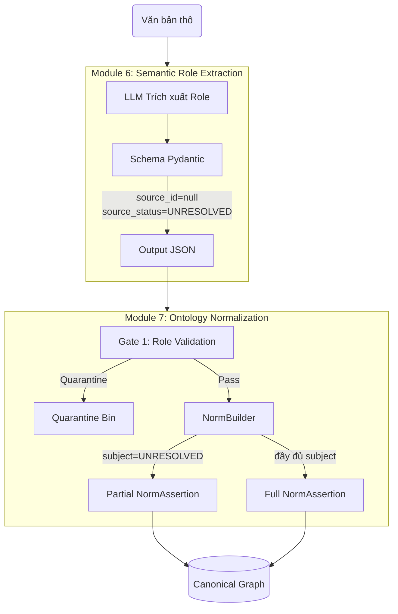

# MODULE 6 — SEMANTIC ROLE EXTRACTION
# Known Issues, Boundary với M7, và Quyết định v2
# ─────────────────────────────────────────────────────
# File: researchnote_m6_lam.md
# Tác giả: Lâm + cuộc tranh luận với GPT & DeepSeek
# Ngày: 2026-09-29
# Trạng thái: v1 FROZEN. v2 PLANNED (Option B - Schema Change)

---

## §0. TL;DR cho người đọc lần đầu

M6 dùng LLM (GPT-4o-mini) để trích xuất thực thể và quan hệ pháp lý từ văn bản luật. Sau khi chạy trên 117 candidates của Chương 3 Luật Đất đai 2024, M6 output được đưa vào M7 và phát hiện **4 vấn đề chính** dẫn đến quarantine.

Qua 6 vòng tranh luận giữa Human, GPT và DeepSeek, nhóm đã:
1. Xác định boundary đúng giữa M6 và M7.
2. Phân loại 5 known issues theo root cause.
3. Phát hiện nghẽn cổ chai kiến trúc: **Modality Loss** vs **Hallucination** — không thể giải quyết bằng prompt, chỉ có thể giải quyết bằng **schema change**.
4. Chốt **Option B**: sửa schema M6 + M7, không hack prompt.
5. Định nghĩa **Partial NormAssertion** với 4 invariants.

**Quyết định:** M6 v1 giữ nguyên (frozen). M6 v2 + M7 v2 sẽ triển khai sau khi cấy 5 component M7 đợt 1.

---

## §1. Bối cảnh: Tại sao cần note này?

### 1.1 Tình huống ban đầu

M6 được viết bởi Minh với prompt khá kỹ:
- 7 entity types (SUBJECT, ACTION, OBJECT, CONDITION, EXCEPTION, REFERENCE, PENALTY).
- 8 relation types (ALLOW, REQUIRE, PROHIBIT, HAS_OBJECT, HAS_CONDITION, HAS_EXCEPTION, REFERENCE_TO, HAS_PENALTY).
- 8 critical rules.
- 3 few-shot examples.
- Structured output qua Pydantic + instructor.

Khi chạy lần đầu, output M6 được đưa vào M7. M7 phát hiện **43 edges bị quarantine**:
- 32 edges có cấu trúc `SUBJECT → OBJECT` (vi phạm domain-range).
- 11 edges có cấu trúc `ACTION → ACTION` (vi phạm domain-range).

### 1.2 Câu hỏi ban đầu

Đội đặt câu hỏi: **"Lỗi ở đâu? Prompt M6? Validator M7? Model GPT-4o-mini?"**

Câu trả lời ban đầu:
- Minh (viết prompt): "Model ngu, prompt tối ưu rồi."
- Lâm (viết validator): "Prompt sai, validator đúng."
- Team: "Chưa rõ, cần phân tích."

### 1.3 Cuộc tranh luận 6 vòng

Qua 6 vòng trao đổi giữa Human, GPT và DeepSeek, nhóm đã:
- Đọc code thực tế thay vì đoán.
- Đối chiếu prompt M6 với validator M7.
- Phân biệt boundary M6-M7.
- Phát hiện nghẽn cổ chai schema.

Note này tổng hợp toàn bộ.

---

## §2. Boundary M6 vs M7 — Định nghĩa chính thức

### 2.1 Định nghĩa ban đầu (SAI)

**Định nghĩa 1:**
> "M6 = extract. M7 = interpret."

**Vấn đề:** Quá tuyệt đối. Khi M6 gán "Người sử dụng đất" là SUBJECT, M6 **đã interpret** — đã quyết định đây là chủ thể, không phải đối tượng.

**Định nghĩa 2:**
> "M6 = extraction. M7 = ontology."

**Vấn đề:** Vẫn mơ hồ. "Extraction" là gì? "Ontology" là gì?

### 2.2 Định nghĩa chính thức (ĐÚNG)

**M6 = Semantic Role Extraction**
- Nhiệm vụ: Nhận diện entity, gán vai trò ngữ nghĩa cục bộ (SUBJECT/ACTION/OBJECT/...).
- Được phép: Dùng context để suy luận khi có căn cứ rõ ràng.
- Không được phép: Bịa thông tin; không chắc thì giữ phần chắc chắn.
- Output: Entity + relation + evidence.

**M7 = Ontology Normalization & Context Modeling**
- Nhiệm vụ: Canonicalize, validate, contextualize, build NormAssertion.
- Được phép: Quarantine khi vi phạm invariant.
- Không được phép: Tạo semantic fact mới (No Semantic Amplification).
- Output: Canonical semantic graph.

### 2.3 Mapping Contract thay vì Shared Schema

**Nguyên tắc quan trọng:** M6 và M7 **không cần cùng schema**.

- M6 có thể rộng hơn M7.
- M6 có thể xuất "imperfect" output.
- M7 đóng vai trò validation gate.
- Giao tiếp qua **Mapping Contract**, không phải schema tĩnh.

**Ví dụ:**

| M6 relation | M7 interpretation |
|-------------|-------------------|
| `SUBJECT --HAS_OBJECT--> OBJECT` | Không phải action-object → Quarantine |
| `ACTION --HAS_OBJECT--> OBJECT` | HAS_OBJECT (đúng) |
| `SUBJECT --REQUIRE--> ACTION` | REQUIRE (deontic, đúng) |
| `ACTION --REQUIRE--> ACTION` | Không phải deontic → Quarantine |

**Ý nghĩa:** M7 Quarantine không phải "lỗi". Đó là **Defense in Depth** — cơ chế phòng thủ hoạt động đúng thiết kế.

---

## §3. Known Issues Matrix

### 3.1 Bảng tổng hợp

| # | Issue | Root Cause | V1 Handling | V2 Fix | Metric đo |
|---|-------|-----------|-------------|--------|-----------|
| 1 | HAS_OBJECT domain quá rộng | Prompt issue | Quarantine `SUBJECT → OBJECT` | Tách relation: `HAS_OBJECT` (action-object) vs `HAS_RIGHT_TO` (subject-object) | `has_object_conflict_count` |
| 2 | REQUIRE gánh 2 nghĩa | Parsing + Prompt | Quarantine `ACTION → ACTION` | Tách relation: `REQUIRE` (deontic) vs `PROCEDURAL_REQUIRES` | `action_to_action_count` |
| 3 | Subject hallucination | Prompt + Example | Quarantine | Sửa Rule 3 + Example 2 | `subject_hallucination_count` |
| 4 | **Modality Loss** | **Schema limitation** | Không xuất REQUIRE | **Sửa schema: `source_id = null`** | `modality_loss_count` |
| 5 | Context inference chưa tracking | Prompt | Giữ nguyên cụm từ | Thêm `source_origin = TARGET \| CONTEXT_INFERRED` | `context_inferred_count` |

### 3.2 Phân loại theo root cause

**Nhóm A — Prompt Issue (3 issues):**
- Issue 1: HAS_OBJECT domain.
- Issue 2: REQUIRE 2 nghĩa.
- Issue 3: Subject hallucination.

**Nhóm B — Schema Limitation (1 issue):**
- Issue 4: Modality Loss.

**Nhóm C — Prompt Improvement (1 issue):**
- Issue 5: Context inference tracking.

**Nguyên tắc quan trọng:** Không gộp chung "Model ngu" hay "Prompt lỗi". Phải tách theo root cause để biết fix ở đâu.

---

## §4. Chi tiết từng Issue

### Issue 1 — HAS_OBJECT domain quá rộng

**Triệu chứng:**
- 32 edges có cấu trúc `SUBJECT → OBJECT`.
- M7 quarantine toàn bộ.
- Ví dụ: `(Người sử dụng đất) --HAS_OBJECT--> (Quyền sử dụng đất)`.

**Root cause:**
Prompt M6 viết:
```
HAS_OBJECT: (ACTION/SUBJECT) -> (OBJECT)
```
Nghĩa là cho phép SUBJECT làm source. Nhưng trong ontology của M7, `HAS_OBJECT` chỉ có nghĩa **action-object**:
```
ACTION --HAS_OBJECT--> OBJECT
```

**Phân tích sâu:**
M6 đang dùng `HAS_OBJECT` cho **2 nghĩa khác nhau**:
- Nghĩa 1 (đúng): `Công chứng --HAS_OBJECT--> Hợp đồng` (action tác động lên object).
- Nghĩa 2 (sai): `Người sử dụng đất --HAS_OBJECT--> Quyền sử dụng đất` (quan hệ sở hữu/quyền).

**Lựa chọn:**

| Lựa chọn | Ưu | Nhược |
|----------|-----|-------|
| A. Sửa prompt: bỏ SUBJECT khỏi domain | Sạch ontology | Mất thông tin quan hệ sở hữu |
| B. Tách relation: `HAS_OBJECT` + `HAS_RIGHT_TO` | Giữ đủ ngữ nghĩa | Phức tạp hóa schema |
| C. Giữ nguyên, M7 quarantine | Đơn giản v1 | Mất 32 edges |

**Quyết định v1: C.**

**Lý do:**
- Chưa đủ evidence để chốt `HAS_RIGHT_TO` là nghĩa đúng.
- Quan hệ `SUBJECT → OBJECT` có thể là: `OWNS`, `HAS_RIGHT_TO`, `MANAGES`, `USES`, hoặc quan hệ khác.
- Thêm relation mới chỉ vì 32 edges là quá sớm.

**Quyết định v2:**
- Sửa prompt: `HAS_OBJECT: (ACTION) -> (OBJECT)`.
- Nếu corpus chứng minh cần relation sở hữu → thêm relation mới.

**Trade-off chấp nhận:**
- V1: mất 32 edges, nhưng giữ ontology sạch.
- Đây là trade-off **Precision vs Recall** — chọn Precision.

---

### Issue 2 — REQUIRE gánh 2 nghĩa

**Triệu chứng:**
- 11 edges có cấu trúc `ACTION → ACTION`.
- Ví dụ: `(Nộp hồ sơ) --REQUIRE--> (Công chứng)`.

**Root cause:**
Prompt M6 viết:
```
REQUIRE: (SUBJECT/ACTION) -> (ACTION)
```
Cho phép ACTION làm source.

Trong ontology M7, `REQUIRE` là **deontic modality** — chỉ có nghĩa "nghĩa vụ pháp lý":
```
SUBJECT --REQUIRE--> ACTION
```

**Phân tích sâu:**
`REQUIRE` đang bị dùng cho **2 nghĩa khác nhau**:
- Nghĩa 1 (deontic): `Người sử dụng đất --REQUIRE--> Công chứng` (chủ thể có nghĩa vụ).
- Nghĩa 2 (procedural): `Thủ tục --REQUIRE--> Công chứng` (thủ tục đòi hỏi).

**Lựa chọn:**

| Lựa chọn | Ưu | Nhược |
|----------|-----|-------|
| A. Sửa prompt: bỏ ACTION khỏi domain | Sạch deontic | Mất thông tin quan hệ thủ tục |
| B. Tách relation: `REQUIRE` + `PROCEDURAL_REQUIRES` | Giữ đủ ngữ nghĩa | Phức tạp hóa schema |
| C. Giữ nguyên, M7 quarantine | Đơn giản v1 | Mất 11 edges |

**Quyết định v1: C.**

**Quyết định v2:**
- Sửa prompt parsing (compound phrase).
- Nếu sau khi sửa prompt vẫn còn 11 edges `ACTION → ACTION` → cân nhắc thêm `PROCEDURAL_REQUIRES`.
- Không thêm relation mới ngay.

**Nguyên tắc:** Đây là **Evidence-Driven Design** — không mở rộng ontology chỉ vì 1 pattern nhỏ.

---

### Issue 3 — Subject hallucination

**Triệu chứng:**
- M6 gán SUBJECT cho "hợp đồng" (thực chất là OBJECT) khi câu ở thể bị động.
- Ví dụ: `(Hợp đồng) --REQUIRE--> (Công chứng)` — sai.

**Root cause:**
Kết hợp 2 lỗi prompt:

**Lỗi A — Rule 3 diễn đạt sai:**
```
3. Suy luận Chủ thể Ẩn: 
   BẮT BUỘC tìm ngược lên... KHÔNG để rỗng Source.
```
Cụm "KHÔNG để rỗng Source" tạo áp lực: phải có subject bằng mọi giá.

**Lỗi B — Example 2 dạy bịa:**
```
Văn bản: "Hợp đồng chuyển nhượng quyền sử dụng đất phải được công chứng."
- ĐÚNG: (Người sử dụng đất) --REQUIRE--> (Công chứng)
```
Câu gốc **không có** "Người sử dụng đất". Example dạy LLM bịa subject.

**Hệ quả:**
- Rule 3 tạo áp lực → LLM tìm subject.
- Example 2 dạy cách tìm sai → LLM bịa.
- Rule 5 cấm bịa bị vô hiệu hóa.

**Lựa chọn:**

| Lựa chọn | Ưu | Nhược |
|----------|-----|-------|
| A. Sửa Rule 3: thêm ngoại lệ "không bịa" | Đúng nguyên tắc | Vẫn có thể bịa nếu model kém |
| B. Sửa Example 2: dùng case có subject thật | Dạy đúng pattern | Né tránh case khó |
| C. Cả A + B + thêm Example 5 (fallback) | Đầy đủ | Prompt dài hơn |

**Quyết định: C.**

**Cụ thể:**

Rule 3 v2:
```
Khi gặp khoản liệt kê chỉ có hành vi:
- Có căn cứ trong context → ĐƯỢC suy luận chủ thể.
- Không có căn cứ → KHÔNG bịa chủ thể.
- Vẫn giữ ACTION + OBJECT + HAS_OBJECT. KHÔNG tạo ALLOW/REQUIRE/PROHIBIT.
```

Example 2 v2:
```
Văn bản: "Hợp đồng chuyển nhượng quyền sử dụng đất phải được công chứng."
- ĐÚNG: 
  - OBJECT: Hợp đồng chuyển nhượng
  - ACTION: Công chứng
  - (Công chứng) --HAS_OBJECT--> (Hợp đồng chuyển nhượng)
  - KHÔNG tạo REQUIRE (vì không có chủ thể).
- SAI:
  - (Người sử dụng đất) --REQUIRE--> (Công chứng) ← bịa subject
```

**Trade-off:** Prompt phức tạp hơn, nhưng giảm hallucination.

---

### Issue 4 — Modality Loss (NGHẼN CỔ CHAI KIẾN TRÚC)

**Đây là issue quan trọng nhất, dẫn đến quyết định sửa schema.**

**Triệu chứng:**
Câu: *"Hợp đồng phải được công chứng."*

Sau khi qua M6 v1:
```
OBJECT: Hợp đồng
ACTION: Công chứng
(Công chứng) --HAS_OBJECT--> (Hợp đồng)
```

**Mất chữ "phải"** — không còn modality REQUIRE.

**Root cause:**
Schema M6 v1:
```python
class LegalRelation(BaseModel):
    source_id: str          # ← Bắt buộc phải có entity
    target_id: str
    relation_type: RelationType
```

**Vấn đề:** Không cho phép `source_id = null`.

**Hệ quả:**
Khi câu khuyết chủ thể, M6 chỉ có 2 lựa chọn:
1. **Bịa subject** (hallucination) → vi phạm zero-hallucination.
2. **Bỏ REQUIRE** (modality loss) → mất tri thức.

Prompt v3 chọn cách 2 (an toàn hơn bịa). Nhưng mất modality.

**Đây là Schema Limitation, không phải Prompt Bug.**

**Hệ quả pháp lý của Modality Loss:**

| Câu gốc | Hệ quả pháp lý |
|---------|----------------|
| Hợp đồng **phải** công chứng | Bắt buộc. Không công chứng → vô hiệu. |
| Hợp đồng **được** công chứng | Tùy chọn. Không công chứng → vẫn hiệu lực. |
| Hợp đồng **không được** công chứng | Cấm. Công chứng → vi phạm. |

Nếu M6 mất modality → M10 không trả lời được câu hỏi như *"Hợp đồng có bắt buộc công chứng không?"*.

**Lựa chọn:**

| Lựa chọn | Ưu | Nhược |
|----------|-----|-------|
| A. Giữ schema v1: không có subject → bỏ REQUIRE | Đơn giản | Mất modality |
| B. Sửa schema: cho phép `source_id = null` | Giải quyết triệt để | Phức tạp hơn |

**Quyết định: B (Option B).**

**Lý do chọn B:**
1. **Triệt để.** Giải quyết 1 lần, không phải quay lại.
2. **Đúng nguyên tắc.** "Không biết subject ≠ Không biết gì."
3. **Ảnh hưởng rộng.** Nếu để lâu, phải chạy lại M6 → tốn $0.2 mỗi lần.
4. **Đúng thời điểm.** M8/M9/M10 chưa build → sửa bây giờ rẻ hơn.

**Trade-off:**
- Chi phí: 5-7 ngày làm việc.
- Lợi ích: Giải quyết triệt để, không phải quay lại.

---

### Issue 5 — Context inference tracking

**Triệu chứng:**
M6 lấy entity từ context (VD: "Công dân" từ tiêu đề Điều 27) nhưng không phân biệt với entity từ target text.

**Root cause:**
Prompt M6 có 2 rules mâu thuẫn:
- Rule 3: "Suy luận chủ thể từ context."
- Rule 5: "Chỉ tạo thực thể từ từ xuất hiện TRỰC TIẾP trong target."

**Lựa chọn:**

| Lựa chọn | Ưu | Nhược |
|----------|-----|-------|
| A. Không tracking | Đơn giản | M7 không phân biệt độ tin cậy |
| B. Thêm `source_origin: TARGET \| CONTEXT_INFERRED` | Rõ ràng | Schema phức tạp hơn |

**Quyết định v1: A (giữ nguyên).**

**Quyết định v2: B.**

**Cụ thể v2:**
- Thêm field `source_origin`.
- `TARGET`: entity từ target text (độ tin cậy cao).
- `CONTEXT_INFERRED`: entity từ context (độ tin cậy trung bình).
- M7 dùng thông tin này để validate stricter với context-inferred entities.

**Nguyên tắc:** Context inference **được phép** khi có căn cứ. Nhưng phải **trích nguyên văn cụm từ trong context**, không tự diễn đạt lại.

---

## §5. Nghẽn cổ chai kiến trúc — Tổng hợp

### 5.1 Phân biệt 3 loại limitation

| Loại | Ví dụ | Fix |
|------|-------|-----|
| **Prompt Bug** | Rule 3 gây áp lực; Example 2 bịa | Sửa prompt |
| **Schema Limitation** | Không cho phép `source_id = null` | Sửa schema |
| **Model Limitation** | 4o-mini không parse compound phrase đúng | Nâng model |

**Nguyên tắc:** Không fix Schema Limitation bằng Prompt. Sẽ tạo ra prompt phức tạp mà vẫn không giải quyết được vấn đề gốc.

### 5.2 Định nghĩa Modality Loss

**Modality = Tính chất quy phạm của hành vi.**

3 modality chính:
- ALLOW (được phép).
- REQUIRE (bắt buộc).
- PROHIBIT (cấm).

**Modality Loss = Mất thông tin về modality khi xử lý.**

**Hậu quả:** M7 không build được NormAssertion. M10 không trả lời được câu hỏi về quyền/nghĩa vụ.

### 5.3 Tại sao đây là nghẽn cổ chai

**Ảnh hưởng toàn hệ thống:**
- M7: Không build NormAssertion.
- M10: Query sai.
- M11: Eval không đo được.

**Không fix được bằng prompt:**
- Prompt chỉ dạy model làm gì.
- Schema là **rào cứng**.
- Prompt không thể vượt qua rào đó.

**Phải sửa Schema:**
- Cho phép `source_id = null`.
- Thêm `source_status = "UNRESOLVED"`.
- M7 tạo NormAssertion partial.

---

## §6. Quyết định Option B — Chi tiết

### 6.1 Schema M6 v2

```python
class LegalRelation(BaseModel):
    source_id: Optional[str] = None
    target_id: str
    relation_type: RelationType
    source_status: Literal[
        "RESOLVED", 
        "CONTEXT_INFERRED", 
        "UNRESOLVED"
    ] = "RESOLVED"
    evidence: str
    
    @model_validator(mode='after')
    def validate_source_status(self):
        # Nếu source_id = null → bắt buộc source_status = UNRESOLVED
        if self.source_id is None and self.source_status != "UNRESOLVED":
            raise ValueError("source_id=None bắt buộc source_status=UNRESOLVED")
        # Nếu source_id != null → không được là UNRESOLVED
        if self.source_id is not None and self.source_status == "UNRESOLVED":
            raise ValueError("source_id có giá trị không thể UNRESOLVED")
        # Chỉ ALLOW/REQUIRE/PROHIBIT được phép null source
        if self.source_id is None and self.relation_type not in {
            "ALLOW", "REQUIRE", "PROHIBIT"
        }:
            raise ValueError(f"Relation {self.relation_type} yêu cầu source_id")
        return self
```

**Điểm quan trọng:**
- `source_id = null` chỉ cho phép với ALLOW/REQUIRE/PROHIBIT.
- Các relation khác (HAS_OBJECT, HAS_CONDITION) vẫn **bắt buộc** source_id thật.
- Validator kiểm tra logic null ↔ UNRESOLVED.

### 6.2 Schema M7 v2 — NormAssertion

```python
class NormAssertion(BaseModel):
    id: str
    modality: Literal["ALLOW", "REQUIRE", "PROHIBIT"]
    
    subject_ids: list[str] = Field(default_factory=list)
    subject_status: Literal["RESOLVED", "UNRESOLVED"] = "RESOLVED"
    
    action_ids: list[str]
    object_ids: list[str] = Field(default_factory=list)
    condition_ids: list[str] = Field(default_factory=list)
    exception_ids: list[str] = Field(default_factory=list)
    consequence_ids: list[str] = Field(default_factory=list)
    
    provenance_node_id: str
    evidence: str
    
    @model_validator(mode='after')
    def validate_subject(self):
        if self.subject_status == "RESOLVED" and not self.subject_ids:
            raise ValueError("RESOLVED nhưng không có subject_ids")
        if self.subject_status == "UNRESOLVED" and self.subject_ids:
            raise ValueError("UNRESOLVED nhưng có subject_ids")
        return self
```

**Điểm quan trọng:**
- M6 dùng `source_status` (3 giá trị).
- M7 dùng `subject_status` (2 giá trị).
- `CONTEXT_INFERRED` từ M6 map thành `RESOLVED` ở M7.

### 6.3 Sơ đồ kiến trúc (M6 → M7 Pipeline)



### 6.4 Luồng xử lý chi tiết

**M6:**
```
Câu: "Hợp đồng phải được công chứng."
↓
M6 output:
{
  "entities": [
    {"id": "e1", "text": "Hợp đồng", "type": "OBJECT"},
    {"id": "e2", "text": "Công chứng", "type": "ACTION"}
  ],
  "relations": [
    {
      "source_id": null,
      "target_id": "e2",
      "relation_type": "REQUIRE",
      "source_status": "UNRESOLVED",
      "evidence": "Hợp đồng phải được công chứng"
    },
    {
      "source_id": "e2",
      "target_id": "e1",
      "relation_type": "HAS_OBJECT",
      "source_status": "RESOLVED",
      "evidence": "Hợp đồng phải được công chứng"
    }
  ]
}
```

**M7:**
```
M7 nhận output → Gate 1:
- Relation 1: source_id = null, source_status = UNRESOLVED
  → Không quarantine. Đi tiếp vào NormBuilder.
- Relation 2: source_id = e2, target = e1
  → Pass.

M7 NormBuilder:
- Relation 1: source UNRESOLVED → tạo NormAssertion partial.
  
NormAssertion:
{
  "id": "d27_k3#NORM#1",
  "modality": "REQUIRE",
  "subject_ids": [],
  "subject_status": "UNRESOLVED",
  "action_ids": ["e2"],
  "object_ids": ["e1"],
  "provenance_node_id": "d27_k3",
  "evidence": "Hợp đồng phải được công chứng"
}
```

**Kết quả:**
- Modality REQUIRE được giữ.
- Subject không bịa.
- NormAssertion partial được tạo.

---

## §7. Invariants cho Partial Norm

**Đây là phần quan trọng nhất của thiết kế.** Không chỉ thêm `subject_status = UNRESOLVED` là xong.

### INV1 — Partial norm KHÔNG có HAS_SUBJECT edge

```
FULL norm:
  NormAssertion ── HAS_SUBJECT ──> LocalSubject

PARTIAL norm:
  NormAssertion  (không có HAS_SUBJECT edge)
```

### INV2 — Partial norm KHÔNG được dùng cho subject-based retrieval

**Query 1:** *"Nghĩa vụ của Nhà nước là gì?"*
→ KHÔNG trả về partial norm. Vì subject chưa xác định, có thể không phải Nhà nước.

**Query 2:** *"Quy định nào yêu cầu công chứng hợp đồng?"*
→ ĐƯỢC trả về partial norm. Vì đây là query về normative statement, không phải subject.

### INV3 — Partial norm KHÔNG cho phép suy luận subject

```
SAI: "Partial norm có modality REQUIRE + context nói về Nhà nước
      → suy ra subject là Nhà nước."
ĐÚNG: Subject = UNRESOLVED. Không suy luận.
```

### INV4 — Partial norm vẫn giữ evidence + provenance

```
NormAssertion partial:
- evidence: "Hợp đồng phải được công chứng"
- provenance_node_id: d27_k3
- Không mất dữ liệu gốc.
```

---

## §8. Implementation Plan (M6 V2 - Revision 3)

### 8.1 Deployment Sequence (8 Bước - Đã hoàn thành)

Quyết định mới nhất: Ưu tiên sửa triệt để M6 và kiến trúc partial norm trước khi mở rộng M7.

```
BƯỚC 1: Cập nhật src/llm_extraction/schema_manager.py
BƯỚC 2: Cập nhật src/ontology/schemas.py
BƯỚC 3: Cập nhật src/ontology/relation_normalizer.py
BƯỚC 4: Cập nhật src/ontology/semantic_quality_gate.py (Gate 1)
BƯỚC 5: Cập nhật src/ontology/norm_builder.py
BƯỚC 6: Cập nhật src/ontology/ontology_validator.py (Gate 2)
BƯỚC 7: Cập nhật src/llm_extraction/prompt_builder.py
BƯỚC 8: Chạy Test Suites & Pipeline End-to-End. (Đang thực hiện)
```

### 8.2 Sửa schema M6

**File:** `src/llm_extraction/schema_manager.py`

**Sửa:**

```python
from typing import Optional, Literal
from pydantic import BaseModel, model_validator

class LegalRelation(BaseModel):
    source_id: Optional[str] = None
    target_id: str
    relation_type: RelationType
    source_status: Literal[
        "RESOLVED", 
        "CONTEXT_INFERRED", 
        "UNRESOLVED"
    ] = "RESOLVED"
    evidence: str
    
    @model_validator(mode='after')
    def validate_source_status(self):
        if self.source_id is None and self.source_status != "UNRESOLVED":
            raise ValueError("source_id=None bắt buộc source_status=UNRESOLVED")
        if self.source_id is not None and self.source_status == "UNRESOLVED":
            raise ValueError("source_id có giá trị không thể UNRESOLVED")
        if self.source_id is None and self.relation_type not in {
            "ALLOW", "REQUIRE", "PROHIBIT"
        }:
            raise ValueError(f"Relation {self.relation_type} yêu cầu source_id")
        return self
```

### 8.3 Sửa prompt M6

**File:** `src/llm_extraction/prompt_builder.py`

**5 sửa chính:**

1. **Câu mở đầu:** "M6 = Semantic Role Extraction, không phải Ontology Normalization."

2. **Rule 3:** Bỏ "KHÔNG để rỗng Source". Thay bằng "Có căn cứ mới suy luận. Không bịa."

3. **Example 2:** Đổi thành case không có subject. Output giữ ACTION + OBJECT + HAS_OBJECT, KHÔNG tạo REQUIRE.

4. **Rule mới về incomplete relation:** "Khi không tìm được SUBJECT, vẫn xuất relation REQUIRE/ALLOW/PROHIBIT với `source_id = null` + `source_status = 'UNRESOLVED'`."

5. **CONDITION definition:** Mở rộng bao gồm "sự kiện" — VD: "Khi Nhà nước thu hồi đất".

### 8.4 Test cases (End-to-End)

```
Test 1: Relation REQUIRE với source_id = null
→ Pydantic pass? (Kỳ vọng: pass)

Test 2: Relation HAS_OBJECT với source_id = null
→ Pydantic fail? (Kỳ vọng: fail, vì HAS_OBJECT yêu cầu source_id)

Test 3: Relation REQUIRE với source_id = null + source_status = "RESOLVED"
→ Pydantic fail? (Kỳ vọng: fail, vì logic mâu thuẫn)

Test 4: NormAssertion partial với subject_status = "UNRESOLVED"
→ M7 tạo được? (Kỳ vọng: pass)

Test 5: Query subject-based trên partial norm
→ M10 trả về? (Kỳ vọng: KHÔNG trả về)
```

### 8.5 Metrics đo lường

**Sau khi chạy lại:**

| Metric | Trước v2 | Kỳ vọng sau v2 |
|--------|----------|----------------|
| `modality_loss_count` | ~20 | 0 |
| `subject_hallucination_count` | ~30 | < 5 |
| `has_object_conflict_count` | 32 | 32 (chưa fix) |
| `action_to_action_count` | 11 | < 5 |
| `total_quarantine` | 43 | < 15 |

---

## §9. Bài học cho luận văn

### 9.1 Structured Output không cứu Semantic Correctness

**Điểm quan trọng:** Pydantic/JSON schema đảm bảo:
- Output đúng **cấu trúc**.
- Fields có đúng **type**.
- Relationships có đúng **referential integrity**.

Nhưng KHÔNG đảm bảo:
- Nội dung **đúng ngữ nghĩa**.
- Phân loại **đúng vai trò**.
- Modality **đúng quy phạm**.

→ Đây là lý do pipeline cần M7 (normalization + validation) ngoài M6 (extraction).

### 9.2 Phân biệt 3 loại limitation

| Loại | Fix | Ví dụ |
|------|-----|-------|
| **Prompt Bug** | Sửa prompt | Rule 3 gây áp lực; Example 2 bịa |
| **Schema Limitation** | Sửa schema | Không cho phép `source_id = null` |
| **Model Limitation** | Nâng model | 4o-mini parse compound phrase sai |

**Nguyên tắc:** Không dùng Prompt để fix Schema Limitation.

### 9.3 Defense in Depth

M7 Quarantine không phải "lỗi". Đó là **cơ chế phòng thủ**:
- M6 được phép output imperfect.
- M7 validate và quarantine.
- Dữ liệu bị quarantine vẫn được giữ để audit.

**Đây là kiến trúc đúng** cho hệ thống AI pháp lý — không ép 1 module làm hết mọi thứ.

### 9.4 Trade-off Precision vs Recall

**V1:** Chọn Precision (quarantine nhiều, giữ ontology sạch).
**V2:** Tăng Recall (giữ modality, partial norm).

Đây là trade-off có chủ đích, không phải "sai".

### 9.5 Evidence-Driven Design

**Nguyên tắc:** Không mở rộng ontology chỉ vì 1 pattern nhỏ.

Ví dụ: 11 edges `ACTION → ACTION` không đủ evidence để thêm `PROCEDURAL_REQUIRES`. Cần:
1. Sửa prompt parsing.
2. Chạy lại.
3. Nếu pattern còn → xét thêm relation.
4. Nếu pattern giảm → không cần relation mới.

---

## §10. Việc cần làm (Checklist)

### Ngay
- [x] Chốt Known Issues Matrix vào research note.
- [x] Chốt boundary M6-M7 vào research note.
- [x] Thiết kế xong Kế hoạch M6 V2 (Revision 3).

### Giai đoạn M6 V2 (Đã hoàn thành code)
- [x] Cập nhật schema M6 (`source_status`, cho phép `source=null`).
- [x] Cập nhật Prompt M6 (7 Rules chống ảo giác, cho phép subject rỗng).
- [x] Cập nhật M7 Gate 1, NormBuilder, Gate 2 để bypass `UNRESOLVED` (Partial Norm).
- [x] Viết test mô phỏng `test_m7_modality_preservation.py` (Pass 100%).
- [x] Chuẩn bị script E2E `test_e2e_real_llm.py` để test luồng thực tế.

### Việc cần làm tiếp theo (Pending)
- [ ] Điền `OPENROUTER_API_KEY` vào `.env` và chạy thử `test_e2e_real_llm.py`.
- [ ] Chạy full pipeline M6 + M7 trên bộ dữ liệu lớn hơn.
- [ ] Đo đếm lại metrics (`modality_loss_count`, `subject_hallucination_count`) để so sánh với bản V1.
- [ ] (Tùy chọn) Commit nhánh `lam_m7` làm baseline ổn định.

### Giai đoạn sau (Tích hợp M7 mở rộng)
- [ ] Tích hợp Fuzzy Match (thefuzz) vào `entity_normalizer.py` (Kế hoạch Hybrid).
- [ ] Hoàn thiện `reference_classifier.py` và `canonical_mapper.py`.

### Trước khi nộp luận văn
- [ ] Document toàn bộ quyết định vào Chương "Methodology".
- [ ] Đo `modality_loss_count` trước/sau v2.
- [ ] So sánh kết quả.
---

## §11. Reference

- **File prompt M6 v2:** `src/llm_extraction/prompt_builder.py`
- **File schema M6 v2:** `src/llm_extraction/schema_manager.py`
- **File M7 Gate 1:** `src/ontology/semantic_quality_gate.py`
- **File M7 Gate 2:** `src/ontology/ontology_validator.py`
- **File M7 NormBuilder:** `src/ontology/norm_builder.py`
- **Output M6:** `outputs/semantic_graphs/semantic_extraction.json`
- **Output M7:** `outputs/canonical_graphs/canonical_semantic_graph.json`
