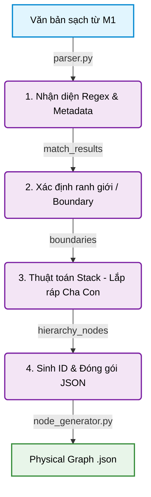

# TÓM TẮT MODULE 2: XÂY DỰNG CÂY VẬT LÝ (PHYSICAL GRAPH PARSER)

## 1. Đánh giá Kiến trúc Hệ thống (System Architecture)
Module 2 đóng vai trò là lõi chuyển đổi quan trọng: Biến đổi văn bản phẳng (Linear Text) thành một Cấu trúc Cây đa tầng (Hierarchical Tree / Physical Graph). Kiến trúc của Module 2 tuân thủ chặt chẽ nguyên lý **Pipeline Design Pattern**, chia quy trình Parsing thành 4 trạm xử lý chuyên biệt:

- **`regex_engine.py` (Bộ Nhận diện):** Sử dụng các biểu thức chính quy (Regex) tinh vi để quét qua từng dòng văn bản, nhận diện ra các thực thể pháp lý (Node) dựa trên từ khóa ("Điều", "Khoản", "Chương", "Mục") và ký hiệu ("1.", "a)").
- **`boundary_detector.py` (Bộ Cắt lớp):** Dựa trên kết quả từ Regex, hệ thống tiến hành cắt văn bản thành từng khúc (chunk). Xác định chính xác vị trí bắt đầu (`start_idx`) và kết thúc (`end_idx`) của từng Node.
- **`hierarchy_builder.py` (Bộ Lắp ráp Cây):** Sử dụng thuật toán Stack (Ngăn xếp) để móc nối các khúc văn bản (Nodes) lại với nhau thành mô hình Cha-Con (Parent-Child) dựa trên Độ sâu (Depth) của luật.
- **`node_generator.py` (Bộ Xuất bản):** Đóng gói toàn bộ thông tin (text, depth, parent_id, children_count, index...) thành cấu trúc JSON chuẩn mực.
- **`parser.py` (Orchestrator):** Trái tim điều phối, kết nối 4 trạm trên lại với nhau, cung cấp giao diện cho cả file `.docx` có cấu trúc lẫn file `.txt` thuần.

## 2. Luồng xử lý (Workflow)

Văn bản từ Module 1 sẽ đi qua 4 bước tuần tự:
1. **Match (Nhận diện):** RegexEngine quét từng dòng, kết hợp với các thông tin ẩn (Metadata: Marker, Number) do Module 1 truyền sang để nhận diện chính xác các cấp bậc (CHƯƠNG = Depth 0, MỤC = Depth 1, ĐIỀU = Depth 2, KHOẢN = Depth 3, ĐIỂM = Depth 4).
2. **Detect Boundary (Chia tách ranh giới):** Văn bản được "chặt" ra thành các đoạn text rời rạc, không bị chồng lấn.
3. **Build Hierarchy (Xây dựng Cây phân cấp):** Xác định đoạn text này là con của đoạn text nào phía trên. 
4. **Generate JSON (Sinh JSON):** Gán `id` duy nhất cho từng Node (vd: `doc_chuong-iii_muc-1_dieu-26`), đếm số lượng node con và ghi ra file `raw_nodes_clean_*.json` sẵn sàng nạp vào Đồ thị.

## 3. Các bài toán gặp phải và Cách giải quyết

### Bài toán 1: Ảo giác Đánh dấu (Marker Misidentification) & Trùng lặp ID
- **Vấn đề:** Ban đầu, hệ thống Regex độc lập của M2 thi thoảng nhận diện nhầm các điểm (point marker). Ví dụ: dãy `a, b, c, d, đ, e` bị hệ thống đọc nhầm `e` thành `đ`, hoặc chữ `o` bị đọc thành chữ `a`. Sự cố này dẫn đến việc gán nhầm ID, sinh ra lỗi **Trùng lặp ID (Historical ID Collision)** giữa điểm `d` và `đ` khi chạy sinh JSON, làm vỡ đồ thị.
- **Cách giải quyết (`parser.py`):** Thiết lập **Contract (Hợp đồng dữ liệu)** chặt chẽ với Module 1. Thay vì để Regex tự đoán mò, M2 sẽ gọi hàm `_merge_contract_metadata()` để lấy thông tin `number` và `marker` chuẩn xác 100% từ lõi XML của file Word (do M1 bóc tách). Nhờ đó, loại bỏ hoàn toàn "ảo giác", tái tạo chuẩn xác cấu trúc 222 nodes của đồ thị mà không còn bất kỳ lỗi ID đụng độ nào.

### Bài toán 2: Đứt gãy hệ gen Cha-Con (Orphans & Gaps) trong cấu trúc phẳng
- **Vấn đề:** Văn bản đầu vào là cấu trúc tuyến tính (Linear text - đọc từ trên xuống dưới). Rất khó để lập trình cho máy tính hiểu rằng "Điểm a" ở trang 5 là con của "Khoản 2" ở trang 4, chứ không phải con của "Khoản 1". Nếu viết logic If-Else thông thường, khi văn bản bị khuyết một "Khoản" nào đó, các node bên dưới sẽ bị mồ côi (Orphan) hoặc gán nhầm cha.
- **Cách giải quyết (`hierarchy_builder.py`):** Triển khai **Thuật toán Ngăn xếp (Stack-based Algorithm)** kinh điển. Khi gặp một Node có độ sâu `d`, hệ thống sẽ liên tục "đẩy" (pop) các node có độ sâu lớn hơn hoặc bằng `d` ra khỏi ngăn xếp cho đến khi đụng phải Node cha hợp lệ (có độ sâu `< d`). Kỹ thuật này giải quyết triệt để vấn đề gán cha con, kết hợp cùng các hàm `check_orphans()` và `check_gaps()` để tự động cảnh báo nếu cấu trúc văn bản Luật bị đứt gãy từ bản gốc.

### Bài toán 3: Phụ thuộc quá nhiều vào Định dạng Word (DOCX vs TXT)
- **Vấn đề:** Ban đầu hệ thống chỉ hoạt động tốt nếu file DOCX có dùng công cụ Style của Microsoft Word. Nhưng trong thực tế, rất nhiều file txt thuần hoặc văn bản copy từ web không hề chứa tín hiệu Style (Heading).
- **Cách giải quyết (`regex_engine.py`):** Triển khai cơ chế **Fallback (Dự phòng)** mạnh mẽ với 2 mode xử lý (`parse_docx` và `parse_text`). Nếu không có Style, Engine sẽ dựa hoàn toàn vào Lớp 2 (Hệ thống Regex siêu việt) để cào bằng văn bản, cho phép linh hoạt xử lý mọi định dạng đầu vào.
