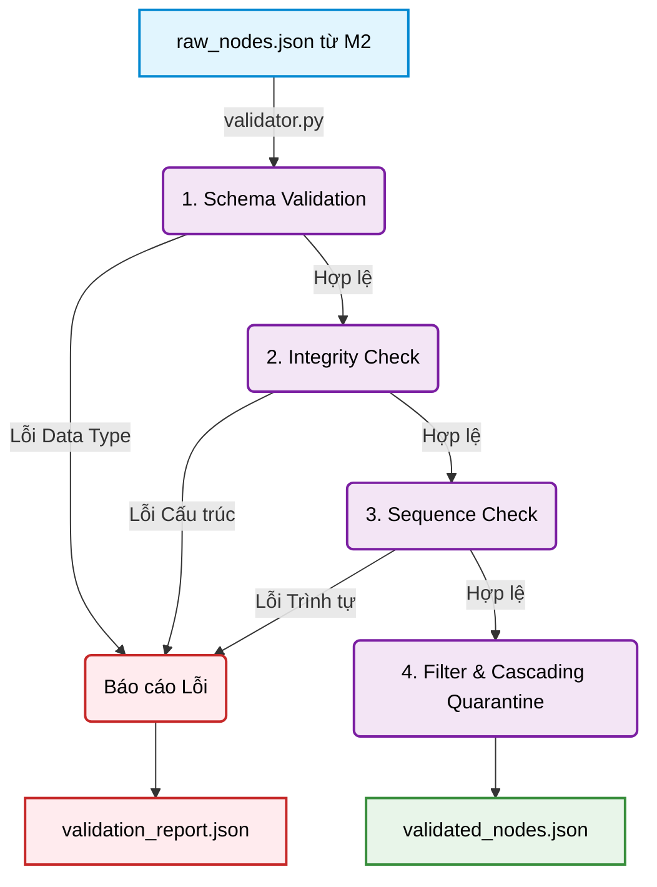

# TỔNG KẾT MODULE 3 - VALIDATION ENGINE (QUALITY GATE) VÀ CHIẾN DỊCH HỢP NHẤT V1

Module 3 đóng vai trò là "Chốt chặn chất lượng" (Quality Gate) cho hệ thống Hybrid Parser của GraphRAG Văn bản Pháp luật Việt Nam. Nhiệm vụ chính của module là rà soát toàn bộ mảng node JSON từ Module 2, phát hiện và phân loại lỗi cấu trúc, lọc bỏ các node lỗi nghiêm trọng, và sinh ra báo cáo chất lượng chi tiết.

**Nguyên tắc tối thượng:** Chỉ phát hiện, lọc và báo cáo — TUYỆT ĐỐI KHÔNG tự sửa dữ liệu (No Auto-repair). Việc sửa chữa phải được thực hiện ở cội nguồn (Module 1 hoặc 2).

## 1. Công nghệ và Nguyên tắc thiết kế
- **Ngôn ngữ & Thư viện:** Python 3, `pydantic` (tái sử dụng `LegalNode` từ Module 2 để validate schema), `json` (đọc/ghi), `re` (trích xuất marker cho sequence check).
- **Nguyên tắc:**
  - **Single Responsibility:** Mỗi file đảm nhận đúng một trách nhiệm kiểm tra riêng biệt (Schema, Integrity, Sequence, Report).
  - **100% Deterministic:** Chạy 2 lần với cùng input cho ra kết quả giống hệt nhau. Không có yếu tố ngẫu nhiên.
  - **Fail-Safe Filtering:** Chỉ các node dính lỗi ERROR mới bị loại bỏ (quarantine). Các node dính WARNING vẫn được giữ lại nguyên vẹn.

## 2. Luồng dữ liệu (Data Flow)



## 3. Vai trò và Workflow của từng file

- **`schema_validator.py`**:
  - *Vai trò:* Tuyến phòng thủ đầu tiên. Kiểm tra từng raw dict có khớp Pydantic `LegalNode` schema hay không.
  - *Workflow:* Duyệt qua từng phần tử trong mảng JSON, gọi `LegalNode.model_validate()`. Nếu fail, bắn issue `SchemaViolation` (ERROR) và loại node đó khỏi pipeline.

- **`integrity_checker.py`**:
  - *Vai trò:* Bộ rà soát toàn vẹn đồ thị (DAG Integrity Checker). Đây là lõi kiểm tra quan trọng nhất.
  - *Workflow:* Thực hiện 5 phép kiểm tra tuần tự:
    1. **DuplicateNodeID (VAL-001, ERROR):** Quét toàn bộ mảng node, dùng `Dict` để đếm tần suất xuất hiện của từng ID. Nếu ID xuất hiện > 1 lần → ERROR.
    2. **OrphanNode (VAL-002, ERROR):** Kiểm tra node con (SECTION, ARTICLE, CLAUSE, POINT) có `parent_id = None` hay không. Cho phép ngoại lệ: PART, CHAPTER, TEXT ở top-level.
    3. **BrokenParent (VAL-003, ERROR):** Thu thập tập hợp `all_ids`, rồi kiểm tra `parent_id` của mỗi node có nằm trong tập hợp đó không. Nếu không tồn tại → ERROR.
    4. **CyclicDependency (VAL-004, ERROR):** Sử dụng thuật toán **DFS ngược (Ancestor Walk)**: Từ mỗi node, đi ngược lên theo chuỗi `parent_id`. Nếu gặp lại chính node đang duyệt → phát hiện chu trình (cycle).
    5. **EmptyNode (VAL-005, WARNING):** Kiểm tra trường `text` rỗng hoặc chỉ chứa whitespace. Đây là cảnh báo nhẹ.

- **`sequence_checker.py`**:
  - *Vai trò:* Bộ kiểm tra tính liên tục của chuỗi đánh số.
  - *Workflow:* Nhóm node theo `(parent_id, type)`. Trích xuất marker từ `title` bằng regex (`"1."` → `1`, `"a)"` → `a`). Dùng phép trừ tập hợp (Set Difference) giữa dãy thực tế và dãy kỳ vọng. Hỗ trợ hệ đếm La Mã, Số tự nhiên, và Chữ cái Tiếng Việt (bao gồm chữ `đ`, bỏ qua `f, j, w, z`). 

- **`report_generator.py`**:
  - *Vai trò:* Bộ tính toán metrics và sinh báo cáo. Phân loại ERROR/WARNING, tính `structural_integrity_score`.

- **`validator.py`**:
  - *Vai trò:* Nhạc trưởng (Orchestrator) điều phối pipeline và thực thi cơ chế **Cascading Quarantine** (Loại bỏ triệt để hệ gen con cháu nếu Node cha dính ERROR để chống sập Graph).

## 4. Phân cấp lỗi và Chính sách xử lý

| Rule ID | Loại lỗi | Severity | Hành động |
|---------|----------|----------|-----------|
| VAL-000 | SchemaViolation | ERROR | Loại bỏ khỏi `validated_nodes.json` |
| VAL-001 | DuplicateNodeID | ERROR | Loại bỏ khỏi `validated_nodes.json` |
| VAL-002 | OrphanNode | ERROR | Loại bỏ khỏi `validated_nodes.json` |
| VAL-003 | BrokenParent | ERROR | Loại bỏ khỏi `validated_nodes.json` |
| VAL-004 | CyclicDependency | ERROR | Loại bỏ khỏi `validated_nodes.json` |
| VAL-005 | EmptyNode | WARNING | Giữ lại trong `validated_nodes.json` |
| VAL-006 | GapIndex | WARNING | Giữ lại trong `validated_nodes.json` |

## 5. Kết quả Audit trên dữ liệu thật (Luật Đất Đai - Chương III)

```text
=== VALIDATION ENGINE RESULTS ===
Structural Integrity Score : 100.0%
Fatal Errors               : 0
Warnings                   : 25 (EmptyNode — các node CHAPTER/SECTION/ARTICLE chỉ có title)
Validated                  : 224/224 node
```
Kết quả này chứng minh thuật toán Hybrid ID (M2) hoạt động hoàn hảo: 0 DuplicateNodeID, 0 BrokenParent. Cây phân cấp 100% hợp lệ.

---

## 6. Tổng kết Chiến dịch Hợp nhất (Merge M1 + M2 + M3 + C2) - Cột mốc Checkpoint v1

Chiến dịch hợp nhất đã kết nối thành công 3 Module (Preprocessing, Physical Parser, Validation Engine) cùng với nhánh nghiên cứu phục hồi đứt gãy (C2) thành một Physical Pipeline v1 hoàn chỉnh và chốt chặn (Frozen).

### A. Quá trình thực thi & Số liệu
1. **M1 → M2 (Production Core):**
   - **Đầu vào:** `Luat_dat_dai_chuong_3.docx` (288 paragraphs).
   - **Đầu ra:** Chính xác **222 nodes**. Thuật toán *Hybrid ID* triệt tiêu 100% tình trạng đụng độ ID.
2. **M3 Validation:** Score đạt **100.0%**. Phát hiện 1 Warning (GapIndex): thiếu Điểm "e" dưới Khoản 1 Điều 37.
3. **M1(TXT) → M2 → M3 (Compatibility Test):** M3 không crash khi nhận file txt bị mất cấu trúc Khoản (còn 37 nodes). Cấu trúc tự phục hồi nhờ `implicit_parent`.
4. **C2 (Research - Phục hồi đứt gãy):** F1-Score tập H2 duy trì ở mức 0.521. Chứng minh Hybrid ID không phá vỡ logic matching.

### B. Các phát hiện & Sửa lỗi (Bugs Fixed)
- **Lỗi thiếu Pydantic Schema:** Tái tạo lại `LegalNode` schema chuẩn hóa theo Data Contract của M2.
- **Xử lý Technical Debt (Single Source of Truth):** Chuyển từ việc M3 tự dùng Regex quét marker sang ưu tiên lấy `node.marker` và `node.number` từ XML (do M1 cấp). Nhờ đó M3 bóc trúng phóc lỗi khuyết Điểm "e" trong văn bản gốc.

### C. Trade-offs (Sự đánh đổi)
1. **TXT Degradation vs. Robustness:** Chấp nhận mất dữ liệu cấp Khoản trên file TXT để đổi lấy tính vững chãi (Robustness).
2. **PDF Out of Scope:** Tạm gác xử lý PDF cho đến khi Parser AI (MinerU, LlamaParse) ổn định.
3. **No Auto-repair:** Quyết định giữ nguyên vẹn bản gốc (dù có lỗi khuyết điểm "e") thay vì tự động sinh điểm ảo để làm đẹp đồ thị.

### D. Câu hỏi mở rộng (Chuyển tiếp sang Phase Semantic Extraction)
Khi Physical Pipeline đã đóng băng (Frozen), bài toán chuyển từ "Bóc tách Cấu trúc" sang "Hiểu Ngữ nghĩa":
1. **Ontology Design:** Trong Luật Đất đai, những Thực thể nào đáng giá nhất? (Cơ quan quản lý, Đối tượng chịu thuế, Hành vi cấm).
2. **Cross-reference Resolution:** Làm sao nối Edge `REFERENCES` từ cụm từ "Tại khoản 2 Điều này" tới đúng ID trên đồ thị?
3. **LLM Chunking Strategy:** Cần gộp (Merge) các Điểm nhỏ (Point) lên Khoản (Clause) hay giữ nguyên từng Node vật lý để LLM nhúng?
