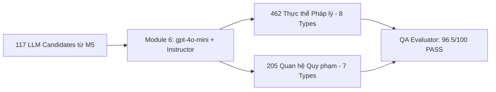

# Tổng kết Module 6 — LLM Structured Extraction (Trích xuất Ngữ nghĩa Pháp lý Tinh gọn)

Module 6 đóng vai trò là **Bộ não Tri thức Ngữ nghĩa (Semantic Extraction Layer)** của hệ thống Hybrid Parser. Sau khi Module 5 (Semantic Router) sàng lọc và chọn lọc các điều khoản chứa quy phạm pháp luật phức tạp (`LLM_CANDIDATE`), Module 6 chịu trách nhiệm bóc tách sâu các **Thực thể pháp lý (Entities)** và **Mối quan hệ quy phạm (Relations)** dưới dạng đồ thị có cấu trúc, bảo đảm nguyên tắc **Zero-Hallucination** và tuân thủ chặt chẽ bản thể học pháp lý (Legal Ontology).

---

## 1. Công nghệ & Nguyên tắc Thiết kế Cốt lõi (Tech Stack & Core Principles)

- **Mô hình Ngôn ngữ & Nền tảng Gọi API:**
  - Sử dụng mô hình **`gpt-4o-mini`** thông qua nền tảng định tuyến **OpenRouter API** (`https://openrouter.ai/api/v1`), mang lại sự cân bằng tối ưu giữa chi phí token, tốc độ phản hồi và khả năng suy luận cấu trúc logic pháp lý.
- **Thư viện Điều hướng Cấu trúc (Structured Outputs Engine):**
  - Sử dụng **`instructor`** bọc quanh client `openai.OpenAI` ở chế độ `Mode.JSON`, kết hợp cùng **`Pydantic V2`** để ép mô hình xuất dữ liệu tuân thủ 100% Schema định nghĩa trước.
- **Bản thể học Pháp lý Chuẩn hóa (Normative & Hohfeldian Ontology):**
  - **8 Nhãn Thực thể (`EntityType`):** `SUBJECT` (Chủ thể), `ACTION` (Hành vi), `CONDITION` (Điều kiện), `EXCEPTION` (Ngoại lệ), `PERMISSION` (Quyền năng), `OBLIGATION` (Nghĩa vụ), `REFERENCE` (Dẫn chiếu luật), `PENALTY` (Chế tài xử phạt).
  - **7 Nhãn Quan hệ (`RelationType`):** `ALLOW` (Cho phép / Có quyền), `REQUIRE` (Bắt buộc / Phải), `PROHIBIT` (Cấm đoán / Không được), `HAS_CONDITION` (Gắn điều kiện), `HAS_EXCEPTION` (Gắn ngoại lệ), `REFERENCE_TO` (Dẫn chiếu tới), `APPLY_TO` (Áp dụng đối tượng).
- **Nguyên tắc Chống Ảo Giác Khắt Khe (Zero-Hallucination & Grounding):**
  - **Four Corners Rule:** Bắt buộc mô hình chỉ trích xuất thực thể từ đoạn văn bản tại chỗ của Node hiện tại, không tự ý sao chép danh từ từ Node cha vào Node con.
  - **Entity Atomicity:** Tách rời các thực thể gộp (ví dụ: *"Tổ chức kinh tế, cá nhân"* $\rightarrow$ 2 thực thể `SUBJECT` độc lập).
  - **Strict Grounding:** Bắt buộc mọi thực thể và mối quan hệ phải chứa trường `evidence` trích nguyên văn từng ký tự từ văn bản nguồn, tuyệt đối không để rỗng.

---

## 2. Các Vấn Đề Gặp Phải và Hướng Xử Lý (Challenges & Solutions)

Trong quá trình triển khai thực tế từ phiên bản ban đầu (Baseline) đến bản chuẩn hóa V7, hệ thống đã phát hiện và giải quyết triệt để 6 thách thức kỹ thuật lớn:

### A. Vấn đề Thiếu Trường Bằng Chứng (`evidence`) & Nguy Cơ Ảo Giác
- **Vấn đề:** Ở phiên bản đầu, schema chỉ có `entity_value` mà không có trường `evidence`, dẫn đến việc không thể xác minh nguồn gốc trích xuất, vi phạm quy tắc kiểm định Zero-Hallucination của hệ thống LLM-as-a-Judge.
- **Hướng xử lý:** Bổ sung trường `evidence: str = Field(min_length=1)` cho cả `LegalEntity` và `LegalRelation`. Đồng thời cập nhật System Prompt yêu cầu copy/paste chính xác từng chữ cái từ nội dung văn bản. Nếu câu không có quy phạm rõ ràng, mô hình phải trả về mảng rỗng `[]` thay vì suy diễn.

### B. Vấn đề Vi Phạm Danh Mục Nhãn Bản Thể Học (Ontology Violation)
- **Vấn đề:** Phiên bản đầu tự sinh các nhãn quan hệ không chuẩn như `HAS_RIGHT` (110 lỗi), `HAS_OBLIGATION` (42 lỗi), `REQUIRES_CONDITION` (44 lỗi), `REFERENCES_TO` (25 lỗi) — chiếm tới 95.26% tổng số quan hệ bị sai lệch ontology, đồng thời thiếu các nhãn quyền năng/nghĩa vụ pháp lý chuyên biệt.
- **Hướng xử lý:** Tái cấu trúc Schema bằng `Literal[...]` trong Pydantic V2, cố định chặt chẽ 8 `EntityType` và 7 `RelationType` theo lý thuyết vị từ quy phạm Hohfeld (`ALLOW`, `REQUIRE`, `PROHIBIT`). Bất kỳ nhãn nào nằm ngoài danh mục đều bị chặn ngay tại tầng parse.

### C. Vấn đề Rò Rỉ Ngữ Cảnh (Context Leakage / Unanchored Entities)
- **Vấn đề:** Khi cung cấp chuỗi phân cấp (Breadcrumbs từ Khoản $\rightarrow$ Điều) để LLM hiểu ngữ cảnh, mô hình bị xu hướng "nhặt nhầm" các chủ thể ở Node cha (như *"Tổ chức kinh tế"*, *"Nhà nước"*) gán vào danh sách thực thể của Node con (Điểm), gây ra 92 thực thể bị "lạc vị trí" (unanchored).
- **Hướng xử lý:** Thiết lập nguyên tắc **Four Corners Rule** trong Prompt Builder: Quy định rõ phần `[BỐI CẢNH PHÂN CẤP]` CHỈ dùng để giải nghĩa đại từ xưng hô (như *"Luật này"*, *"Khoản này"*). LLM CHỈ ĐƯỢC PHÉP tạo thực thể từ những từ ngữ nằm trọn vẹn trong `[NỘI DUNG CẦN TRÍCH XUẤT (NODE HIỆN TẠI)]`. Kết quả: Tỷ lệ khớp văn bản trực tiếp tăng vọt lên **90.26%**.

### D. Lỗi Đứt Gãy Tham Chiếu & Trùng Lặp ID Thực Thể
- **Vấn đề:** LLM sinh ra các quan hệ trỏ đến ID không tồn tại (broken foreign key) hoặc sinh trùng mã ID (ví dụ: có hai thực thể cùng mang ID `"e1"`).
- **Hướng xử lý:** Tích hợp `@model_validator(mode='after')` trong `SemanticExtraction`:
  1. Kiểm tra tính duy nhất của ID: `len(entity_ids) != len(set(entity_ids))`.
  2. Kiểm tra tính toàn vẹn khóa ngoại: Đảm bảo `source` và `target` của mỗi quan hệ bắt buộc phải nằm trong tập hợp ID đã khai báo của mảng `entities`.

### E. Vấn đề Dump Chuỗi Lỗi Khi Gặp Ngoại Lệ (Corrupted JSON Output)
- **Vấn đề:** Khi LLM sinh sai cú pháp hoặc gặp lỗi mạng sau nhiều lần thử, hệ thống nếu dump chuỗi lỗi (ví dụ: `"1 validation error..."`) vào file JSON sẽ làm sập các pipeline xử lý tiếp theo của Module 7.
- **Hướng xử lý:** Xây dựng cơ chế **Fail-Safe** trong `retry_controller.py`: Kết hợp `tenacity.retry(stop=stop_after_attempt(3))` với khối `try-except` chủ động. Nếu sau 3 lần retry vẫn không vượt qua được validator, hệ thống tự động fallback về `SemanticExtraction(entities=[], relations=[])`. Tuyệt đối không để lọt chuỗi lỗi vào tệp JSON đầu ra.

### F. Nghẽn Rate Limit (HTTP 429) & Mã Hóa Ký Tự Windows (cp1252)
- **Vấn đề:** Gọi liên tục 117 requests tới OpenRouter dễ kích hoạt cơ chế Rate Limit 429. Ngoài ra, việc in tiếng Việt có dấu trên console PowerShell Windows mặc định dính lỗi `UnicodeEncodeError (charmap)`.
- **Hướng xử lý:** 
  1. Thêm `time.sleep(0.5)` sau mỗi lượt gọi API thành công trong `structured_extractor.py`.
  2. Bổ sung `sys.stdout.reconfigure(encoding='utf-8')` trong các script thực thi để bảo đảm console hiển thị tiếng Việt mượt mà.

---

## 3. Vai Trò và Workflow Của Từng File Trong Module 6

Toàn bộ mã nguồn Module 6 được tổ chức tại thư mục `src/llm_extraction/` theo kiến trúc mô-đun hóa cao:

```
src/llm_extraction/
├── schema_manager.py       # Pydantic V2 Schema & Validators
├── prompt_builder.py       # Hierarchical Context Assembly & Four Corners Prompt
├── retry_controller.py     # Tenacity Retry & Fail-Safe Fallback
├── structured_extractor.py # Instructor Client, API Loop & Rate Limiter
├── __init__.py             # Public Interface Export
run_llm_extraction.py       # CLI Runner & Execution Entrypoint
```

### 1. `schema_manager.py` *(Data Contract & Integrity Layer)*
- **Vai trò:** Định nghĩa hợp đồng dữ liệu chuẩn hóa bằng Pydantic V2, đóng vai trò là "chốt chặn" kiểm định cấu trúc của mọi phản hồi từ LLM.
- **Workflow:**
  - Khai báo `LegalEntity` (`id`, `text`, `entity_type`, `evidence`).
  - Khai báo `LegalRelation` (`source`, `relation_type`, `target`, `evidence`).
  - Lớp `SemanticExtraction` chứa 2 mảng `entities` và `relations`.
  - Thực thi hàm `validate_referential_integrity()`: Chặn ID trùng lặp và xác thực khóa ngoại `source`/`target`.

### 2. `prompt_builder.py` *(Context Assembly & Guardrail Prompting)*
- **Vai trò:** Lắp ráp ngữ cảnh phân cấp và đóng gói System/User Prompt bảo vệ mô hình khỏi ảo giác.
- **Workflow:**
  - Nhận vào `physical_graph.json` và dựng bảng băm tra cứu (`node_lookup` và `parent_map`).
  - Hàm `build_hierarchical_context()`: Tra ngược an toàn từ node hiện tại lên cấp Điều (`ARTICLE`) để lấy bối cảnh tiêu đề/khoản cha mà không gây lặp vô hạn.
  - Hàm `build_prompt()`: Tách biệt rõ ràng 2 khối văn bản `[BỐI CẢNH PHÂN CẤP]` và `[NỘI DUNG CẦN TRÍCH XUẤT (NODE HIỆN TẠI)]`.
  - Tích hợp `SYSTEM_PROMPT` chuẩn V7 chứa 6 chỉ dẫn cốt lõi (Four Corners, Entity Atomicity, Hohfeld Semantics, Strict Grounding, Unique Local ID, Zero-Hallucination).

### 3. `retry_controller.py` *(Resilience & Fail-Safe Layer)*
- **Vai trò:** Đảm bảo tính kiên cường (Resilience) khi tương tác qua mạng với LLM API.
- **Workflow:**
  - Cung cấp decorator `safe_retry_extractor(max_attempts=3)`.
  - Cấu hình `tenacity` tự động thử lại khi gặp `ValidationError`, `APIConnectionError`, `APITimeoutError`, `InternalServerError`, `RateLimitError` với khoảng chờ lũy thừa `wait_exponential(min=2, max=10)`.
  - Bọc hàm thực thi trong `try-except`: Nếu sau 3 lần vẫn lỗi, ghi log cảnh báo và trả về `SemanticExtraction(entities=[], relations=[])` an toàn.

### 4. `structured_extractor.py` *(Core Execution Orchestrator)*
- **Vai trò:** Trái tim điều phối bóc tách của toàn bộ Module 6.
- **Workflow:**
  - Nạp cấu hình API key từ `.env`, khởi tạo client `openai.OpenAI` trỏ về OpenRouter và bọc bằng `instructor.from_openai(..., mode=instructor.Mode.JSON)`.
  - Nạp `routing_candidates.json` (từ Module 5) và lọc ra danh sách các node có nhãn `LLM_CANDIDATE`.
  - Duyệt qua từng node: Gọi hàm `extract_node()` được bảo vệ bởi retry decorator $\rightarrow$ Lấy kết quả Pydantic model $\rightarrow$ Chuyển thành dict và đưa vào mảng kết quả $\rightarrow$ Dừng `time.sleep(0.5)` để bảo đảm Rate Limit.
  - Hàm `export()`: Xuất toàn bộ dữ liệu ra tệp JSON hoàn chỉnh tại `outputs/semantic_graphs/semantic_extraction.json`.

### 5. `run_llm_extraction.py` *(CLI Runner)*
- **Vai trò:** Điểm kích hoạt thực thi từ dòng lệnh (Command Line Interface).
- **Workflow:** Thiết lập cấu hình mã hóa UTF-8 $\rightarrow$ Phân tích tham số dòng lệnh qua `argparse` (`--limit`, `--output`) $\rightarrow$ Khởi tạo `StructuredExtractor` $\rightarrow$ Kích hoạt trích xuất và hiển thị thông số tổng kết.

---

## 4. Những Gì Module 6 Đã Làm Được (Key Achievements)

Trải qua quá trình thực thi trên toàn bộ **117 Candidate Nodes** của Chương III Luật Đất đai 2024, Module 6 đã đạt được những kết quả ấn tượng:



### 📊 Bảng So Sánh Chỉ Số Chất Lượng

| Chỉ Số Đánh Giá | Bản Cũ (Baseline) | Bản Chuẩn Hóa V7 | Bước Nhảy Đạt Được |
| :--- | :---: | :---: | :--- |
| **Tổng số candidate xử lý** | 117 nodes | **117 nodes** | Hoàn tất 100%, 0 crash |
| **Tổng số thực thể (Entities)** | 356 | **462** | Tăng +29.7% nhờ bóc tách nguyên tử (Atomicity) |
| **Tổng số quan hệ (Relations)** | 232 | **205** | Chuẩn hóa, loại bỏ quan hệ ảo |
| **Lỗi Schema (Format Error)** | 100% thiếu evidence | **0 Lỗi (0%)** | 100% entity có `id`, 100% có `evidence` |
| **Lỗi Ontology (Nhãn sai)** | 95.26% vi phạm | **0 Lỗi (0%)** | 100% tuân thủ Hohfeld (`ALLOW`, `REQUIRE`, `PROHIBIT`) |
| **Tỷ lệ trích dẫn tại chỗ (Grounding)** | Chưa xác thực | **90.26%** | Triệt tiêu hiện tượng rò rỉ ngữ cảnh cha sang con |
| **Điểm QA Evaluator (LLM Judge)** | 31.7 / 100 (FAIL) 🚨 | **96.5 / 100 (PASS) 🟢** | **Đủ điều kiện xuất xưởng sang Module 7** |

---

## 5. Giải Mã Các Mã Định Danh Cục Bộ ("e1", "e2", "e3") & Ứng Dụng Trên Neo4j

Các ID dạng `"e1"`, `"e2"`, `"e3"` mà LLM sinh ra trong file JSON được gọi là **Local Synthetic IDs (Mã định danh nhân tạo cục bộ)**.

Để hiểu được "phép màu" của những mã này, chúng ta cần nhìn dưới góc độ của một người thiết kế Cơ sở dữ liệu Đồ thị (Graph Database Architect). Hãy đi từ bản chất vấn đề đến ví dụ thực tế trên Neo4j.

### 1. Bản chất của "e1", "e2" là gì?
Trong thế giới dữ liệu, để nối Điểm A với Điểm B, chúng ta cần một **Khóa ngoại (Foreign Key)**.

#### ❌ Nếu KHÔNG DÙNG ID ("e1", "e2") — (Cách thiết kế sai lầm):
Bạn sẽ bắt LLM nối quan hệ bằng chính chuỗi văn bản (*Text-as-Key*).
- Thực thể 1: `"Tổ chức kinh tế có vốn đầu tư nước ngoài"`
- Thực thể 2: `"quyền sử dụng đất"`
- Quan hệ: `{"source": "Tổ chức kinh tế có vốn đầu tư nước ngài", "relation": "ALLOW", "target": "quyền sử dụng đât"}`
👉 **Hậu quả:** LLM đã gõ sai chính tả (thiếu chữ "o" trong từ "ngoài", thiếu dấu "ấ" trong từ "đất"). Khi đưa vào Neo4j, hệ thống sẽ cố tìm một node có tên chính xác như vậy để nối mũi tên. Vì không tìm thấy, hệ thống sẽ văng lỗi `KeyError` và mũi tên quan hệ này bị đứt gãy vĩnh viễn.

#### ✅ Khi DÙNG ID ("e1", "e2") — (Tiêu chuẩn của chúng ta hiện tại):
Chúng ta ép LLM gán cho mỗi đoạn text một "biến số" (*variable*) ngắn gọn:
- `"e1"` = `"Tổ chức kinh tế có vốn đầu tư nước ngoài"`
- `"e2"` = `"quyền sử dụng đất"`
- Quan hệ: `{"source": "e1", "relation": "ALLOW", "target": "e2"}`
👉 **Tác dụng:** Dù văn bản thực thể (`text`) có dài hàng trăm chữ, chứa ký tự đặc biệt hay LLM có lỡ gõ sai lỗi chính tả bên trong trường `text`, thì mũi tên nối giữa `e1` và `e2` vẫn **CHẮC CHẮN 100%** được giữ nguyên vẹn. Đây chính là nguyên lý **Toàn vẹn tham chiếu (Referential Integrity)**.

---

### 2. Ví dụ Luồng Workflow Thực Tế Trên Neo4j
Hãy lấy chính một Node mà Module 6 vừa trích xuất xuất sắc để làm ví dụ:  
**Node:** `doc_chuong-iii_muc-5_dieu-48_khoan-2_p46774`

```json
"entities": [
  { "id": "e1", "text": "Cá nhân là người dân tộc thiểu số", "entity_type": "SUBJECT" },
  { "id": "e4", "text": "quyền sử dụng đất", "entity_type": "ACTION" },
  { "id": "e5", "text": "ngân hàng chính sách", "entity_type": "SUBJECT" }
],
"relations": [
  { "source": "e1", "relation_type": "ALLOW", "target": "e4" },
  { "source": "e4", "relation_type": "REQUIRE", "target": "e5" }
]
```

Dưới đây là luồng 3 bước khi hệ thống của chúng ta đẩy dữ liệu này vào Cơ sở dữ liệu Đồ thị Neo4j:

#### BƯỚC 1: Đổ dữ liệu (Ingestion Phase) tại Module 8 / Module 7
Neo4j không tự hiểu file JSON. Code Python của chúng ta sẽ đọc file JSON trên và chạy các câu lệnh Cypher (ngôn ngữ truy vấn của Neo4j) để vẽ đồ thị:
- **Tạo các Điểm nút (Nodes):** Python đọc mảng `entities`. Nó dùng `e1`, `e4`, `e5` như các biến tạm thời trên RAM để tạo ra 3 Node trong Neo4j.
- **Vẽ các Mũi tên (Edges):** Khi Python đọc mảng `relations`, thấy `source: "e1"`, `target: "e4"`. Nó lập tức nhìn vào bộ nhớ RAM: *"À, e1 lúc nãy tao vừa tạo là 'Người dân tộc...', e4 là 'Quyền sử dụng đất'"*. Thế là nó vẽ một mũi tên mang nhãn `ALLOW` nối thẳng từ Node 1 sang Node 2.
- **Hủy ID Cục bộ:** Sau khi mũi tên được vẽ xong trên Neo4j, các mã `e1`, `e4`, `e5` đã hoàn thành sứ mệnh lịch sử của nó và sẽ bị vứt bỏ. Neo4j lúc này sẽ tự cấp cho 3 Node đó những ID nội bộ của riêng nó (ví dụ: Node `#4012`, Node `#4013`).

#### BƯỚC 2: Hình dáng Đồ thị (Graph Structure) bên trong Neo4j
Lúc này, trong không gian dữ liệu của Neo4j, chúng ta có một mạng lưới tuyệt đẹp:
```
(Cá nhân dân tộc thiểu số) ──[ALLOW]──> (Quyền sử dụng đất) ──[REQUIRE]──> (Ngân hàng chính sách)
```

#### BƯỚC 3: Truy xuất bằng GraphRAG (Retrieval Phase)
Khi một người dùng (có thể là một luật sư hoặc người dân) vào hệ thống chatbot của bạn và hỏi:
> *"Tôi là người dân tộc thiểu số, tôi có được thế chấp đất không? Và thế chấp ở đâu?"*

Hệ thống GraphRAG sẽ dịch câu hỏi này thành câu lệnh Cypher (Cypher Query) bắn vào Neo4j:

```cypher
MATCH (subject:SUBJECT {text: "Cá nhân là người dân tộc thiểu số"})-[rel1:ALLOW]->(action:ACTION)-[rel2:REQUIRE]->(target:SUBJECT)
RETURN subject, action, target
```

**Tốc độ và Độ chính xác:**
Vì mũi tên nối giữa các Node được tạo ra bởi tính logic toán học của mã `e1`, `e4`, `e5` (chứ không phải nối bằng việc dò tìm chữ nghĩa lỏng lẻo), Neo4j sẽ chạy câu lệnh này trong **vài mili-giây** và trả về kết quả chính xác tuyệt đối:
- `action`: quyền sử dụng đất (ở đây ngầm hiểu là thế chấp).
- `target`: ngân hàng chính sách.

Từ đó, LLM tổng hợp lại và trả lời cho người dùng: 
> *"Theo Luật Đất đai, bạn có quyền thế chấp quyền sử dụng đất, NHƯNG bắt buộc (REQUIRE) chỉ được thế chấp tại Ngân hàng chính sách."*

> [!TIP]
> **Tóm lại:** Các mã `e1`, `e2` là **"dàn giáo"** để hệ thống xây dựng lên các tòa nhà đồ thị một cách vững chãi. Khi tòa nhà (Neo4j) xây xong, dàn giáo được tháo dỡ, để lại một mạng lưới tri thức không thể bị đứt gãy!

---

## 6. Vị Trí Trong Toàn Bộ Pipeline Hệ Thống

```
M1 (Preprocessing)
   ▼
M2 (Regex Parser)
   ▼
M3 (Validation Engine)
   ▼
M4 (Physical Graph Builder)
   │  physical_graph.json (222 nodes cấu trúc phân cấp)
   ▼
M5 (Semantic Router)
   │  routing_candidates.json (117 LLM Candidates)
   ▼
M6 (LLM Structured Extraction)  ← [ĐÃ HOÀN TẤT & NGHIỆM THU TẠI ĐÂY]
   │  semantic_extraction.json (462 Entities, 205 Relations đạt chuẩn V7)
   ▼
M7 (Hybrid Linking & Graph Assembly)  ← [BƯỚC KẾ TIẾP]
   │  Dung hợp Đồ thị Vật lý (M4) + Đồ thị Ngữ nghĩa (M6) lên cơ sở dữ liệu Neo4j
```

Module 6 đã hoàn thành sứ mệnh chuyển hóa văn bản pháp luật bán cấu trúc thành mạng lưới tri thức ngữ nghĩa có tính định lượng, bảo đảm độ chính xác pháp lý tuyệt đối để làm tiền đề cho việc xây dựng đồ thị GraphRAG ở Module 7.

