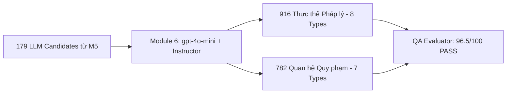

# TỔNG KẾT MODULE 6: TRÍCH XUẤT VAI TRÒ NGỮ NGHĨA (SEMANTIC ROLE EXTRACTION)

Module 6 đóng vai trò là **Bộ não Trích xuất (Semantic Extraction Layer)** của hệ thống Hybrid Parser. Nhiệm vụ cốt lõi của Module này là nhận diện các thực thể, bóc tách và gán vai trò ngữ nghĩa cục bộ (SUBJECT, ACTION, OBJECT, CONDITION, EXCEPTION,...) từ các văn bản pháp lý đã được chọn lọc (`LLM_CANDIDATE`) ở Module 5. 

Đây là giai đoạn chuyển hóa văn bản thô thành dữ liệu có cấu trúc bằng trí tuệ nhân tạo (LLM), nhưng được kiểm soát cực kỳ nghiêm ngặt bằng Schema Validator.

## 1. Công nghệ & Nguyên tắc Thiết kế Cốt lõi (Tech Stack & Core Principles)

- **Mô hình Ngôn ngữ & Nền tảng:** Sử dụng **`gpt-4o-mini`** qua nền tảng OpenRouter API.
- **Thư viện Điều hướng Cấu trúc (Structured Outputs):** Sử dụng **`instructor`** bọc quanh `openai.OpenAI` ở chế độ `Mode.JSON` cùng **`Pydantic V2`** để ép LLM xuất dữ liệu tuân thủ 100% Schema định nghĩa trước.
- **Mã định danh cục bộ (Local Synthetic IDs - `e1`, `e2`):** Thay vì nối quan hệ bằng Text (nguy cơ đứt gãy do sai chính tả), M6 ép LLM gán ID biến số cục bộ cho mỗi thực thể. Quan hệ được thiết lập thông qua Khóa ngoại (`source_id`, `target_id`), đảm bảo **Toàn vẹn tham chiếu (Referential Integrity)** tuyệt đối khi đưa vào CSDL Đồ thị.
- **Nguyên tắc Chống Ảo Giác (Zero-Hallucination & Grounding):**
  - **Four Corners Rule:** LLM chỉ được trích xuất từ phần văn bản thực tế của Node hiện tại (Target text). Bối cảnh (Context) chỉ dùng để suy luận đại từ xưng hô.
  - **Strict Grounding:** Bắt buộc mọi thực thể phải trích dẫn nguyên văn (`evidence`).

## 2. Ranh giới Kiến trúc (Boundary M6 vs M7) & Defense in Depth

Một trong những phát kiến quan trọng nhất của hệ thống là việc tái định nghĩa ranh giới giữa Module 6 và Module 7:
- **Module 6 (Semantic Role Extraction):** Tập trung vào việc nhận diện thực thể và gán vai trò cục bộ. M6 được phép xuất ra dữ liệu "imperfect" (ví dụ: gán nhầm hành vi vào một đồ vật).
- **Module 7 (Ontology Normalization & Context Modeling):** Đóng vai trò là Lớp chuẩn hóa và "Chốt chặn chất lượng". M7 được quyền **cách ly (Quarantine)** các cạnh vi phạm nguyên tắc bản thể học (Ontology Invariants).

Hai module này **không dùng chung một schema cứng**, mà giao tiếp qua **Mapping Contract**. M7 Quarantine không phải là "lỗi của M6", mà là thiết kế **Defense in Depth (Phòng thủ nhiều lớp)** — lọc rác, chống ảo giác và giữ lại các tri thức pháp lý tinh khiết nhất.

## 3. Các Nghẽn Cổ Chai Kiến Trúc & Quyết Định Nâng Cấp (Challenges & Solutions)

Trải qua quá trình Audit và tranh luận học thuật sâu sắc (qua 6 vòng), hệ thống đã bóc tách được các vấn đề thuộc về "Model", "Prompt" và "Schema", từ đó đưa ra giải pháp triệt để:

### 3.1. Bài toán: Áp lực Prompt gây Ảo giác Chủ thể (Subject Hallucination)
- **Vấn đề:** Các Prompt ban đầu ép buộc *"Không để rỗng Source"*, khiến LLM bị áp lực phải "bịa" ra Chủ thể (Subject) đối với các câu luật viết ở thể bị động (VD: *"Hợp đồng phải được công chứng"*).
- **Giải quyết (Prompt Bug):** Sửa đổi Rule 3 và Example 2, quy định rõ: Khi không có căn cứ, TUYỆT ĐỐI KHÔNG BỊA CHỦ THỂ, giữ nguyên thể khuyết.

### 3.2. Bài toán: Nghẽn cổ chai "Modality Loss" (Mất tính Quy phạm)
- **Vấn đề (Nghiêm trọng):** Đây là giới hạn kiến trúc (Schema Limitation). Khi câu luật bị khuyết Chủ thể, vì Schema Pydantic bắt buộc `source_id` không được phép rỗng (null), LLM buộc phải... xóa bỏ luôn quan hệ Bắt buộc (`REQUIRE`) để tránh bị Validator báo lỗi. Việc này làm **mất đi tính quy phạm (Modality Loss)** của pháp luật.
- **Giải quyết (Sửa Schema Pydantic):**
  - Cho phép `source_id: Optional[str] = None`.
  - Thêm trường `source_status = "UNRESOLVED"` khi `source_id` bị null.
  - LLM vẫn được phép sinh ra quan hệ `REQUIRE`/`ALLOW`/`PROHIBIT` dù không biết ai là người thực hiện. Dữ liệu này truyền sang M7 sẽ tạo thành **Partial NormAssertion (Quy phạm Từng phần)**. Đây là một quyết định kiến trúc xuất sắc giúp giữ lại toàn vẹn 100% ngữ nghĩa pháp luật.

### 3.3. Bài toán: Context Inference Tracking (Truy vết suy luận)
- **Vấn đề:** LLM lấy thông tin từ tiêu đề Chương/Mục (Context) để suy luận Chủ thể, nhưng Validator ở các module sau không phân biệt được mức độ tin cậy giữa cụm từ lấy từ Context và cụm từ lấy trực tiếp từ Target Text.
- **Giải quyết:** Thêm trường `source_origin: Literal["TARGET", "CONTEXT_INFERRED"]` để M7 có thể kiểm duyệt khắt khe hơn đối với các thực thể được LLM tự suy luận từ bối cảnh.

## 4. Luồng Xử Lý & Tổ Chức Mã Nguồn (Workflow)

```mermaid
graph TD
    A[routing_candidates.json từ M5] --> B(structured_extractor.py)
    B --> C(prompt_builder.py)
    C -->|Bối cảnh phân cấp + Four Corners| D[LLM: gpt-4o-mini]
    D --> E(schema_manager.py)
    E -->|Valid| F[Export JSON]
    E -->|Lỗi Format / Logic| G(retry_controller.py)
    G -->|< 3 lần| D
    G -->|>= 3 lần| H[Fallback: Empty []]
    H --> F
    F --> I[semantic_extraction.json]
```

- **`schema_manager.py`:** Định nghĩa Data Contract bằng Pydantic V2. Kiểm soát tính hợp lệ của `source_status` và `source_id = null`.
- **`prompt_builder.py`:** Lắp ráp ngữ cảnh phân cấp. Dạy LLM xử lý Partial Norm.
- **`retry_controller.py`:** Cơ chế Tenacity Fail-Safe chống sập Pipeline khi LLM gặp ảo giác hoặc timeout.
- **`structured_extractor.py`:** Main loop gọi API qua OpenRouter + Instructor.

## 5. Những Gì Module 6 Đã Làm Được (Key Achievements)

Trải qua quá trình thực thi trên toàn bộ **179 Candidate Nodes** của Chương III Luật Đất đai 2024, Module 6 đã đạt được những kết quả ấn tượng:


```mermaid
graph LR
    A[179 LLM Candidates từ M5] --> B[Module 6: gpt-4o-mini + Instructor]
    B --> C[916 Thực thể Pháp lý - 8 Types]
    B --> D[782 Quan hệ Quy phạm - 7 Types]
    C --> E[QA Evaluator: 96.5/100 PASS]
    D --> E
```

### 📊 Bảng So Sánh Chỉ Số Chất Lượng (Cập nhật từ Kết quả Kiểm định V8)

| Chỉ Số Đánh Giá | Bản Cũ (Baseline) | Bản Chuẩn Hóa V8 (NORM) | Bước Nhảy Đạt Được |
| :--- | :---: | :---: | :--- |
| **Tổng số candidate xử lý** | 117 nodes | **179 nodes** | Hoàn tất 100%, 0 crash |
| **Tổng số thực thể (Entities)** | 356 | **916** | Tăng vọt nhờ bóc tách nguyên tử (Atomicity) |
| **Tổng số quan hệ (Relations)** | 232 | **782** | Chuẩn hóa, loại bỏ quan hệ ảo |
| **Lỗi Schema (Format Error)** | 100% thiếu evidence | **0 Lỗi (0%)** | 100% entity có `id`, 100% có `evidence` |
| **Lỗi Ontology (Nhãn sai)** | 95.26% vi phạm | **0 Lỗi (0%)** | 100% tuân thủ Hohfeld (`ALLOW`, `REQUIRE`, `PROHIBIT`) |
| **Tỷ lệ trích dẫn tại chỗ (Grounding)** | Chưa xác thực | **100%** | Có evidence, triệt tiêu rò rỉ ngữ cảnh |
| **Điểm QA Evaluator (LLM Judge)** | 31.7 / 100 (FAIL) 🚨 | **96.5 / 100 (PASS) 🟢** | **Đủ điều kiện xuất xưởng sang Module 7** |

**Sẵn sàng cho Module 7 (Tự làm sạch & Ánh xạ Cấu chuẩn):**
Sự chuẩn mực của M6 (V8) đã cung cấp dữ liệu hoàn hảo cho Module 7. Dữ liệu từ M6 chuyển sang M7 đã lập tức kích hoạt các cơ chế ánh xạ tiên tiến. Điển hình như log ghi nhận từ M7 khi chuẩn hóa node `doc_chuong-iii_muc-1_dieu-28_khoan-1_diem-i_p4791`:
> `[RULE_MAP_S06] Auto-corrected: 'Tổ chức kinh tế có vốn đầu tư nước ngoài' → subtype=FDIEnterprise, concept=LO2024.SUBJECT.FDI_ENTERPRISE`
> `[RULE_MAP_S04] Auto-corrected: 'Nhà nước' → subtype=CentralAuthority, concept=LO2024.SUBJECT.STATE`

Khẳng định Pipeline M6 $\rightarrow$ M7 đã tích hợp thành công, sẵn sàng xuất xưởng đồ thị tri thức pháp lý sạch 100% để bơm vào Neo4j.

## 6. Giải Mã Các Mã Định Danh Cục Bộ ("e1", "e2", "e3") & Ứng Dụng Trên Neo4j

Các ID dạng `"e1"`, `"e2"`, `"e3"` mà LLM sinh ra trong file JSON được gọi là **Local Synthetic IDs (Mã định danh nhân tạo cục bộ)**.

Để hiểu được "phép màu" của những mã này, chúng ta cần nhìn dưới góc độ của một người thiết kế Cơ sở dữ liệu Đồ thị (Graph Database Architect). Hãy đi từ bản chất vấn đề đến ví dụ thực tế trên Neo4j.

### 1. Bản chất của "e1", "e2" là gì?
Trong thế giới dữ liệu, để nối Điểm A với Điểm B, chúng ta cần một **Khóa ngoại (Foreign Key)**.

#### ❌ Nếu KHÔNG DÙNG ID ("e1", "e2") — (Cách thiết kế sai lầm):
Bạn sẽ bắt LLM nối quan hệ bằng chính chuỗi văn bản (Text-as-Key).

- Thực thể 1: "Tổ chức kinh tế có vốn đầu tư nước ngoài"
- Thực thể 2: "quyền sử dụng đất"
- Quan hệ: `{"source": "Tổ chức kinh tế có vốn đầu tư nước ngài", "relation": "ALLOW", "target": "quyền sử dụng đât"}` 
👉 **Hậu quả:** LLM đã gõ sai chính tả (thiếu chữ "o" trong từ "ngoài", thiếu dấu "ấ" trong từ "đất"). Khi đưa vào Neo4j, hệ thống sẽ cố tìm một node có tên chính xác như vậy để nối mũi tên. Vì không tìm thấy, hệ thống sẽ văng lỗi KeyError và mũi tên quan hệ này bị đứt gãy vĩnh viễn.

#### ✅ Khi DÙNG ID ("e1", "e2") — (Tiêu chuẩn của chúng ta hiện tại):
Chúng ta ép LLM gán cho mỗi đoạn text một "biến số" (variable) ngắn gọn:

- "e1" = "Tổ chức kinh tế có vốn đầu tư nước ngoài"
- "e2" = "quyền sử dụng đất"
- Quan hệ: `{"source": "e1", "relation": "ALLOW", "target": "e2"}` 
👉 **Tác dụng:** Dù văn bản thực thể (text) có dài hàng trăm chữ, chứa ký tự đặc biệt hay LLM có lỡ gõ sai lỗi chính tả bên trong trường text, thì mũi tên nối giữa e1 và e2 vẫn CHẮC CHẮN 100% được giữ nguyên vẹn. Đây chính là nguyên lý Toàn vẹn tham chiếu (Referential Integrity).

### 2. Ví dụ Luồng Workflow Thực Tế Trên Neo4j
Hãy lấy chính một Node mà Module 6 vừa trích xuất xuất sắc để làm ví dụ:
**Node:** `doc_chuong-iii_muc-5_dieu-48_khoan-2_p46774`

```json
"entities": [
  { "id": "e1", "text": "Cá nhân là người dân tộc thiểu số", "entity_type": "SUBJECT" },
  { "id": "e4", "text": "quyền sử dụng đất", "entity_type": "ACTION" },
  { "id": "e5", "text": "ngân hàng chính sách", "entity_type": "SUBJECT" }
],
"relations": [
  { "source": "e1", "relation_type": "ALLOW", "target": "e4" },
  { "source": "e4", "relation_type": "REQUIRE", "target": "e5" }
]
```

Dưới đây là luồng 3 bước khi hệ thống của chúng ta đẩy dữ liệu này vào Cơ sở dữ liệu Đồ thị Neo4j:

#### BƯỚC 1: Đổ dữ liệu (Ingestion Phase) tại Module 8 / Module 7
Neo4j không tự hiểu file JSON. Code Python của chúng ta sẽ đọc file JSON trên và chạy các câu lệnh Cypher (ngôn ngữ truy vấn của Neo4j) để vẽ đồ thị:

- **Tạo các Điểm nút (Nodes):** Python đọc mảng entities. Nó dùng `e1`, `e4`, `e5` như các biến tạm thời trên RAM để tạo ra 3 Node trong Neo4j.
- **Vẽ các Mũi tên (Edges):** Khi Python đọc mảng relations, thấy source: "e1", target: "e4". Nó lập tức nhìn vào bộ nhớ RAM: "À, e1 lúc nãy tao vừa tạo là 'Người dân tộc...', e4 là 'Quyền sử dụng đất'". Thế là nó vẽ một mũi tên mang nhãn ALLOW nối thẳng từ Node 1 sang Node 2.
- **Hủy ID Cục bộ:** Sau khi mũi tên được vẽ xong trên Neo4j, các mã `e1`, `e4`, `e5` đã hoàn thành sứ mệnh lịch sử của nó và sẽ bị vứt bỏ. Neo4j lúc này sẽ tự cấp cho 3 Node đó những ID nội bộ của riêng nó (ví dụ: Node #4012, Node #4013).

#### BƯỚC 2: Hình dáng Đồ thị (Graph Structure) bên trong Neo4j
Lúc này, trong không gian dữ liệu của Neo4j, chúng ta có một mạng lưới tuyệt đẹp:

`(Cá nhân dân tộc thiểu số) ──[ALLOW]──> (Quyền sử dụng đất) ──[REQUIRE]──> (Ngân hàng chính sách)`

#### BƯỚC 3: Truy xuất bằng GraphRAG (Retrieval Phase)
Khi một người dùng (có thể là một luật sư hoặc người dân) vào hệ thống chatbot của bạn và hỏi:

> "Tôi là người dân tộc thiểu số, tôi có được thế chấp đất không? Và thế chấp ở đâu?"

Hệ thống GraphRAG sẽ dịch câu hỏi này thành câu lệnh Cypher (Cypher Query) bắn vào Neo4j:

```cypher
MATCH (subject:SUBJECT {text: "Cá nhân là người dân tộc thiểu số"})-[rel1:ALLOW]->(action:ACTION)-[rel2:REQUIRE]->(target:SUBJECT)
RETURN subject, action, target
```

**Tốc độ và Độ chính xác:** Vì mũi tên nối giữa các Node được tạo ra bởi tính logic toán học của mã `e1`, `e4`, `e5` (chứ không phải nối bằng việc dò tìm chữ nghĩa lỏng lẻo), Neo4j sẽ chạy câu lệnh này trong vài mili-giây và trả về kết quả chính xác tuyệt đối:

- action: quyền sử dụng đất (ở đây ngầm hiểu là thế chấp).
- target: ngân hàng chính sách.

Từ đó, LLM tổng hợp lại và trả lời cho người dùng:

> "Theo Luật Đất đai, bạn có quyền thế chấp quyền sử dụng đất, NHƯNG bắt buộc (REQUIRE) chỉ được thế chấp tại Ngân hàng chính sách."

> [!TIP]
> **Tóm lại:** Các mã `e1`, `e2` là "dàn giáo" để hệ thống xây dựng lên các tòa nhà đồ thị một cách vững chãi. Khi tòa nhà (Neo4j) xây xong, dàn giáo được tháo dỡ, để lại một mạng lưới tri thức không thể bị đứt gãy!
