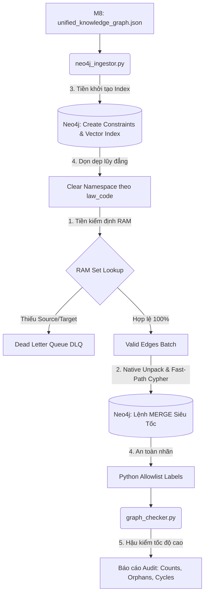

# Tổng kết Module 9: Neo4j Ingestion Engine (M9 V3.0)

Module 9 là chặng đường cuối cùng của hệ thống Hybrid Parser, đảm nhận vai trò **Vật lý hóa (Materialize)** Đồ thị Tri thức Thống nhất (UKG) từ định dạng Flat JSON (ở Module 8) lên hệ quản trị cơ sở dữ liệu đồ thị Neo4j. 

Bản cập nhật kiến trúc **M9 V3.0** mang triết lý cốt lõi: *"Không bắt Database làm những việc của RAM"*. Nhờ đó, M9 trở thành một Động cơ Nạp (Ingestion Engine) siêu tốc, có khả năng tự kiểm chứng (Self-verifying) và miễn nhiễm với ảo giác của AI.

---

## 1. Kiến trúc Hệ thống & Luồng Xử lý (Workflow)

Kiến trúc M9 V3.0 phá vỡ tư duy "Fire-and-forget" truyền thống, thay bằng quy trình đóng vòng khép kín (Closed-loop) với sự bảo vệ của In-memory DLQ:

### 5 Trụ cột Cốt lõi (V3.0):
1. **In-Memory Dead Letter Queue (Tiền kiểm định trên RAM):** Thay vì dùng Subquery `CALL { UNION }` đắt đỏ trên Cypher, Python nạp toàn bộ ID Node vào bộ nhớ `set()` để tra cứu cực tốc độ ($O(1)$). Bất kỳ cạnh nào khuyết mút (Source/Target) đều bị đẩy vào DLQ, chỉ giữ lại `valid_edges` nguyên chất.
2. **Fast-Path Cypher & Unpack Native Properties:** Vì dữ liệu đã sạch, Cypher dùng cú pháp `SET n += row.properties` để bung trực tiếp (Unpack) toàn bộ JSON thành các thuộc tính Native. Các batch từ 500-1000 record được chạy trơn tru qua mệnh đề `UNWIND`.
3. **Hybrid Search Pre-Indexing:** Ngay trước khi nạp dữ liệu, M9 tự động trải thảm "đường cao tốc" cho M10 (GraphRAG) bằng cách tạo B-Tree Index cho `ontology_class`, `modality` và khởi tạo luôn **Vector Index** trên trường `embedding`.
4. **An Toàn Nhãn (Safe Labels) & Lũy đẳng Namespace:** Dùng Python rà soát nhãn sinh ra qua lớp màng lọc Allowlist (chặn đứng Cypher Injection). Lệnh `MATCH ... DETACH DELETE` chạy trước mỗi lần nạp giúp làm sạch không gian theo `law_code`, đảm bảo tính lũy đẳng (Idempotency).
5. **Hậu kiểm Tốc độ cao (Lightweight Audit):** Sử dụng `graph_checker.py` làm giám khảo cuối cùng để đếm đối chiếu số lượng Node/Edge, truy quét Node mồ côi (Orphan) và Vòng lặp ngữ nghĩa (Semantic Cycles) ngay trên Neo4j.

---

## 2. Các Bài Toán Gặp Phải & Cách Giải Quyết

Trong quá trình từ V1.0 lên V3.0, M9 đã phải giải quyết nhiều bài toán nhức nhối ở ranh giới giữa Code Logic và Database:

### Bài toán 2.1: Silent Drop và Nghẽn Cổ Chai Subquery
- **Tình trạng:** Việc kiểm tra hai đầu mút của một Cạnh bằng Cypher `OPTIONAL MATCH` kết hợp Subquery làm Neo4j kiệt sức khi Scale-up. Mặc dù nó phát hiện được cạnh khuyết (Silent Drop), nhưng gánh nặng I/O lên Database là khổng lồ (vấn đề N+1 query).
- **Giải quyết:** Triển khai **Trụ cột 1 (DLQ trên RAM)**. Chuyển gánh nặng Validation về RAM của máy chủ Python. Python lọc mảng nhanh gấp hàng nghìn lần Database, biến Cypher trở thành Động cơ Nạp thuần túy siêu tốc (**Trụ cột 2**).

### Bài toán 2.2: Ảo giác Nhãn (Hallucinated Labels) dẫn đến Cypher Injection
- **Tình trạng:** Bản chất của việc truyền mảng `labels` sinh ra từ LLM trực tiếp vào mệnh đề Cypher động (Dynamic Labels) tạo ra rủi ro chèn mã độc (Cypher Injection). Đồng thời AuraDB 5.x chưa hỗ trợ tốt cú pháp `SET n:$(...)`.
- **Giải quyết:** Triển khai **Trụ cột 4 (Python Allowlist)**. Python kiểm tra cứng các nhãn hợp lệ (như `GLOBAL_NORM`, `CONDITION`, `PENALTY`) và tự động sinh lệnh Cypher an toàn gán cứng nhãn: `SET n:\`Label\``.

### Bài toán 2.3: Ô nhiễm đồ thị khi Retry (Thiếu tính Lũy đẳng)
- **Tình trạng:** Khi một Batch lỗi giữa chừng, nếu chạy lại Script thì Neo4j sẽ sinh ra các Node bóng ma (Ghost Nodes) bị nhân bản đôi, phá nát toàn bộ đồ thị do không biết xóa dữ liệu cũ thế nào cho an toàn.
- **Giải quyết:** Tận dụng siêu dữ liệu (Metadata). M9 tự động bóc tách `law_code` (Ví dụ: `59/2024/QH15`) và xóa sạch (Clear Namespace) phân vùng dữ liệu của bộ luật đó trước khi nạp lại. Đảm bảo Idempotency tuyệt đối.

### Bài toán 2.4: Khó khăn cho GraphRAG khi truy vấn JSON lồng nhau
- **Tình trạng:** Ở phiên bản trước, các thuộc tính (như `modality`) bị nén trong một chuỗi `properties_json`, khiến GraphRAG không thể linh hoạt dùng câu lệnh `WHERE n.modality = 'ALLOW'` để lọc dữ liệu trực tiếp từ Neo4j.
- **Giải quyết:** Loại bỏ `properties_json`. Sử dụng **Unpack Native Properties** thông qua toán tử giải nén của Cypher `SET n += row.properties`. Các trường như `source_node_ids`, `modality` trở thành thuộc tính hạng nhất trên Database.

---

## 3. Đánh giá Kiến trúc Hệ thống

Kiến trúc M9 V3.0 đã thiết lập một tiêu chuẩn mới về **"Self-Verifying Ingestion Pipeline" (Đường ống tự xác thực)**. Thay vì phó mặc tính toàn vẹn cho Database, tầng Application (Python) giờ đây đóng vai trò người giữ cổng (Gatekeeper) khắt khe nhất:
- **Tốc độ:** Tăng vọt nhờ xử lý In-memory Validation và Fast-Path MERGE.
- **Bảo mật:** Chống Cypher Injection hoàn hảo từ LLM.
- **Trạng thái Sẵn sàng:** Hệ thống Vector Index và B-Tree Index được chuẩn bị sẵn sàng từ Day-0.

Với M9 V3.0, đồ thị UKG được nạp lên Neo4j không chỉ là một kho chứa (Storage), mà thực sự là một cơ sở dữ liệu "chống đạn" (Bulletproof), trải sẵn thảm đỏ để Hệ thống Tác tử Trí tuệ Nhân tạo (Agentic GraphRAG - M10) bắt đầu cất cánh.
