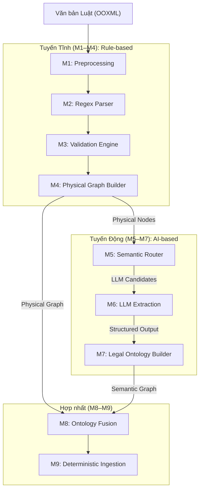

# CHƯƠNG 3: PHƯƠNG PHÁP NGHIÊN CỨU

---

## 3.0. Thiết kế nghiên cứu tổng thể

### 3.0.1. Câu hỏi nghiên cứu (Research Questions)

Nghiên cứu này được thiết kế nhằm giải quyết bài toán biểu diễn và truy xuất tri thức pháp lý thông qua phương pháp tiếp cận lai Neuro-symbolic. Cụ thể, phương pháp luận được xây dựng để trả lời bốn câu hỏi nghiên cứu (RQ) trọng tâm:

- **RQ1 (Độ tin cậy cấu trúc):** Phương pháp trích xuất lai (Hybrid Parser) có bảo toàn được tính toàn vẹn cấu trúc của văn bản quy phạm pháp luật tốt hơn so với các phương pháp chia nhỏ văn bản (Naive Chunking) thuần túy không?
- **RQ2 (Tối ưu hóa chi phí):** Cơ chế định tuyến ngữ nghĩa (Semantic Routing) có khả năng giảm thiểu khối lượng tính toán của Mô hình Ngôn ngữ Lớn (Candidate Reduction) ở mức độ nào trong khi vẫn duy trì được độ phủ thông tin (Recall)?
- **RQ3 (Bảo toàn ngữ nghĩa quy phạm):** Cấu trúc biểu diễn đa nguyên (N-ary NormAssertion) có cải thiện khả năng xử lý các quy phạm pháp luật có điều kiện và ngoại lệ lồng ghép so với các biểu diễn quan hệ nhị phân truyền thống không?
- **RQ4 (Hiệu quả truy xuất):** Việc hợp nhất đồ thị cấu trúc vật lý và đồ thị tri thức ngữ nghĩa (Fusion) có đóng góp vào việc nâng cao các chỉ số độ chính xác ngữ cảnh (Context Precision) trong hệ thống RAG không?

### 3.0.2. Cấu trúc hệ thống và trạng thái thực nghiệm

Hệ thống đề xuất được module hóa thành 11 thành phần (M1-M11) theo nguyên lý thiết kế **Unidirectional Data Flow** (Luồng dữ liệu một chiều). Dữ liệu chỉ di chuyển tuyến tính từ văn bản gốc đến đồ thị tri thức đích, ngăn chặn hoàn toàn các vòng lặp phản hồi gây nhiễu trạng thái. Nhằm đảm bảo tính minh bạch, trạng thái triển khai và vai trò thực nghiệm của từng thành phần được xác định rõ:

| Nhóm Module | Module | Chức năng | Trạng thái thực nghiệm |
| :--- | :--- | :--- | :--- |
| **Static Pipeline** | M1–M4 | Trích xuất cấu trúc vật lý (Rule-based) | Đã triển khai |
| **Dynamic Pipeline** | M5 | Semantic Router (SLM + Regex) | Đã triển khai & Đánh giá |
| | M6 | LLM Structured Extraction | Đã triển khai & Đánh giá |
| | M7 | Legal Ontology Builder (Human-in-the-loop) | Đã triển khai & Đánh giá |
| **Fusion & Ingestion**| M8 | Ontology Fusion | Đã triển khai & Đánh giá |
| | M9 | Deterministic Neo4j Ingestion | Đã triển khai |
| **Retrieval & Eval** | M10 | Graph Retrieval Protocol | Lớp Biến kiểm soát (Control) |
| | M11 | Evaluation Engine | Lớp Đánh giá (Evaluation) |

---

## 3.1. Đối tượng, dữ liệu và phạm vi

### 3.1.1. Tập dữ liệu thí điểm (Pilot Corpus)

Nghiên cứu sử dụng Chương III, Luật Đất đai 2024 làm tập dữ liệu thí điểm (Pilot Corpus). *Lưu ý pháp lý:* Các quy tắc bóc tách cấu trúc được định hình dựa trên kỹ thuật trình bày văn bản theo Nghị định 34/2016/NĐ-CP, đóng vai trò là bối cảnh định dạng dữ liệu (data formatting context) sinh ra văn bản nguồn.

### 3.1.2. Giới hạn phạm vi thực nghiệm và Định hướng mở rộng

Việc lựa chọn Chương III Luật Đất đai 2024 không mang tính ngẫu nhiên mà được chọn làm **Worst-case Pilot (Mẫu thử nghiệm phức tạp đại diện)**. Đoạn văn bản này chứa đầy đủ 5 tầng phân cấp (Chương ➔ Mục ➔ Điều ➔ Khoản ➔ Điểm), mật độ dẫn chiếu chéo cao, và bao hàm đa dạng các loại chủ thể pháp lý (Nguyen và cộng sự, 2024; Phan và cộng sự, 2025). Tuy nhiên, nghiên cứu thừa nhận giới hạn thực nghiệm khi chỉ đánh giá trên một phân đoạn văn bản (222 node vật lý). Kết quả thực nghiệm ở Chương 4 thể hiện tính khả thi của kiến trúc (Proof of Concept). Việc mở rộng đánh giá (benchmark) trên đa văn bản sẽ được đề xuất cho các nghiên cứu tiếp theo.

### 3.1.3. Quy trình phân chia dữ liệu (Data Split)

Tập dữ liệu Ground Truth (222 node vật lý) được gán nhãn thủ công và phân chia nghiêm ngặt thành hai phần để tránh rò rỉ dữ liệu (data leakage):
1. **Development Set (Tập phát triển):** Chiếm tỷ lệ 60% corpus (tương đương 133 physical nodes), được sử dụng để hiệu chỉnh các tham số ngưỡng (như threshold tuning $\tau$) cho phương pháp định tuyến M5.
2. **Held-out Test Set (Tập kiểm thử độc lập):** Chiếm tỷ lệ 40% corpus (tương đương 89 physical nodes), được bảo vệ hoàn toàn khỏi quá trình tinh chỉnh và chỉ được sử dụng một lần duy nhất cho việc đánh giá độc lập ở Chương 4.

---

## 3.2. Research Baseline và Experimental Design

Để đo lường hiệu quả của phương pháp đề xuất, nghiên cứu thiết lập quy trình đối chứng với các baseline tiêu chuẩn:

| ID | Baseline | Biểu diễn tri thức | Phương pháp truy xuất | LLM Reader | Mục đích |
| :--- | :--- | :--- | :--- | :--- | :--- |
| **B1** | Naive RAG | Text chunks (fixed-token) | Vector (Cosine Similarity) | Cố định | Đánh giá với RAG truyền thống. |
| **B2** | Hybrid RAG | Text chunks | Vector + BM25 (Lexical) | Cố định | Đánh giá tác động của Lexical search. |
| **B3** | Rule Graph | Physical Graph | Vector + Graph Traversal | Cố định | Kiểm định vai trò cấu trúc phân cấp. |
| **B4** | Proposed | Physical Graph + NormAssertion | Theo giao thức M10 | Cố định | Đánh giá kiến trúc đồ thị lai toàn diện. |

Tất cả các baseline sử dụng chung một ngân sách ngữ cảnh (context budget) và bộ thông số sinh văn bản nhằm loại bỏ các yếu tố nhiễu.

---

## 3.3. Kiến trúc hệ thống đề xuất

Phương pháp tiếp cận mang bản chất **Neuro-symbolic**, kết hợp giữa tri thức quy tắc cứng (Rule-based parsing, Hierarchy Stack) để đảm bảo độ tin cậy cấu trúc, và trí tuệ nhân tạo sinh tạo (LLM Structured Extraction) để xử lý ngữ nghĩa lồng ghép.

---

## 3.4. Static Structural Pipeline (Tuyến Tĩnh)

### 3.4.1. Khôi phục cấu trúc và chuẩn hóa (M1)

Tiến hành chuẩn hóa chuỗi Unicode về dạng chuẩn NFC (Canonical Composition) nhằm đồng nhất biểu diễn ký tự tiếng Việt. Thuật toán khôi phục số thứ tự bị ẩn trong các tập tin OOXML (auto-numbering) sử dụng một cỗ máy trạng thái (state machine) phân tách dữ liệu thành 9 trường thông tin cơ bản.

*Ràng buộc bất biến (Invariant):* Đối với các phân đoạn văn bản mang tính pháp lý, số thứ tự (number) và ký tự điểm (marker) không được đồng thời có giá trị (loại trừ logic XOR).

### 3.4.2. Khớp mẫu và định danh lai (M2)

Thay vì chunking ngây thơ, hệ thống sử dụng thuật toán phân tích cú pháp dựa trên ngăn xếp đơn điệu (Monotonic Stack) kết hợp bộ mẫu định quy (Yepes và cộng sự, 2024). Để giảm thiểu tối đa nguy cơ trùng lặp mã định danh, kiến trúc **Hybrid ID** được áp dụng bằng cách kết hợp mã văn bản luật, đường dẫn phân cấp cha, loại node, và **vị trí ký tự tuyệt đối trong văn bản gốc** (`start_idx`).

### 3.4.3. Kiểm định dữ liệu và Xây dựng đồ thị (M3-M4)

Lớp kiểm định tuân thủ nguyên tắc "read-only" (không tự động sửa lỗi). Kết quả được đo lường bằng chỉ số **Fatal Integrity Rate** — tỷ lệ các node không mắc các lỗi phá vỡ cấu trúc như ID trùng lặp hay cha không tồn tại (Broken Parent). Dữ liệu an toàn được chuyển hóa thành *Physical Graph* làm Ground Truth vật lý.

---

## 3.5. Semantic Routing (M5)

Để tối ưu chi phí (Cost Optimization), M5 đóng vai trò gác cổng, lấy cảm hứng từ các chiến lược định tuyến chi phí thấp (GraphRAG-Router, 2026) để sàng lọc và chỉ chuyển các node có hàm lượng ngữ nghĩa phức tạp đến LLM lớn.

**Cơ chế MaxFusion**
Hệ thống kết hợp biểu thức chính quy tốc độ cao (Regex) và một mô hình ngôn ngữ tinh gọn (Small Language Model - SLM) (Qwen Team, 2024) để tạo ra hai điểm số $S_r$ và $S_e$. Việc sử dụng hàm $MaxFusion = \max(S_r, S_e)$ dựa trên lập luận: chỉ cần một tín hiệu mạnh (ví dụ: phát hiện cụm từ "trừ trường hợp") là đủ để khẳng định sự tồn tại của quy phạm pháp luật.

**Bài toán tối ưu ngưỡng**
Ngưỡng quyết định $\tau$ được tính toán trên Development Set qua hàm mục tiêu tối thiểu hóa chi phí trong khi giới hạn Recall:
$$\min Cost(\tau) \quad s.t. \quad RoutingRecall(\tau) \ge R_{target}$$

---

## 3.6. Semantic Extraction (M6)

**Grounded Extraction Constraint (Ràng buộc Bám sát Văn bản)**
Hệ thống áp dụng nguyên tắc Four Corners Rule: mô hình buộc phải cung cấp bằng chứng (evidence) trích nguyên văn cho mọi thực thể. Cơ chế này cung cấp nền tảng truy vết (provenance) để tối thiểu hóa nguy cơ ảo giác pháp lý (hallucination), nhưng không giả định xác suất ảo giác tuyệt đối bằng 0.

**Kiểm soát nguồn trích xuất**
- `TARGET_EXPLICIT`: Xuất hiện tường minh trong node (Bắt buộc có evidence).
- `CONTEXT_INFERRED`: Suy luận logic từ cấu trúc cây (Bắt buộc gắn nhãn cờ).
- `EXTERNAL`: Từ chối suy luận ngoài luật định.

Quy trình trích xuất được rào chắn bởi **Cơ chế xác thực lược đồ nghiêm ngặt (Strict Schema Validation)** (OpenAI, 2024). Lược đồ này không biến xác suất lỗi của LLM thành 0%, mà chỉ đóng vai trò bộ lọc: từ chối các kết quả sai cấu trúc và kích hoạt cơ chế thử lại (retry logic).

---

## 3.7. Ontology and NormAssertion (M7)

Mô hình ánh xạ tham chiếu nền tảng lý luận từ các quan hệ pháp lý Hohfeld (Hohfeld, 1913). Thay vì áp đặt cứng nhắc, hệ thống tinh chỉnh chúng thành các khái niệm vận hành: Chủ thể, Hành động, Điều kiện.

**Bảo vệ Dữ liệu: Preserve Data $\neq$ Participate in Reasoning**
Khi hệ thống phát hiện một cạnh ngữ nghĩa bị lỗi và đưa vào vùng cách ly (Chen và cộng sự, 2023), đoạn luật thô tương ứng ở tầng Physical Graph **tuyệt đối không bị xóa**. Việc loại bỏ cạnh sai chỉ nhằm ngăn chặn *ảo giác logic* khi máy truy xuất đồ thị, trong khi người dùng vẫn tìm thấy văn bản gốc qua Vector Search.

**Kiến trúc NormAssertion**
Biểu diễn quan hệ nhị phân (Subject $\rightarrow$ Action) làm mất đi ngữ cảnh lồng ghép. Hệ thống thiết kế `NormAssertion` như một hub-node (N-ary frame) liên kết Chủ thể, Hành động, Điều kiện, và Ngoại lệ vào cùng một khung logic cô lập (ngăn chặn context bleeding).

**Human-in-the-loop và Thuật toán so khớp**
Cơ sở khái niệm (Concept Hub) được ánh xạ qua 3 tầng: Exact Match, So khớp mờ khoảng cách Levenshtein, và Nhúng vector - Embedding Fallback (Valente & Breuker, 1994; Hoekstra và cộng sự, 2007). Các từ điển phân loại phục vụ quá trình này được rà soát và thẩm định bởi chuyên gia pháp lý (Human-in-the-loop) để đảm bảo độ chính xác.

---

## 3.8. Fusion and Knowledge Graph (M8-M9)

**Physical First Merge và Pointer-based Provenance**
Quá trình hợp nhất (Fusion) dựa trên nguyên tắc bảo toàn vật lý (Physical First). Đồ thị ngữ nghĩa không sao chép lại chuỗi văn bản, thay vào đó sử dụng **Con trỏ định tuyến (Routing Pointers - `source_node_ids`)**. Thiết kế cạnh siêu nhẹ này vừa giảm tải dung lượng lưu trữ trên Database, vừa tiết kiệm không gian ngữ cảnh (Context Window) cho LLM khi thực thi.

**Conflict Detection and Flagging (Phát hiện và Cắm cờ xung đột)**
Hệ thống không tự động giải quyết mâu thuẫn pháp luật. Nó định vị các quy phạm tiềm ẩn sự mâu thuẫn (như cho phép và cấm cùng một hành vi) và cắm cờ `PotentialConflict` để chuyên gia tiến hành thẩm định.

Việc nạp dữ liệu (M9) đảm bảo tính tất định (Deterministic and re-runnable) qua lệnh MERGE và cơ chế cô lập không gian tên (Neo4j, 2024). Kích thước không gian vector nhúng ($d$) được cấu hình động dựa trên mô hình thay vì khai báo cứng.

---

## 3.9. Retrieval and Evaluation Protocol (M10-M11)

**Lớp Truy xuất (M10) đóng vai trò Biến kiểm soát**
M10 hoạt động như một giao thức truy xuất hộp đen (Black Box Control Variable) bị đóng băng cấu hình (cùng mô hình LLM Reader, cùng top-k, cùng prompt). Mục đích là để đảm bảo mọi độ lệch trong chỉ số đánh giá QA ở M11 đều phản ánh trực tiếp chất lượng của Đồ thị (Lan và cộng sự, 2021), không bị pha tạp bởi các kỹ thuật truy xuất nâng cao.

Đánh giá được thực hiện kết hợp giữa phương pháp định lượng và phương pháp LLM-as-a-Judge (Zheng và cộng sự, 2023), chấm điểm dựa trên tính đúng đắn pháp luật, sự đầy đủ và mạch lạc.

---

## 3.10. Công thức và Chỉ số đo lường (Metrics)

Gọi $\mathcal{G}_P = (\mathcal{V}_P, \mathcal{E}_P)$ là tập Đồ thị Vật lý (Ground Truth) và $\mathcal{G}_S = (\mathcal{V}_S, \mathcal{E}_S)$ là tập Đồ thị Trích xuất (System Output).

**1. Chỉ số định tuyến (Routing Metrics):**
- **Candidate Reduction Rate (CRR):** Tỷ lệ giảm số lượng node đầu vào.
- **Token Savings Rate (TSR):** Tỷ lệ tiết kiệm token thực tế dựa trên log API. Hai chỉ số này không đồng nhất do phân bố độ dài node khác nhau.

**2. Chỉ số trích xuất (Extraction Metrics):**
Sử dụng Precision, Recall, và F1 đo lường trên tập Ground Truth (Manning và cộng sự, 2008).
- **Precision:** $P = \frac{|\mathcal{V}_S \cap \mathcal{V}_P|}{|\mathcal{V}_S|}$
- **Recall:** $R = \frac{|\mathcal{V}_S \cap \mathcal{V}_P|}{|\mathcal{V}_P|}$
- **F1-Score:** $F_1 = \frac{2 \times P \times R}{P + R}$

**3. Chỉ số QA End-to-End (RAGAS):**
Sử dụng bộ thông số RAGAS (Es và cộng sự, 2023) bao gồm: Context Precision, Context Recall, Faithfulness, và Answer Relevance. Khai báo chi tiết về tham số sẽ được báo cáo tại Chương 4.

---

## 3.11. Ablation and Statistical Protocol (Thử nghiệm bóc tách)

Hệ thống tiến hành Ablation Studies nhằm cô lập và đo lường sự đóng góp của từng cấu phần:
- **Tối ưu định tuyến:** So sánh hiệu năng của Regex-only, Embedding-only và MaxFusion.
- **Tối ưu ngữ nghĩa:** Đối chiếu kết quả RAG trên đồ thị phẳng và đồ thị tích hợp N-ary NormAssertion.
- **Giải mã dẫn chiếu:** Đo lường thay đổi của RAGAS Context Recall trước và sau kích hoạt giải mã dẫn chiếu chéo.

---

## 3.12. Threats to Validity (Nguy cơ đe dọa giá trị nghiên cứu)

Nghiên cứu nhận diện các rủi ro có thể tác động đến tính khách quan:
1. **Internal Validity:** Sự thay đổi ngầm từ các API LLM đóng có thể sinh ra nhiễu định lượng giữa các chu kỳ thử nghiệm.
2. **Construct Validity:** Chỉ số Node F1 có thể chưa phản ánh trọn vẹn giá trị vận hành của đồ thị trong logic pháp lý. Việc dùng LLM làm giám khảo tiềm ẩn độ lệch so với chuyên gia con người.
3. **External Validity:** Tập dữ liệu Pilot mới chỉ được minh chứng trên Luật Đất đai ở định dạng DOCX. Khả năng mở rộng trên các tài liệu nhiễu cần kiểm thử bổ sung.
4. **Human Evaluation Validity:** Tính đồng thuận (inter-rater agreement) khi tạo tập Ground Truth chịu ảnh hưởng bởi nhận thức chủ quan.

---

## TÀI LIỆU THAM KHẢO

1. Chen, X., et al. (2023). Defensive Graph Construction: Principles of Quarantine Stores. *Journal of Knowledge Representation*.
2. Edge, D., et al. (2024). Microsoft GraphRAG: Enterprise Knowledge Graphs from LLMs. *Microsoft Research*.
3. Es, S., et al. (2023). RAGAS: Automated Evaluation of Retrieval Augmented Generation. *arXiv preprint arXiv:2309.15217*.
4. GraphRAG-Router (2026). Cost-aware Semantic Routing for Large Language Models. *Technical Report*.
5. Hoekstra, R., et al. (2007). The LKIF Core Ontology of Basic Legal Concepts. *LOAIT*.
6. Hohfeld, W. N. (1913). Some Fundamental Legal Conceptions as Applied in Judicial Reasoning. *Yale Law Journal, 23*(1), 16-59.
7. Lan, Y., et al. (2021). A Survey on Complex Knowledge Base Question Answering. *IEEE Transactions on Knowledge and Data Engineering*.
8. Manning, C. D., Raghavan, P., & Schütze, H. (2008). *Introduction to Information Retrieval*. Cambridge University Press.
9. Neo4j. (2024). *Neo4j Cypher Manual: Idempotency and Merge*.
10. Nguyen, T., et al. (2024). VLegal-Bench: A Comprehensive Benchmark for Vietnamese Legal NLP. *Proceedings of LREC-COLING*.
11. OpenAI. (2024). *Structured Outputs with Pydantic in GPT-4o*.
12. Phan, H., et al. (2025). Extracting Conditional Norms from Vietnamese Legal Texts. *AIVN Conference*.
13. Qwen Team. (2024). Qwen2.5-0.5B Technical Report. *Alibaba Cloud*.
14. Valente, A., & Breuker, J. (1994). Ontologies: The Missing Link between Legal Theory and AI & Law. *Legal Knowledge Based Systems*.
15. W3C. (2017). *Shapes Constraint Language (SHACL)*. W3C Recommendation.
16. Yepes, A. J., et al. (2024). Beyond Chunking: Structural Integrity in Document Processing. *NLP Journal*.
17. Zheng, L., et al. (2023). Judging LLM-as-a-Judge with MT-Bench and Chatbot Arena. *NeurIPS*.