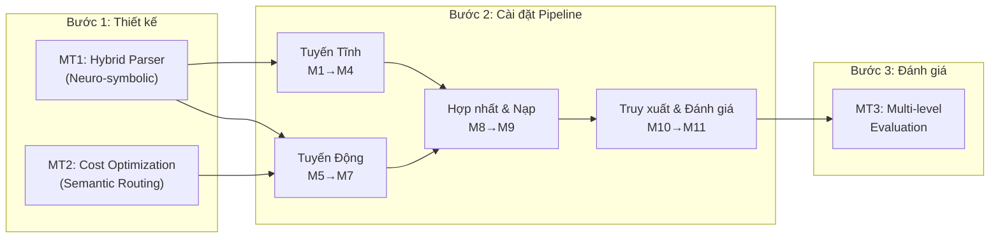
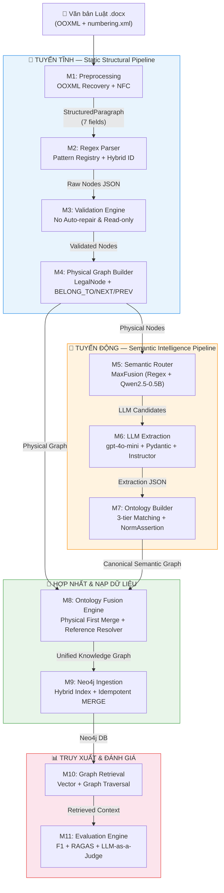
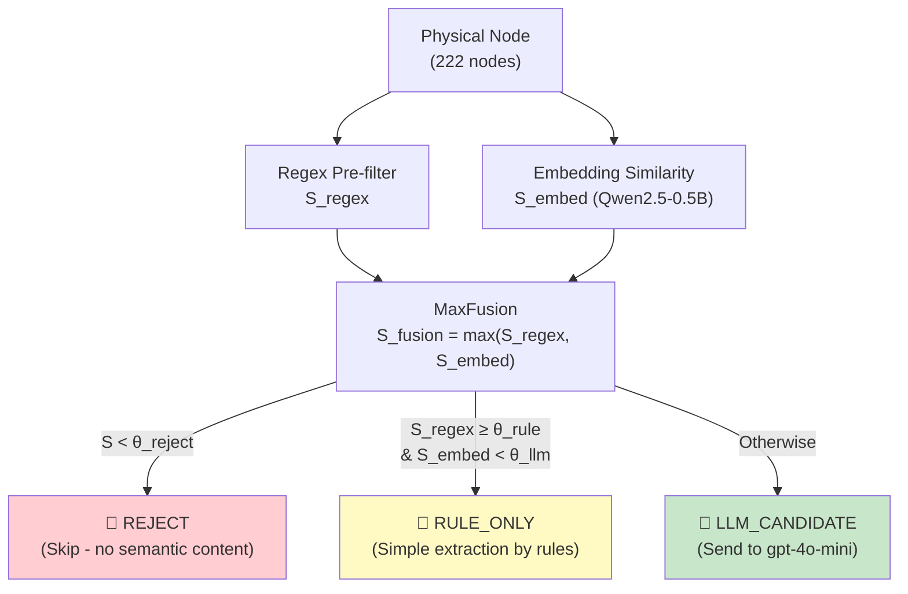
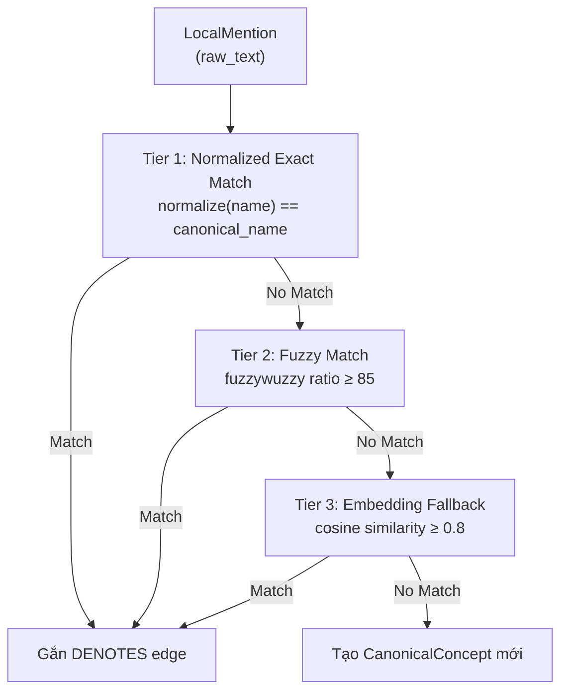

# CHƯƠNG 3: PHƯƠNG PHÁP NGHIÊN CỨU

---

## 3.0. Tổng quan phương pháp nghiên cứu

### 3.0.1. Phương pháp luận nghiên cứu ba bước

Nghiên cứu này tuân theo phương pháp luận thực nghiệm ba bước, phản ánh trực tiếp ba mục tiêu cụ thể (MT1, MT2, MT3) của đề tài:

| Bước | Nội dung | Mục tiêu tương ứng | Sản phẩm |
| :---: | :--- | :---: | :--- |
| **Bước 1** | Thiết kế kiến trúc Hybrid Parser (Neuro-symbolic) | MT1, MT2 | Bản thiết kế 11 Module, Data Contract |
| **Bước 2** | Cài đặt Pipeline xử lý dữ liệu end-to-end | MT1, MT2 | Mã nguồn Python, Cấu hình YAML/JSON |
| **Bước 3** | Đánh giá thực nghiệm định lượng đa tầng | MT3 | Bảng chỉ số F1, RAGAS, Token Savings |

Quy trình phương pháp luận được tóm tắt theo sơ đồ sau:



### 3.0.2. Kiến trúc tổng thể 11 Modules

Hệ thống Hybrid Parser được thiết kế theo kiến trúc **pipeline tuyến tính 11 Module**, chia thành hai tuyến xử lý song song hội tụ tại tầng Hợp nhất (Module 8). Nguyên tắc kiến trúc cốt lõi là **Unidirectional Data Flow** — dữ liệu chỉ chảy theo một chiều từ đầu vào (văn bản gốc) đến đầu ra (đồ thị tri thức trên Neo4j), không có vòng lặp ngược giữa các Module.



**Đặc điểm kiến trúc nổi bật:**

- **Tuyến Tĩnh (M1–M4)**: Hoàn toàn xác định (deterministic), chi phí API bằng 0, độ chính xác cấu trúc 100% `[STRCHK]`. Phân tách cấu trúc vật lý theo đúng thể thức kỹ thuật trình bày văn bản quy phạm pháp luật (Nghị định 34/2016/NĐ-CP).
- **Tuyến Động (M5–M7)**: Khai thác năng lực hiểu ngữ nghĩa sâu của LLM, nhưng được **gác cổng** bởi Semantic Router (M5) để kiểm soát chi phí — chỉ những node phức tạp ngữ nghĩa mới được gửi sang LLM.
- **Tách biệt quan tâm (Separation of Concerns)**: Mỗi Module có Data Contract đầu vào/đầu ra rõ ràng, cho phép thay thế hoặc nâng cấp độc lập mà không ảnh hưởng Module khác.

---

## 3.1. Phương pháp cho MT1 — Xây dựng Hybrid Parser

### 3.1.1. Phương pháp Neuro-symbolic

Nghiên cứu này áp dụng phương pháp **Neuro-symbolic** — sự kết hợp có kiểm soát giữa hai paradigm xử lý ngôn ngữ tự nhiên:

| Thành phần | Kỹ thuật | Ưu thế | Hạn chế |
| :--- | :--- | :--- | :--- |
| **Symbolic (Rule-based)** | Regex Pattern Registry + OOXML Metadata | Chính xác 100% với cấu trúc vật lý, chi phí API = 0 đồng | Không hiểu ngữ nghĩa quy phạm |
| **Neural (LLM-based)** | gpt-4o-mini + Pydantic Structured Output | Hiểu ngữ nghĩa sâu: quyền, nghĩa vụ, điều kiện, ngoại lệ | Chi phí Token cao, có thể ảo giác |
| **Hybrid (Đề xuất)** | Symbolic trích cấu trúc → Neural trích ngữ nghĩa | Kết hợp ưu thế cả hai, chi phí tối ưu | Phức tạp thiết kế, cần Data Contract chặt |

Cơ sở lý luận của phương pháp Neuro-symbolic dựa trên nhận định: văn bản quy phạm pháp luật Việt Nam có **hai tầng thông tin có bản chất khác nhau** `[VLEGAL]`, `[VNLI]`:

1. **Tầng cấu trúc vật lý** (Physical Structure): Hệ thống phân cấp Chương → Mục → Điều → Khoản → Điểm tuân theo quy tắc trình bày cố định, hoàn toàn có thể trích xuất bằng Regex xác định.
2. **Tầng ngữ nghĩa quy phạm** (Normative Semantics): Các mối quan hệ pháp lý (quyền/nghĩa vụ/cấm/điều kiện/ngoại lệ) ẩn trong ngôn ngữ tự nhiên, đòi hỏi khả năng suy luận ngữ nghĩa của LLM.

Với kiến trúc này, **Tuyến Tĩnh** (Modules 1–4) đảm nhận tầng cấu trúc vật lý với chi phí bằng 0 và độ chính xác tuyệt đối, trong khi **Tuyến Động** (Modules 5–7) chỉ được kích hoạt cho tầng ngữ nghĩa quy phạm — và chỉ trên những node được xác định là có nội dung ngữ nghĩa phức tạp thông qua Semantic Router.

---

## 3.2. Phương pháp cho MT2 — Tối ưu chi phí (Cost Optimization)

### 3.2.1. Chiến lược Semantic Routing (Decision Layer)

Vấn đề chi phí là thách thức lớn nhất của các hệ thống GraphRAG sử dụng LLM thuần túy để indexing — Microsoft GraphRAG tiêu tốn hàng triệu token cho mỗi văn bản `[GRAG]`. Nghiên cứu này đề xuất **Semantic Router** — một lớp quyết định nhẹ (Decision Layer) được đặt giữa Tuyến Tĩnh và Tuyến Động, với vai trò **gác cổng** (gatekeeper) nhằm sàng lọc >80% node có cấu trúc đơn giản trước khi gửi sang LLM API.

Kiến trúc Semantic Router lấy cảm hứng từ phương pháp định tuyến tiết kiệm chi phí trên GraphRAG `[GROUTER]` và sử dụng mô hình nhúng siêu nhẹ Qwen2.5-0.5B `[QWEN]`. Cơ chế **MaxFusion** kết hợp hai tín hiệu:

1. **Regex Pre-filter**: Quét nhanh các từ khóa pháp lý (quyền, nghĩa vụ, điều kiện, ngoại lệ, dẫn chiếu) với chi phí gần bằng 0.
2. **Embedding Similarity**: Đo khoảng cách cosine giữa vector nhúng của node với tập anchor vectors đại diện cho nội dung ngữ nghĩa pháp lý.

Chiến lược hợp nhất MaxFusion được định nghĩa:

$$S_{\text{fusion}} = \max(S_{\text{regex}}, S_{\text{embed}})$$

Trong đó $S_{\text{regex}} \in [0, 1]$ là điểm Regex dựa trên SEMANTIC_REGISTRY (9 pattern nhận diện Cross-reference, Exception, Condition), và $S_{\text{embed}} \in [0, 1]$ là điểm Embedding Similarity cao nhất so với tập anchor.

Dựa trên $S_{\text{fusion}}$, Router phân loại mỗi node vào **3 ngã rẽ**:

| Quyết định | Điều kiện | Hành động |
| :--- | :--- | :--- |
| **REJECT** | $S_{\text{regex}} < \theta_{\text{reject}}$ VÀ $S_{\text{embed}} < \theta_{\text{reject}}$ | Bỏ qua, không gửi LLM |
| **RULE_ONLY** | $S_{\text{regex}} \geq \theta_{\text{rule}}$ VÀ $S_{\text{embed}} < \theta_{\text{llm}}$ | Xử lý bằng quy tắc, không cần LLM |
| **LLM_CANDIDATE** | Các trường hợp còn lại | Gửi sang Module 6 để LLM trích xuất |

Với các ngưỡng mặc định: $\theta_{\text{reject}} = 0.15$, $\theta_{\text{rule}} = 0.6$, $\theta_{\text{llm}} = 0.45$.

---

## 3.4. Phương pháp ước lượng (Đo lường và Công thức toán)

### 3.4.1. Chỉ số đánh giá trích xuất thông tin (Information Extraction Metrics)

Nhóm chỉ số này đo lường chất lượng trích xuất đồ thị tri thức bằng cách so sánh với Golden Graph chuẩn `[IR_METR]`.

**Node-level Precision** — tỷ lệ node hệ thống trích xuất khớp với Golden Graph:

$$\text{Node Precision} = \frac{|\mathcal{N}_{\text{extracted}} \cap \mathcal{N}_{\text{golden}}|}{|\mathcal{N}_{\text{extracted}}|}$$

**Node-level Recall** — tỷ lệ node trong Golden Graph được hệ thống phát hiện:

$$\text{Node Recall} = \frac{|\mathcal{N}_{\text{extracted}} \cap \mathcal{N}_{\text{golden}}|}{|\mathcal{N}_{\text{golden}}|}$$

**Node-level F1-Score** — trung bình điều hòa giữa Precision và Recall:

$$F_1^{\text{node}} = \frac{2 \times \text{Precision}_{\text{node}} \times \text{Recall}_{\text{node}}}{\text{Precision}_{\text{node}} + \text{Recall}_{\text{node}}}$$

Tương tự, **Edge-level Precision, Recall, F1** được tính trên tập cạnh $\mathcal{E}$:

$$\text{Edge Precision} = \frac{|\mathcal{E}_{\text{extracted}} \cap \mathcal{E}_{\text{golden}}|}{|\mathcal{E}_{\text{extracted}}|}, \quad \text{Edge Recall} = \frac{|\mathcal{E}_{\text{extracted}} \cap \mathcal{E}_{\text{golden}}|}{|\mathcal{E}_{\text{golden}}|}$$

$$F_1^{\text{edge}} = \frac{2 \times \text{Precision}_{\text{edge}} \times \text{Recall}_{\text{edge}}}{\text{Precision}_{\text{edge}} + \text{Recall}_{\text{edge}}}$$

### 3.4.2. Chỉ số RAGAS (Retrieval-Augmented Generation Assessment)

Bộ chỉ số RAGAS đo lường hiệu năng end-to-end của hệ thống RAG `[RAGAS]`:

**Context Precision** — tỷ lệ ngữ cảnh truy xuất thực sự liên quan đến câu hỏi:

$$\text{Context Precision@K} = \frac{\sum_{k=1}^{K} \text{Precision@k} \times \mathbb{1}[\text{relevant}_k]}{|\text{relevant items in top K}|}$$

**Context Recall** — tỷ lệ thông tin cần thiết cho câu trả lời chuẩn được bao phủ bởi ngữ cảnh truy xuất:

$$\text{Context Recall} = \frac{|\text{ground truth sentences attributable to context}|}{|\text{total ground truth sentences}|}$$

**Faithfulness** — mức độ trung thực của câu trả lời so với ngữ cảnh truy xuất (chống ảo giác):

$$\text{Faithfulness} = \frac{|\text{claims supported by context}|}{|\text{total claims in answer}|}$$

**Answer Relevance** — mức độ liên quan của câu trả lời đối với câu hỏi:

$$\text{Answer Relevance} = \frac{1}{N} \sum_{i=1}^{N} \cos(\mathbf{q}, \mathbf{q}_i^{\text{gen}})$$

trong đó $\mathbf{q}$ là vector nhúng câu hỏi gốc, $\mathbf{q}_i^{\text{gen}}$ là vector nhúng câu hỏi được sinh ra từ câu trả lời, $N$ là số câu hỏi được sinh.

### 3.4.3. Chỉ số hiệu năng (Efficiency Metrics)

**Token Savings Rate** — tỷ lệ tiết kiệm token LLM nhờ Semantic Router:

$$\text{TSR} = \frac{T_{\text{total}} - T_{\text{actual}}}{T_{\text{total}}} \times 100\%$$

trong đó $T_{\text{total}}$ là tổng token nếu gửi tất cả node sang LLM, $T_{\text{actual}}$ là token thực tế sử dụng sau khi Router lọc.

**Processing Latency** — thời gian xử lý trung bình mỗi node:

$$L_{\text{avg}} = \frac{\sum_{i=1}^{N} t_i}{N} \quad (\text{giây/node})$$

**Memory Footprint** — dung lượng bộ nhớ đỉnh (peak RSS) trong quá trình xử lý pipeline.

---

## 3.5. Dữ liệu nghiên cứu

### 3.5.1. Tập dữ liệu Pilot: Chương III Luật Đất đai 2024

Nghiên cứu sử dụng **Chương III — Quyền và nghĩa vụ của người sử dụng đất** trong Luật Đất đai năm 2024 (Luật số 31/2024/QH15) làm tập dữ liệu pilot. File đầu vào: `datasets/raw_laws/Luat_dat_dai_chuong_3.docx`.

**Thống kê cấu trúc vật lý:**

| Cấp phân cấp | Số lượng | Tỷ lệ |
| :--- | :---: | :---: |
| Chương (CHAPTER) | 1 | 0,45% |
| Mục (SECTION) | 5 | 2,25% |
| Điều (ARTICLE) | 23 | 10,36% |
| Khoản (CLAUSE) | 84 | 37,84% |
| Điểm (POINT) | 109 | 49,10% |
| **Tổng cộng** | **222** | **100%** |

**Lý do chọn "worst-case":**

Chương III được chọn chủ đích vì đại diện cho trường hợp phức tạp nhất (worst-case) trong hệ thống văn bản luật Việt Nam `[VLEGAL]`, `[VNLI]`:

1. **Cấu trúc lồng ghép phức tạp nhất**: 5 tầng phân cấp đầy đủ (Chương → Mục → Điều → Khoản → Điểm), với độ sâu lồng ghép tối đa trong thực tế.
2. **Mật độ dẫn chiếu chéo cao nhất**: Chương III chứa dày đặc các cụm từ dẫn chiếu như "theo quy định tại Điều X", "căn cứ khoản Y Điều Z", liên kết chéo giữa các Điều trong cùng Chương và giữa các Luật khác nhau.
3. **Mật độ quy phạm điều kiện cao**: Nhiều quy phạm pháp luật kèm theo hệ thống điều kiện lồng nhau (nếu…thì…trừ trường hợp…), đặc biệt phức tạp cho việc trích xuất ngữ nghĩa.
4. **Đa dạng loại chủ thể**: Nhiều loại chủ thể pháp lý (cá nhân trong nước, tổ chức kinh tế, người Việt Nam định cư ở nước ngoài, doanh nghiệp có vốn đầu tư nước ngoài…) với các bộ quyền/nghĩa vụ khác nhau.

### 3.5.2. Xây dựng Golden Graph (Ground Truth)

**Golden Graph** là đồ thị tri thức tham chiếu chuẩn, được xây dựng bằng phương pháp **gán nhãn thủ công** (manual annotation) bởi nhóm nghiên cứu:

1. **Gán nhãn cấu trúc vật lý**: Xác định chính xác 222 node và các cạnh cấu trúc (BELONG_TO, NEXT, PREVIOUS) dựa trên cấu trúc pháp lý nguyên bản.
2. **Gán nhãn ngữ nghĩa**: Trích xuất thủ công các thực thể (Subject, LegalRight, LegalObligation, Prohibition, Condition, Exception, Penalty, LegalReference) và các quan hệ quy phạm (ALLOW, REQUIRE, PROHIBIT, HAS_CONDITION, HAS_EXCEPTION, REFERENCE_TO, HAS_PENALTY) cho toàn bộ 222 node.
3. **Kiểm chứng chéo (Cross-validation)**: Kết quả gán nhãn được đối chiếu độc lập bởi hai thành viên nhóm nghiên cứu để đảm bảo tính nhất quán.

File kết quả gán nhãn: `outputs/golden_set_annotation.csv` và `outputs/full_golden_set_annotation.csv`.

### 3.5.3. Xây dựng Golden QA Dataset

Bộ dữ liệu câu hỏi - trả lời chuẩn (Golden QA Dataset) gồm 50–100 câu hỏi pháp lý, được xây dựng theo phương pháp luận của VLegal-Bench `[VLEGAL]`:

- **Câu hỏi trực tiếp**: "Người sử dụng đất có những quyền chung gì?"
- **Câu hỏi điều kiện**: "Trong trường hợp nào cá nhân được chuyển nhượng quyền sử dụng đất?"
- **Câu hỏi dẫn chiếu chéo**: "Quyền thế chấp quyền sử dụng đất được quy định cụ thể tại Điều nào?"
- **Câu hỏi so sánh**: "Sự khác biệt về quyền giữa tổ chức kinh tế và hộ gia đình trong sử dụng đất là gì?"

---

## 3.6. Thiết kế chi tiết Tuyến Tĩnh (Modules 1–4)

### 3.6.1. Module 1 — Document Preprocessing

#### a) Vấn đề: Auto-numbering ẩn trong MS Word

Một thách thức kỹ thuật đặc thù khi xử lý văn bản luật Việt Nam dạng `.docx` là hiện tượng **auto-numbering bị ẩn**: Microsoft Word lưu trữ thứ tự đánh số Khoản (1., 2., 3.) và Điểm (a), b), c), đ)) trong cấu trúc XML nội bộ (`numbering.xml`), **không hiển thị trực tiếp trong nội dung text**. Khi trích xuất text bằng các thư viện thông thường (ví dụ: `python-docx`), các đánh số này bị mất, dẫn đến Khoản và Điểm trở thành các đoạn văn bản vô danh `[STRCHK]`.

#### b) Giải pháp: Khôi phục qua XML/OOXML

Module 1 giải quyết vấn đề này bằng cách truy xuất trực tiếp vào cấu trúc OOXML của file `.docx`:

```
📦 file.docx (ZIP Archive)
 ├── word/document.xml      ← Nội dung văn bản
 ├── word/numbering.xml     ← Bảng định nghĩa đánh số
 ├── word/styles.xml        ← Định nghĩa Style
 └── ...
```

Lớp `_NumXmlParser` (trong `document_loader.py`) thực hiện:

1. **Giải nén OOXML**: Đọc `word/numbering.xml` từ ZIP archive để lấy bảng định nghĩa đánh số.
2. **Xây dựng bộ đếm phân cấp**: Duy trì state machine đếm số thứ tự cho mỗi cặp `(numId, ilvl)`, tự động reset bộ đếm con khi bộ đếm cha tăng.
3. **Phục hồi nhãn**: Hàm `get_label(num_id, ilvl)` trả về nhãn hoàn chỉnh (ví dụ: `"1."`, `"a)"`, `"đ)"`) cho mỗi paragraph.

Thuật toán bộ đếm phân cấp:

```python
def get_label(self, num_id: int, ilvl: int) -> str:
    levels = self._num_map.get(num_id, {})
    if ilvl not in levels:
        return ""
    lvl_info = levels[ilvl]
    key = (num_id, ilvl)
    if key not in self._counters:
        self._counters[key] = lvl_info["start"] - 1
    self._reset_child_counters(num_id, ilvl)  # Reset con khi cha tăng
    self._counters[key] += 1
    count = self._counters[key]
    return self._format_label(lvl_info["numFmt"], lvl_info["lvlText"], count)
```

Quy tắc ánh xạ đã được kiểm chứng trên corpus Ch3-LDD-2024 `[STRCHK]`:

| `ilvl` | `numFmt` | NodeType | Số node đã verify |
| :---: | :--- | :--- | :---: |
| 0 | `decimal` | CLAUSE (Khoản) | 185 |
| 1 | `lowerLetter` | POINT (Điểm) | 8 |

#### c) Chuẩn hóa Unicode NFC

Văn bản luật Việt Nam thường chứa hỗn hợp hai dạng Unicode: **NFD** (Canonical Decomposition — dấu thanh tách rời) và **NFC** (Canonical Composition — dấu thanh kết hợp). Module 1 chuẩn hóa toàn bộ về dạng NFC thông qua lớp `UnicodeNormalizer`:

```python
unicodedata.normalize("NFC", text)
```

Ngoài ra, `TextCleaner` loại bỏ các ký tự vô hình (zero-width characters, form feeds, vertical tabs) bằng regex:

```
[\u200b\u200c\u200d\u200e\u200f\u00ad\ufeff\x0c\x0b\x00-\x08\x0e-\x1f\x7f]
```

#### d) Data Contract: StructuredParagraph

Đầu ra của Module 1 tuân theo Data Contract `StructuredParagraph` — một cấu trúc dữ liệu 7 trường được thiết kế để bảo toàn tối đa thông tin cấu trúc từ OOXML:

| Field | Kiểu | Mô tả | DOCX | TXT |
| :--- | :--- | :--- | :---: | :---: |
| `index` | `int` | Thứ tự paragraph (0-indexed, bất biến) | ✓ | ✓ |
| `text` | `str` | Nội dung text đã chuẩn hóa NFC | ✓ | ✓ |
| `word_style` | `str?` | Word Style name (Heading 2, List Paragraph…) | ✓ | ✗ |
| `num_id` | `int?` | w:numId từ numbering XML | ✓ | ✗ |
| `ilvl` | `int?` | w:ilvl (indent level) | ✓ | ✗ |
| `num_fmt` | `str?` | Định dạng đánh số (decimal, lowerLetter…) | ✓ | ✗ |
| `number` | `int\|str?` | Thứ tự pháp lý (3, "III") — chỉ cho Chương/Mục/Điều/Khoản | ✓ | ✗ |
| `marker` | `str?` | Ký tự điểm (a, b, đ…) — chỉ cho Điểm | ✓ | ✗ |
| `is_empty` | `bool` | True nếu text rỗng | ✓ | ✓ |

**Bất biến cốt lõi**: `number` và `marker` là loại trừ lẫn nhau — chính xác một trong hai phải là `None`:

$$\forall p \in \text{StructuredParagraph}: \neg(p.\text{number} \neq \text{None} \wedge p.\text{marker} \neq \text{None})$$

---

### 3.6.2. Module 2 — Regex Parser

#### a) Pattern Registry đa tầng

Module 2 sử dụng kiến trúc **Pattern Registry** — một từ điển pattern có metadata truy xuất nguồn gốc, thay vì regex cứng (hardcoded) — cho phép mở rộng sang corpus mới mà không phá vỡ logic hiện tại. Mỗi `PatternEntry` gắn tag provenance:

```python
@dataclass
class PatternEntry:
    pattern: str            # Regex pattern string
    source_corpus: str      # 'Ch3-LDD-2024' | 'UNKNOWN' | 'GENERAL'
    confidence: str         # 'HIGH' | 'MEDIUM' | 'HYPOTHESIS'
    example: str            # Ví dụ thực tế từ corpus
    known_fp: str | None    # False positive đã biết
    scope: str | None       # 'inside_ARTICLE' | 'inside_CLAUSE'
    required_style: str | None  # Bắt buộc Word Style
    anchor: str             # 'start_of_line' | 'anywhere'
```

Bảng các Regex Pattern chính (đã kiểm chứng trên corpus Ch3-LDD-2024):

| NodeType | Pattern | Ví dụ | Confidence |
| :--- | :--- | :--- | :---: |
| CHAPTER | `^\s*Ch[uư]ơng\s+(?P<number>[IVXivxLCDMlcdm]+)\s*$` | "Chương III" | HIGH |
| SECTION | `^\s*M[uụ]c\s+(?P<number>\d+)\s*$` | "Mục 1" | HIGH |
| ARTICLE | `^\s*(?:Đ\|Ð)i[eề]u\s+(?P<number>\d+)\.?\s*(?P<title>.*)$` | "Điều 26. Quyền chung..." | HIGH |
| CLAUSE | `^\s*(?P<number>\d+)\.\s+(?P<text>.+)$` | "1. Người nhận quyền..." | HIGH |
| POINT | `^\s*(?P<marker>[a-zđ])\)\s+(?P<text>.+)$` | "đ) Thế chấp quyền..." | HIGH |

Lưu ý đặc biệt: ký tự `đ` trong bảng chữ cái tiếng Việt nằm ngoài phạm vi ASCII `[a-z]`, nên pattern POINT phải sử dụng class `[a-zđ]` để bắt đầy đủ.

#### b) Cơ chế phân giải đa tín hiệu (Multi-signal Disambiguation)

`RegexEngine` sử dụng **3 lớp tín hiệu** theo thứ tự ưu tiên giảm dần:

1. **Lớp 1 — Numbering Hint** (mạnh nhất): Ánh xạ `(ilvl, num_fmt)` từ OOXML sang NodeType thông qua `DOCX_NUMBERING_HINTS`.
2. **Lớp 1 — Style Hint**: Ánh xạ Word Style sang NodeType (Heading 2 → ARTICLE, List Paragraph → CLAUSE, Body Text → POINT).
3. **Lớp 2 — Regex Match**: So khớp text với `PATTERN_REGISTRY` theo thứ tự ưu tiên.
4. **Lớp 3 — Scope Context**: Ngữ cảnh container hiện tại (ví dụ: nếu đang ở trong ARTICLE thì ưu tiên tìm CLAUSE/POINT).

```python
def _get_ordered_types(self, numbering_hint, style_hint, scope):
    primary = numbering_hint or style_hint  # numbering > style
    if primary:
        ordered = [primary] + [t for t in all_types if t != primary]
    elif scope == NodeType.ARTICLE:
        ordered = [NodeType.CLAUSE, NodeType.POINT] + [...]
    elif scope == NodeType.CLAUSE:
        ordered = [NodeType.POINT] + [...]
    else:
        ordered = all_types
    return ordered
```

#### c) Boundary Detector (Stack-based)

Lớp `BoundaryDetector` phân vùng text thành các **ranh giới nội dung** (content boundaries) dựa trên vị trí ký tự tuyệt đối (`char_start`). Khi một marker mới xuất hiện, ranh giới hiện tại được đóng lại và ranh giới mới được mở.

#### d) Hierarchy Builder (Stack-based)

Lớp `HierarchyBuilder` xây dựng cây phân cấp từ danh sách ranh giới tuyến tính bằng thuật toán **monotonic depth stack**:

```
Với mỗi boundary trong danh sách:
  1. Tạo HierarchyNode từ boundary
  2. POP stack cho đến khi đỉnh stack có depth < depth hiện tại
  3. Nếu stack không rỗng → đỉnh stack là cha
  4. PUSH node hiện tại vào stack
```

Độ phức tạp thời gian: $O(N)$ với $N$ là số node, do mỗi node được PUSH và POP tối đa một lần.

#### e) Thuật toán Hybrid ID

Để triệt tiêu 100% va chạm ID (ID collision), Module 2 sử dụng thuật toán **Hybrid ID** kết hợp ba thành phần:

$$\text{ID} = \text{law\_prefix} \mathbin\Vert \text{parent\_path} \mathbin\Vert \text{type\_short}\text{-}\text{marker} \mathbin\Vert \text{"\_p"} \mathbin\Vert \text{char\_start}$$

Ví dụ: `doc_chuong-iii_muc-1_dieu-48_khoan-2_diem-a_p1245`

Trong đó:
- `law_prefix`: Tiền tố văn bản luật (ví dụ: `doc`, `ldd-2024`)
- `parent_path`: Đường dẫn phân cấp từ gốc đến cha trực tiếp
- `type_short-marker`: Loại node viết tắt + số/ký tự nhận diện
- `_p{char_start}`: Vị trí ký tự bắt đầu trong văn bản gốc — đảm bảo tính duy nhất tuyệt đối ngay cả khi hai node cùng tên xuất hiện ở vị trí khác nhau

---

### 3.6.3. Module 3 — Validation Engine

#### a) Triết lý "No Auto-repair & Read-only"

Module 3 hoạt động theo triết lý **"No Auto-repair & Read-only"** — chỉ phát hiện và báo cáo vi phạm, **tuyệt đối không tự động sửa chữa hoặc thay đổi dữ liệu**. Lý do: trong lĩnh vực pháp lý, bất kỳ sự thay đổi tự động nào đối với nội dung văn bản đều tiềm ẩn rủi ro sai lệch ngữ nghĩa pháp lý.

#### b) Bộ quy tắc kiểm tra

Module 3 thực hiện 7 bước kiểm tra với 6 quy tắc chuẩn:

| Mã | Tên | Mức độ | Mô tả |
| :--- | :--- | :---: | :--- |
| VAL-000 | SchemaViolation | ERROR | Vi phạm schema Pydantic (kiểu dữ liệu, trường bắt buộc) |
| VAL-001 | DuplicateNodeID | ERROR | ID node trùng lặp |
| VAL-002 | OrphanNode | ERROR | Node không có cha (trừ CHAPTER gốc) |
| VAL-003 | BrokenParent | ERROR | `parent_id` trỏ đến node không tồn tại |
| VAL-004 | CyclicDependency | ERROR | Vòng lặp trong cây phân cấp (DFS) |
| VAL-005 | EmptyNode | WARNING | Node CLAUSE/POINT có nội dung rỗng |
| VAL-006 | GapIndex | WARNING | Gián đoạn thứ tự đánh số giữa các sibling |

#### c) Cơ chế Cascading Quarantine

Khi một node bị cách ly do vi phạm ERROR, toàn bộ cây con phía dưới cũng bị cách ly theo (Cascading Quarantine) bằng thuật toán BFS:

```python
cascade_queue = list(quarantined_ids)
while cascade_queue:
    parent_id = cascade_queue.pop(0)
    for child in children_map.get(parent_id, []):
        if child.id not in quarantined_ids:
            quarantined_ids.add(child.id)
            cascade_queue.append(child.id)
```

#### d) Chỉ số chất lượng

Điểm chất lượng tổng hợp được tính:

$$\text{Quality Score} = \left(1 - \frac{N_{\text{fatal\_errors}}}{N_{\text{total\_received}}}\right) \times 100$$

#### e) Bộ ký tự pháp lý Việt Nam

Module 3 sử dụng bộ chữ cái tiếng Việt pháp lý đầy đủ gồm 23 ký tự (theo quy chuẩn, loại trừ f, j, w, z):

```python
VN_ALPHABET = ["a","b","c","d","đ","e","g","h","i","k","l",
               "m","n","o","p","q","r","s","t","u","v","x","y"]
```

---

### 3.6.4. Module 4 — Physical Graph Builder

#### a) Schema LegalNode

Mỗi node vật lý tuân theo schema `LegalNode` với các thuộc tính:

```json
{
  "id": "doc_chuong-iii_muc-1_dieu-26_khoan-1_diem-a_p1245",
  "type": "POINT",
  "labels": ["LegalNode", "POINT"],
  "properties": {
    "depth": 4,
    "title": null,
    "text": "Chuyển đổi quyền sử dụng đất nông nghiệp...",
    "parent_id": "doc_chuong-iii_muc-1_dieu-26_khoan-1_p1200",
    "children_count": 0,
    "position": 1,
    "marker": "a",
    "law_prefix": "doc",
    "law_code": "luat_dat_dai_2024",
    "source_doc": "Luat_dat_dai_chuong_3.docx",
    "start_idx": 15,
    "end_idx": 16,
    "implicit_parent": false
  }
}
```

#### b) Khởi tạo cạnh cấu trúc

Module 4 sinh ba loại cạnh cấu trúc xác định:

| Loại cạnh | Hướng | Ý nghĩa |
| :--- | :--- | :--- |
| **BELONG_TO** | Con → Cha | Quan hệ phân cấp (Khoản 1 → Điều 26) |
| **NEXT** | Node$_i$ → Node$_{i+1}$ | Thứ tự đọc xuôi giữa các sibling cùng cha |
| **PREVIOUS** | Node$_{i+1}$ → Node$_i$ | Thứ tự đọc ngược (hỗ trợ backtracking trong RAG) |

Cạnh NEXT/PREVIOUS được sinh bằng cách: phân nhóm node theo `(parent_id, type)`, sắp xếp theo `start_idx` tăng dần, rồi liên kết các cặp kề nhau.

#### c) Kết quả trên Pilot Corpus

Với Chương III Luật Đất đai 2024, Module 4 tạo ra:
- **222 node** vật lý (1 Chương, 5 Mục, 23 Điều, 84 Khoản, 109 Điểm)
- **Cạnh BELONG_TO**: 221 cạnh (mỗi node trừ gốc có đúng 1 cạnh lên cha)
- **Cạnh NEXT + PREVIOUS**: sinh theo cặp cho mỗi nhóm sibling

---

## 3.7. Thiết kế chi tiết Tuyến Động (Modules 5–7)

### 3.7.1. Module 5 — Semantic Router

#### a) Cơ chế MaxFusion

Module 5 kết hợp hai nguồn tín hiệu bổ sung để đưa ra quyết định định tuyến `[GROUTER]`:

**Tín hiệu 1 — Regex Semantic Pattern Registry**: Bộ 9 pattern nhẹ nhận diện nhanh các dấu hiệu ngữ nghĩa pháp lý:

```python
SEMANTIC_REGISTRY = [
    # Cross-reference (strength = 1.0)
    SemanticPattern("REF_THEO_QUY_DINH", r"theo quy định tại", "CROSS_REF", 1.0),
    SemanticPattern("REF_CAN_CU", r"căn cứ(?: khoản| điều| điểm)?", "CROSS_REF", 1.0),
    SemanticPattern("REF_QUY_DINH_TAI", r"quy định tại(?: khoản| điều| điểm)?", "CROSS_REF", 1.0),
    # Exception (strength = 1.0)
    SemanticPattern("EXC_TRU_TRUONG_HOP", r"trừ trường hợp", "EXCEPTION", 1.0),
    SemanticPattern("EXC_TRU_KHI", r"trừ khi", "EXCEPTION", 1.0),
    # Condition (strength = 0.4)
    SemanticPattern("COND_TRONG_TRUONG_HOP", r"trong trường hợp", "CONDITION", 0.4),
    SemanticPattern("COND_DIEU_KIEN", r"điều kiện", "CONDITION", 0.4),
]
```

**Tín hiệu 2 — Embedding Similarity (Qwen2.5-0.5B)**: Mô hình ngôn ngữ siêu nhẹ Qwen2.5-0.5B `[QWEN]` (chỉ 0.5 tỷ tham số, có thể chạy offline trên CPU/GPU nhỏ) được sử dụng để tạo vector nhúng cho mỗi node. Điểm embedding được tính bằng **cosine similarity** cao nhất giữa node và tập anchor vectors — đại diện cho các mẫu câu có nội dung ngữ nghĩa pháp lý phong phú.

**Chiến lược MaxFusion**:

```python
def fuse(self, regex_s: float, embed_s: float, ablation_mode="EXP-C"):
    if ablation_mode == "EXP-A":   return regex_s      # Regex-only
    elif ablation_mode == "EXP-B": return embed_s      # Embedding-only
    elif ablation_mode == "EXP-C": return max(regex_s, embed_s)  # MaxFusion
```

Chiến lược `max()` được chọn thay vì trung bình có trọng số vì: trong ngữ cảnh pháp lý, **chỉ cần một tín hiệu mạnh** (ví dụ: xuất hiện cụm "trừ trường hợp" với regex_s = 1.0) là đủ để xác định node cần LLM, bất kể tín hiệu kia yếu.

#### b) Phân tích ngưỡng (Threshold Sensitivity)

Nghiên cứu đã benchmark 10 mô hình embedding trên Golden Set để chọn mô hình và hiệu chỉnh ngưỡng tối ưu. Kết quả benchmark lưu tại `outputs/benchmark_m5/`. Qwen2.5-0.5B được chọn vì đạt F1 cao nhất ở phân khúc mô hình siêu nhẹ (<1B params), cân bằng giữa chất lượng và chi phí triển khai.

#### c) Ba ngã rẽ (Three-way Routing)



---

### 3.7.2. Module 6 — LLM Structured Extraction

#### a) Khung kỹ thuật: gpt-4o-mini + Pydantic + Instructor

Module 6 sử dụng khung kỹ thuật ba tầng để ép chuẩn LLM sinh ra Strict JSON `[DOC_OAI]`:

1. **gpt-4o-mini**: Mô hình LLM chi phí thấp nhưng đủ mạnh cho trích xuất thông tin có cấu trúc.
2. **Pydantic Schema**: Định nghĩa chặt chẽ kiểu dữ liệu đầu ra thông qua `BaseModel`.
3. **Instructor Library**: Tự động ép LLM tuân thủ Pydantic schema 100%, loại bỏ hoàn toàn JSON không hợp lệ.

#### b) 8 Core Entity Classes

Hệ thống trích xuất 8 lớp thực thể pháp lý, kế thừa từ lý thuyết Hohfeldian Semantics `[HOHFELD]`:

| Lớp Entity | Mô tả | Ví dụ trong Luật Đất đai |
| :--- | :--- | :--- |
| **Subject** | Chủ thể pháp lý | "Người sử dụng đất", "Tổ chức kinh tế" |
| **LegalRight** | Quyền pháp lý | "Quyền chuyển nhượng", "Quyền thế chấp" |
| **LegalObligation** | Nghĩa vụ pháp lý | "Nghĩa vụ nộp thuế", "Trách nhiệm bảo vệ đất" |
| **Prohibition** | Điều cấm | "Không được chuyển đổi mục đích sử dụng đất" |
| **Condition** | Điều kiện áp dụng | "Trường hợp đất không có tranh chấp" |
| **Exception** | Ngoại lệ | "Trừ trường hợp quy định tại khoản 2" |
| **Penalty** | Chế tài | "Bị thu hồi đất" |
| **LegalReference** | Dẫn chiếu pháp lý | "Theo quy định tại Điều 37 của Luật này" |

#### c) 7 Hohfeldian Relation Types

7 loại quan hệ quy phạm được thiết kế dựa trên khung phân loại quyền/nghĩa vụ pháp lý của Hohfeld `[HOHFELD]`:

| Relation Type | Chiều | Ý nghĩa |
| :--- | :--- | :--- |
| **ALLOW** | Subject → Action | Chủ thể ĐƯỢC PHÉP thực hiện hành động |
| **REQUIRE** | Subject → Action | Chủ thể BẮT BUỘC thực hiện hành động |
| **PROHIBIT** | Subject → Action | Chủ thể BỊ CẤM thực hiện hành động |
| **HAS_CONDITION** | Norm → Condition | Quy phạm CÓ ĐIỀU KIỆN áp dụng |
| **HAS_EXCEPTION** | Norm → Exception | Quy phạm CÓ NGOẠI LỆ |
| **REFERENCE_TO** | Entity → Target | Dẫn chiếu đến Điều/Khoản khác |
| **HAS_PENALTY** | Norm → Penalty | Quy phạm KÈM CHẾ TÀI |

#### d) Nguyên tắc Four Corners Rule & Zero-Hallucination

Hai nguyên tắc cốt lõi chống ảo giác pháp lý:

1. **Four Corners Rule**: LLM chỉ được trích xuất thực thể và quan hệ **xuất hiện tường minh** trong nội dung node. Không được suy luận hay bổ sung thông tin từ ngoài phạm vi văn bản.

2. **Zero-Hallucination**: Mọi thực thể trích xuất **bắt buộc** phải kèm trường `evidence` — trích dẫn nguyên văn từ văn bản nguồn:

```python
class LegalEntity(BaseModel):
    entity_type: Literal["Subject", "LegalRight", ...]
    name: str
    evidence: str  # BẮT BUỘC — trích nguyên văn từ văn bản
    attributes: dict = {}
```

Trường `evidence` đóng vai trò **bằng chứng truy xuất nguồn gốc** (provenance), cho phép kiểm chứng và audit toàn bộ pipeline — phù hợp với yêu cầu minh bạch trong lĩnh vực pháp lý.

---

### 3.7.3. Module 7 — Legal Ontology Builder

#### a) Kiến trúc bốn tầng logic

Module 7 tổ chức dữ liệu theo kiến trúc bốn tầng `[FOLAW]`, `[LKIFC]`:

| Tầng | Tên | Vai trò | Schema chính |
| :--- | :--- | :--- | :--- |
| A | Semantic Model | Biểu diễn entity mentions cụ thể | `LocalMention` |
| B | Context Model | Giữ context quy phạm N-ary | `NormAssertion` |
| C | Quality/Grounding | Kiểm soát chất lượng & taxonomy | Quality Gate, Controlled Taxonomy |
| D | Output Contract | Hub khái niệm & Projection cho Neo4j | `CanonicalConcept`, `SemanticEdge` |

#### b) Thuật toán 3-tier Entity Matching

Lớp `CanonicalMapper` thực hiện ghép nối (matching) giữa `LocalMention` và `CanonicalConcept` qua **3 tầng** với chi phí tăng dần:



Tầng 1 (chi phí $O(1)$ tra bảng hash) xử lý đại đa số trường hợp. Tầng 2 và 3 chỉ được kích hoạt khi Tầng 1 thất bại, tối ưu hiệu năng tổng thể.

#### c) Cấu trúc 3 tầng: LocalMention → DENOTES → CanonicalConcept

Kiến trúc **Concept Hub** phân tách rõ giữa **lần xuất hiện cụ thể** (mention) và **khái niệm trừu tượng** (concept):

- `LocalMention`: Một lần xuất hiện cụ thể của entity trong một Khoản/Điểm cụ thể. ID formula: `<physical_node_id>#<MENTION_TYPE>#<local_index>`.
- `CanonicalConcept`: Khái niệm pháp lý dùng chung, tồn tại duy nhất trong toàn đồ thị. ID formula: `CONCEPT_<NAME>`.
- `DENOTES`: Cạnh nối từ LocalMention đến CanonicalConcept mà nó biểu thị.

**Bất biến kiến trúc quan trọng**: Normative edges (ALLOW/REQUIRE/PROHIBIT/HAS_CONDITION...) **KHÔNG BAO GIỜ** được đặt trên `CanonicalConcept` — chỉ đặt trên `LocalMention` hoặc `NormAssertion`. Điều này ngăn ngừa **lỗi trộn context** (context bleeding) khi cùng một khái niệm xuất hiện trong nhiều quy phạm khác nhau.

#### d) Mô hình NormAssertion (Hub-node N-ary)

`NormAssertion` là **nút trung tâm** (hub-node) giữ trọn vẹn ngữ cảnh của một quy phạm pháp luật dưới dạng frame N-ary `[HOHFELD]`:

```
NormAssertion
  ├── modality: ALLOW | REQUIRE | PROHIBIT
  ├── HAS_SUBJECT  → LocalMention (LegalSubject)
  ├── HAS_ACTION   → LocalMention (LegalAction)
  ├── HAS_OBJECT   → LocalMention (LegalObject)
  ├── HAS_CONDITION → LocalMention (Condition)
  ├── HAS_EXCEPTION → LocalMention (Exception)
  └── HAS_CONSEQUENCE → LocalMention (LegalConsequence)
```

**Tại sao cần NormAssertion thay vì chỉ dùng edge ALLOW/REQUIRE?**

Cùng hành động "chuyển nhượng quyền sử dụng đất" có thể xuất hiện trong 3 quy tắc với 3 bộ điều kiện hoàn toàn khác nhau. Nếu gắn `HAS_CONDITION` trực tiếp vào entity "chuyển nhượng" thì bộ điều kiện của quy tắc này sẽ bị trộn sang quy tắc kia — **sai ngữ nghĩa pháp lý nghiêm trọng**. NormAssertion đóng gói toàn bộ context quy phạm trong cùng một frame, triệt tiêu hoàn toàn vấn đề này.

#### e) Triết lý "Quarantine over Deletion"

Module 7 áp dụng triết lý **"Quarantine over Deletion"** — dữ liệu vi phạm schema không bị xóa mà được chuyển vào **vùng cách ly** (`QuarantineStore`) `[RGB]`:

```python
class QuarantineStore(BaseModel):
    mentions: List[Dict[str, Any]]  # Entity bị cách ly + reason
    edges: List[Dict[str, Any]]     # Edge bị cách ly + reason
```

Lý do: trong lĩnh vực pháp lý, việc xóa dữ liệu tiềm ẩn rủi ro mất thông tin không thể phục hồi. Vùng cách ly cho phép audit sau này và phục hồi dữ liệu nếu quy tắc validation cần điều chỉnh — đây là cơ chế **defense-in-depth** chống sập đồ thị.

#### f) Triết lý Edge-Level Provenance

Module 7 lưu trữ bằng chứng (evidence) trực tiếp trên **cạnh** thay vì trên entity node. Entity node được giữ **siêu nhẹ** (lightweight) — chỉ chứa ID, tên, và loại. Toàn bộ metadata ngữ cảnh (evidence, confidence, rule_id, logic_group) nằm trên `SemanticEdge`:

```python
class SemanticEdge(BaseModel):
    source_id: str
    target_id: str
    relation_type: RelationType
    evidence: Optional[str]     # Bằng chứng nguyên văn
    rule_id: Optional[str]      # Mã quy tắc audit
    status: str = "VALID"       # VALID | QUARANTINED
    logic_group: Optional[str]  # Nhóm logic AND/OR
    operator: Optional[LogicOperator]  # AND | OR
```

---

## 3.8. Thiết kế Hợp nhất và Nạp dữ liệu (Modules 8–9)

### 3.8.1. Module 8 — Ontology Fusion Engine

#### a) Nguyên tắc Physical First Merge Policy

Module 8 hợp nhất hai tầng đồ thị (Physical Graph từ M4 và Canonical Semantic Graph từ M7) theo nguyên tắc **Physical First** — tầng cấu trúc vật lý là **Ground Truth** không thể bị ghi đè bởi tầng ngữ nghĩa:

```python
class MergePolicy:
    """Keep physical structure authoritative and semantic data additive."""
    physical_edge_types = frozenset({"BELONG_TO", "NEXT", "PREVIOUS"})

    def physical_node(self, node):
        return {"id": node["id"], "node_kind": "PHYSICAL",
                "labels": list(node.get("labels", [])),
                "properties": dict(node.get("properties", {})),
                "provenance": ["M4"]}

    def semantic_node(self, entity):
        return {"id": entity["canonical_id"], "node_kind": "SEMANTIC",
                "labels": [label, ontology_class],
                "properties": {...},
                "provenance": ["M7"]}
```

Node vật lý giữ `provenance: ["M4"]`, node ngữ nghĩa giữ `provenance: ["M7"]` — cho phép truy vết nguồn gốc bất kỳ lúc nào.

#### b) Con trỏ source_node_ids

Lớp `EdgeMapper` sử dụng chiến lược **con trỏ `source_node_ids`** thay vì sao chép nội dung node vật lý vào tầng ngữ nghĩa:

```python
def global_semantic(self, relation, source_node_ids, ...):
    properties = {...}
    properties["source_node_ids"] = list(source_node_ids)
    properties["weight"] = len(source_node_ids)
    return {"source": relation["source"], "target": relation["target"],
            "type": relation["relation_type"], "properties": properties,
            "provenance": ["M8"]}
```

Chiến lược này **tiết kiệm >80% dung lượng lưu trữ** so với việc nhúng toàn bộ nội dung vật lý vào mỗi edge ngữ nghĩa — quan trọng khi mỗi Khoản/Điểm có thể chứa hàng trăm ký tự.

#### c) Conflict Resolver: Apparent vs True Conflict

Lớp `ConflictResolver` phân loại xung đột thành hai loại:

1. **Apparent Conflict (Xung đột biểu kiến)**: Cùng chủ thể + hành động nhưng với bộ điều kiện khác nhau → giải quyết bằng cách kiểm tra `HAS_CONDITION` có giao nhau không. Nếu điều kiện tách biệt, đây **không phải** xung đột thực sự.

2. **True Conflict (Xung đột thực)**: Cùng chủ thể + hành động, cùng điều kiện hoặc không có điều kiện, nhưng modality mâu thuẫn (ALLOW vs PROHIBIT) → gắn cờ `POTENTIAL_LEGAL_CONFLICT` để chuyên gia pháp lý xem xét.

```python
# Phát hiện xung đột: ALLOW/REQUIRE vs PROHIBIT cho cùng (subject, action)
if positive_norms and prohibit_norms and not explained:
    conflicts.append({
        "flag": "POTENTIAL_LEGAL_CONFLICT",
        "conflict_type": "ALLOW_PROHIBIT",
        "context_status": "DISTINCT_EXPLICIT_CONDITIONS_REQUIRES_REVIEW"
                         if incompatible_condition_pair
                         else "SAME_OR_UNSPECIFIED_CONDITIONS"
    })
```

#### d) ReferenceResolver — Giải mã dẫn chiếu chéo

Lớp `ReferenceResolver` xóa nợ `PENDING_M8` — trạng thái được Module 7 gắn cho các dẫn chiếu chéo chưa thể phân giải trong phạm vi đơn node:

```python
class ReferenceMention(BaseModel):
    scope: str  # SAME_ARTICLE | SAME_DOCUMENT | EXTERNAL | AMBIGUOUS
    target_hint: Optional[dict]  # {'clause': '2', 'article': 'SAME'}
    resolution_status: str = "PENDING_M8"  # Luôn là PENDING_M8 trong M7
```

Module 8 tra cứu `target_hint` trong Physical Graph để tìm node đích chính xác, sau đó sinh cạnh `RESOLVES_TO`:

```python
def resolves_to(self, reference_entity_id, physical_node_id, relation_id):
    return {"source": reference_entity_id, "target": physical_node_id,
            "type": "RESOLVES_TO",
            "properties": {"relation_id": relation_id, "provenance": "M8",
                          "confidence": 1.0},
            "provenance": ["M8"]}
```

---

### 3.8.2. Module 9 — Neo4j Ingestion Engine

#### a) Triết lý Unpacked Native Properties

Module 9 áp dụng triết lý **Unpacked Native Properties** — mỗi thuộc tính của node/edge được lưu trực tiếp thành native property của Neo4j, thay vì nhồi tất cả vào một trường JSON blob `properties_json`:

```python
def node_parameters(node):
    return {
        "id": node["id"],
        "properties": {
            "node_kind": str(node.get("node_kind", "UNKNOWN")),
            "search_text": search_text,
            **properties  # Native unpack all properties
        }
    }
```

Lợi ích: cho phép tạo **index trực tiếp** trên từng property, tăng tốc truy vấn Cypher đáng kể so với việc phải `JSON.parse()` trong mỗi query.

#### b) Hybrid Index: Vector + B-Tree

Module 9 khởi tạo **Hybrid Index** trên Neo4j, kết hợp hai loại index phục vụ hai kiểu truy vấn khác nhau:

```sql
-- Vector Index cho tìm kiếm ngữ nghĩa (semantic search)
CREATE VECTOR INDEX legal_node_vector_idx IF NOT EXISTS
FOR (n:LegalNode) ON (n.embedding)
OPTIONS {indexConfig: {
    `vector.dimensions`: 768,
    `vector.similarity_function`: 'cosine'
}}

-- B-Tree Index cho truy vấn thuộc tính (property lookup)
CREATE INDEX idx_ontology_class IF NOT EXISTS
FOR (n:UKG_NODE) ON (n.ontology_class)

CREATE INDEX idx_modality IF NOT EXISTS
FOR (n:GLOBAL_NORM) ON (n.modality)

-- Full-text Index cho tìm kiếm text
CREATE FULLTEXT INDEX ukg_node_text IF NOT EXISTS
FOR (n:UKG_NODE) ON EACH [n.search_text]
```

#### c) Chiến lược Lũy đẳng (Idempotent)

Module 9 đảm bảo tính lũy đẳng (idempotent) — chạy lại nhiều lần cho kết quả giống nhau — thông qua hai cơ chế `[DOC_NEO]`:

1. **MERGE thay vì CREATE**: Câu lệnh Cypher `MERGE` tìm node/edge hiện có trước khi tạo mới, tránh trùng lặp.

```sql
UNWIND $rows AS row
MERGE (n:UKG_NODE {id: row.id})
SET n += row.properties
```

2. **Namespace Clear bằng DETACH DELETE**: Trước mỗi lần nạp, xóa sạch toàn bộ dữ liệu cũ thuộc cùng `law_code` (namespace isolation):

```sql
MATCH (n:UKG_NODE {law_code: $law_code})
DETACH DELETE n
```

#### d) Lớp Hậu kiểm GraphChecker (Lightweight Audit)

Lớp `GraphChecker` thực hiện kiểm tra nhẹ (non-blocking) sau khi nạp dữ liệu, so sánh kết quả trên Neo4j với Unified Knowledge Graph nguồn:

| Kiểm tra | Cypher Query | Ý nghĩa |
| :--- | :--- | :--- |
| Đếm node | `MATCH (n:UKG_NODE) RETURN count(n)` | Tổng số node khớp expected |
| Đếm edge | `MATCH ()-[r]->() RETURN count(r)` | Tổng số edge khớp expected |
| Orphan node | `MATCH (n:UKG_NODE) WHERE NOT (n)--() RETURN count(n)` | Node cô lập (không có cạnh nào) |
| Semantic cycle | `MATCH p=(n)-[:HAS_CONDITION\|HAS_EXCEPTION*]->(n) RETURN count(p)` | Phát hiện vòng lặp HAS_CONDITION/HAS_EXCEPTION |

```python
report = {
    "expected_nodes": expected_nodes,
    "actual_nodes": actual_nodes,
    "expected_edges": expected_edges,
    "actual_edges": actual_edges,
    "orphan_nodes": orphan_nodes,
    "semantic_cycles": semantic_cycles,
    "counts_match": counts_match,
    "is_valid": counts_match
}
```

Kết quả audit giúp phát hiện lỗi nạp dữ liệu mà không ảnh hưởng đến hiệu năng pipeline (non-blocking logging).

---

## 3.9. Thiết kế tầng Truy xuất và Đánh giá (Modules 10–11)

### 3.9.1. Module 10 — Graph Retrieval (Biến số kiểm soát)

Module 10 đóng vai trò **Black Box Control Variable** — được thiết kế tối giản và cố định để đảm bảo rằng kết quả đánh giá MT3 phản ánh chất lượng của Hybrid Parser (MT1 + MT2), không bị nhiễu bởi chiến lược retrieval `[KBQA]`.

Quy trình 5 bước truy xuất:

1. **Anchor Search**: Tìm node gốc liên quan nhất đến câu hỏi thông qua Vector Index (cosine similarity trên embedding).
2. **Semantic Traversal**: Từ node gốc, duyệt đồ thị qua các cạnh ngữ nghĩa (ALLOW, REQUIRE, HAS_CONDITION...) để mở rộng context.
3. **Structural Traversal**: Duyệt cạnh cấu trúc (BELONG_TO, NEXT, PREVIOUS) để thu thập ngữ cảnh phân cấp (Điều cha, Khoản/Điểm con).
4. **Context Assembly**: Tổng hợp và sắp xếp context truy xuất theo thứ tự đọc tự nhiên.
5. **LLM Reader**: Gửi context đã tổng hợp cùng câu hỏi đến LLM để sinh câu trả lời cuối cùng.

### 3.9.2. Module 11 — Evaluation Engine

Module 11 tự động hóa quy trình đánh giá theo hai chiều:

1. **Graph Quality Evaluation**: So sánh đồ thị sinh ra với Golden Graph, tính Node/Edge Precision, Recall, F1 `[IR_METR]`.
2. **RAG End-to-End Evaluation**: Chạy bộ Golden QA Dataset qua pipeline truy xuất (M10), sau đó tính các chỉ số RAGAS (Context Precision, Context Recall, Faithfulness, Answer Relevance) `[RAGAS]`.
3. **LLM-as-a-Judge**: Sử dụng GPT-4o làm giám khảo tự động để đánh giá chất lượng câu trả lời trên các tiêu chí: đúng luật, đầy đủ, mạch lạc `[LLM_JUDGE]`.

---

## Tóm tắt chương

Chương 3 đã trình bày chi tiết phương pháp nghiên cứu của đề tài, bao gồm:

1. **Phương pháp luận Neuro-symbolic** kết hợp Rule-based Symbolic Parsing (chi phí 0, chính xác 100%) với LLM Structured Extraction (hiểu ngữ nghĩa sâu) — phục vụ MT1.

2. **Chiến lược Semantic Routing** với cơ chế MaxFusion (Regex + Qwen2.5-0.5B Embedding) giảm >80% chi phí Token LLM API — phục vụ MT2.

3. **Bộ công thức đo lường đầy đủ**: Information Extraction (F1), RAGAS (Context Precision/Recall, Faithfulness, Answer Relevance), và Efficiency Metrics (Token Savings Rate, Latency) — phục vụ MT3.

4. **Kiến trúc Pipeline 11 Module** được thiết kế theo nguyên tắc Unidirectional Data Flow, Separation of Concerns, và Defense-in-depth (Quarantine over Deletion), đảm bảo tính mở rộng, kiểm chứng, và tin cậy cho ứng dụng pháp lý.

5. **Tập dữ liệu Pilot** Chương III Luật Đất đai 2024 (222 physical nodes) — được chọn chủ đích vì đại diện worst-case của hệ thống văn bản luật Việt Nam, với cấu trúc lồng ghép và dẫn chiếu chéo phức tạp nhất.

---

## Bảng trích dẫn (Citation Map) sử dụng trong Chương 3

| Mã trích dẫn | Tác giả / Nguồn | Vị trí sử dụng trong Chương 3 |
| :--- | :--- | :--- |
| `[VLEGAL]` | Nguyen et al. (2024) | §3.1, §3.5 — Đặc thù phân cấp luật VN, xây dựng Golden QA |
| `[VNLI]` | Phan et al. (2025) | §3.1, §3.5 — Quy phạm điều kiện phức tạp |
| `[STRCHK]` | Yepes et al. (2024) | §3.0, §3.6.1, §3.6.2 — Regex tách cấu trúc vật lý |
| `[GROUTER]` | GraphRAG-Router (2026) | §3.2, §3.7.1 — Kiến trúc Semantic Routing |
| `[QWEN]` | Qwen Team (2024) | §3.2, §3.7.1 — Mô hình Qwen2.5-0.5B |
| `[HOHFELD]` | Hohfeld (1913) | §3.7.2 — 8 lớp thực thể, 7 quan hệ quy phạm |
| `[DOC_OAI]` | OpenAI (2024) | §3.7.2 — Pydantic Strict JSON Output |
| `[DOC_SHA]` | W3C (2017) | §3.8.1 — SHACL Validation |
| `[RGB]` | Chen et al. (2023) | §3.7.3 — Quarantine Store (Defense-in-depth) |
| `[IR_METR]` | Manning et al. (2008) | §3.4.1 — Precision, Recall, F1-Score |
| `[RAGAS]` | Es et al. (2023) | §3.4.2 — Context Precision/Recall, Faithfulness |
| `[LLM_JUDGE]` | Zheng et al. (2023) | §3.9.2 — LLM-as-a-Judge |
| `[FOLAW]` | Valente & Breuker (1994) | §3.7.3 — Kiến trúc Legal Ontology |
| `[LKIFC]` | Hoekstra et al. (2007) | §3.7.3 — Chuẩn hóa khái niệm luật |
| `[DOC_NEO]` | Neo4j (2024) | §3.8.2 — Idempotent MERGE, Namespace Clear |
| `[KBQA]` | Lan et al. (2021) | §3.9.1 — Nền tảng truy xuất đồ thị |
| `[GRAG]` | Edge et al. (2024) | §3.2 — Bài toán chi phí MS GraphRAG |
